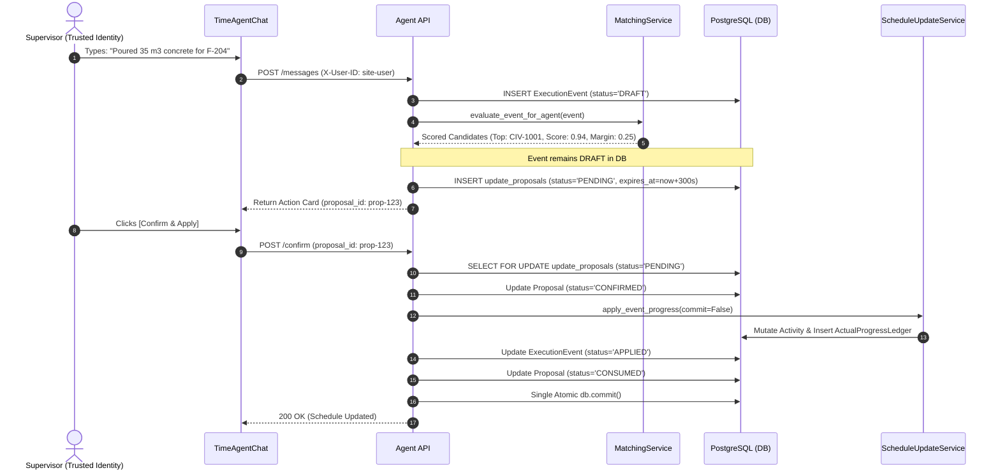

# Time Agent Implementation Specification

Status: Architecture Review / Implementation Gate  
Source of Truth: Current ScheduleManager Repository  
Previous Design Reviewed: TIME_AGENT_IMPLEMENTATION_ANALYSIS.md  
Code Changes Made: NONE  

---

## 1. Previous Analysis Audit

A rigorous line-by-line inspection was conducted comparing every major claim and design proposal in `TIME_AGENT_IMPLEMENTATION_ANALYSIS.md` against the actual current implementation files in `ScheduleManager` (`backend/app/domain/models.py`, `backend/app/services/matching_service.py`, `backend/app/services/schedule_update_service.py`, `backend/app/services/extraction_service.py`, `backend/app/services/minio_service.py`, `backend/app/domain/database.py`, etc.).

### Classification Definitions
- **`[VERIFIED]`**: Directly supported by current code.
- **`[PROPOSED]`**: A new design that does not exist yet.
- **`[ASSUMPTION]`**: Suggested by the document but not verified in code.
- **`[INCORRECT]`**: Contradicted by the current implementation.
- **`[NEEDS_CHANGE]`**: Concept is valid but the proposed implementation is inconsistent or unsafe.

### Claim-by-Claim Audit Table

| Claim / Design Element | Previous Document Says | Current Code Says | Classification | Required Correction |
|---|---|---|---|---|
| **Matching Confidence Routing Thresholds** | $S_{\text{total}} \ge 0.85 \wedge \Delta \ge 0.15 \wedge C_{\text{ext}} \ge 0.80 \implies \mathbf{AUTO\_LINK}$ | Matches lines 224–230 in [`matching_service.py`](file:///c:/Users/Gues/Desktop/sihnew/ScheduleManager/backend/app/services/matching_service.py). | `[VERIFIED]` | Retain exact formula and routing thresholds. |
| **Matching 5-Signal Scoring Engine** | Combines $S_{\text{id}}, S_{\text{text}}, S_{\text{wbs}}, S_{\text{temp}}, S_{\text{context}}$ with exact weights (0.45, 0.25, 0.15, 0.15 without code; $\ge 0.95$ floor with code). | Matches lines 80–154 in [`matching_service.py`](file:///c:/Users/Gues/Desktop/sihnew/ScheduleManager/backend/app/services/matching_service.py). | `[VERIFIED]` | Retain scoring engine without alteration. |
| **Matching Clarification In-Flight Mutation** | Assumed existing `evaluate_event()` can be re-run across clarification turns without side effects. | `MatchingService.evaluate_event()` directly mutates `event.status = 'AUTO_LINKED'` or `'IN_REVIEW'`, sets `matched_activity_id`, and executes `db.commit()`. Calling this during clarification prematurely finalizes the draft event! | `[NEEDS_CHANGE]` | Implement `evaluate_event_for_agent()` as a non-finalizing, non-committing evaluation method. |
| **Progress Ledger Idempotency** | Checks composite unique constraint `(activity_id, execution_event_id)` on `ActualProgressLedger`. | Matches lines 50–62 in [`schedule_update_service.py`](file:///c:/Users/Gues/Desktop/sihnew/ScheduleManager/backend/app/services/schedule_update_service.py) and `UniqueConstraint` in [`models.py`](file:///c:/Users/Gues/Desktop/sihnew/ScheduleManager/backend/app/domain/models.py#L425). | `[VERIFIED]` | Retain composite uniqueness constraint for all event updates. |
| **CPM Baseline Protection Firewall** | Update mutates only `percent_complete`, `status`, `actual_start`, `actual_finish`. Planned dates and logic remain immutable. | Confirmed in [`schedule_update_service.py`](file:///c:/Users/Gues/Desktop/sihnew/ScheduleManager/backend/app/services/schedule_update_service.py#L110-L129) and [`validation_service.py`](file:///c:/Users/Gues/Desktop/sihnew/ScheduleManager/backend/app/services/validation_service.py#L252-L292). | `[VERIFIED]` | Retain CPM baseline firewall. Conversational updates must never mutate planned dates or predecessor/successor relationships. |
| **MinIO SHA-256 Storage & Presigned URLs** | S3 client computes SHA-256 and generates 15-minute presigned URLs (`get_presigned_view_url`). | Confirmed in [`minio_service.py`](file:///c:/Users/Gues/Desktop/sihnew/ScheduleManager/backend/app/services/minio_service.py#L86-L161). | `[VERIFIED]` | Direct re-use for chat attachments and stored evidence. |
| **Audio Reporting & Speech-to-Text** | Claimed "MinIO audio extraction pipeline" and voice memo processing for site supervisors. | [`extraction_service.py`](file:///c:/Users/Gues/Desktop/sihnew/ScheduleManager/backend/app/services/extraction_service.py#L410-L428) stores format-agnostic bytes in MinIO, but generates a hardcoded placeholder text note ("Audio evidence stored in MinIO..."). No speech-to-text (Whisper/STT) exists. | `[NEEDS_CHANGE]` | Correct claim: **Artifact storage is supported; speech transcription is not yet implemented.** Defer audio STT to V1.1 / future. |
| **Schedule Version Representation** | Proposed binding context to `schedule_version (Current Active)` with version roll-forward. | No `ScheduleVersion` table exists in [`domain/models.py`](file:///c:/Users/Gues/Desktop/sihnew/ScheduleManager/backend/app/domain/models.py). The schedule is directly represented by `Project` (`id`, `data_date`, `planned_start`, `planned_finish`) and associated `Activity` rows. | `[INCORRECT]` | Context must bind to `project_id` and `data_date`. Do not introduce an imaginary `ScheduleVersion` entity. |
| **ExecutionEvent Schema Evolution** | Made `artifact_id` nullable, added `source_type` and `conversation_id`, but kept `storage_key`, `file_sha256`, `source_document_name` non-nullable. | In [`models.py`](file:///c:/Users/Gues/Desktop/sihnew/ScheduleManager/backend/app/domain/models.py#L294-L297), `source_report_id`, `source_document_name`, `storage_key`, `file_sha256` are `nullable=False`. Pure conversational events would trigger database integrity errors! | `[NEEDS_CHANGE]` | All artifact provenance columns (`storage_key`, `file_sha256`, `source_report_id`, `source_document_name`, `page_number`) must be made `nullable=True`. |
| **ConfidenceRoutingResultDTO Pydantic Model** | Proposed reusing `ConfidenceRoutingResultDTO` for conversational evaluation. | In [`backend/app/schemas/matching.py`](file:///c:/Users/Gues/Desktop/sihnew/ScheduleManager/backend/app/schemas/matching.py#L23), `artifact_id: str` is mandatory (`str`, not `Optional[str]`). If `artifact_id` is `None`, Pydantic validation fails immediately. | `[NEEDS_CHANGE]` | Update `ConfidenceRoutingResultDTO.artifact_id` to `Optional[str] = None`. |
| **Two-Phase Commit (2PC) Terminology** | Claimed schedule updates use a "Two-Phase Commit" pattern. | 2PC is a distributed systems atomic consensus protocol. The system is a single PostgreSQL instance executing a staged proposal, explicit human confirmation, and local transaction write. | `[INCORRECT]` | Replace misleading distributed systems terminology with **"proposal-and-confirmation workflow"** or "two-step human-in-the-loop validation". |
| **Proposal Persistence & Concurrency** | Staged proposals with `proposal_id` and 5-minute TTL without specifying storage or race condition protection. | In-memory storage is unsafe in multi-worker Uvicorn environments. Two concurrent confirmation requests could double-execute. | `[NEEDS_CHANGE]` | Define dedicated `update_proposals` table in PostgreSQL with row-level locking (`SELECT ... FOR UPDATE`) or compare-and-set semantics. |
| **Transaction Ownership** | Assumed proposal confirmation and schedule update execute as one transaction. | [`schedule_update_service.py`](file:///c:/Users/Gues/Desktop/sihnew/ScheduleManager/backend/app/services/schedule_update_service.py#L172) executes an internal `db.commit()`, creating a split transaction with proposal status updates. | `[NEEDS_CHANGE]` | Refactor `ScheduleUpdateService.apply_event_progress()` to accept `commit: bool = True`, enabling caller transaction ownership. |
| **Database Migration Strategy** | Claimed migrations run via `init_db()`. | [`database.py`](file:///c:/Users/Gues/Desktop/sihnew/ScheduleManager/backend/app/domain/database.py#L32-L34) calls `Base.metadata.create_all()`. SQLAlchemy `create_all()` only creates missing tables; it never alters existing columns. No Alembic setup exists. | `[NEEDS_CHANGE]` | V1 strictly uses the standalone SQL migration script (`migrations/001_time_agent_schema.sql`). Alembic is deferred as a future DevOps enhancement. |
| **User Identity & Authentication Claims** | Claimed "authenticated user" / "authenticated session" with RBAC roles ("Field Supervisor" vs "Lead Planner"). | Current codebase has NO authentication middleware, NO user table, and NO JWT/session tokens. APIs take unvalidated strings like `uploaded_by: str = Form("site-user")` in [`artifacts.py`](file:///c:/Users/Gues/Desktop/sihnew/ScheduleManager/backend/app/api/artifacts.py#L27) or `reviewer_id` in [`review.py`](file:///c:/Users/Gues/Desktop/sihnew/ScheduleManager/backend/app/api/review.py#L156). | `[INCORRECT]` | Correct all references: use **"trusted/demo caller identity"** (`X-User-ID`). Clearly distinguish this from production authentication. |
| **Active Activity UI Context vs Evidence** | Treated `active_activity_id` as automatically conferring an exact match score ($S_{\text{id}} = 1.0$). | $S_{\text{id}} = 1.0$ is strictly defined in [`matching_service.py`](file:///c:/Users/Gues/Desktop/sihnew/ScheduleManager/backend/app/services/matching_service.py#L86-L90) as exact code match against field evidence. UI context is an anchor, not evidence. | `[NEEDS_CHANGE]` | Keep $S_{\text{id}}$ tied strictly to reported text/code evidence. Define deterministic conversational rules for statements referencing UI context. |
| **Quantity Semantics in Backend** | Assumed backend handles cumulative and percentage quantity updates seamlessly. | [`schedule_update_service.py`](file:///c:/Users/Gues/Desktop/sihnew/ScheduleManager/backend/app/services/schedule_update_service.py#L78-L80) implements an exact formula that treats `event.quantity` as strictly **incremental**. Cumulative input will overstate progress! | `[NEEDS_CHANGE]` | Implement governed backend conversion and validation for cumulative quantities before applying to schedule; mark as Current Code Gap. |
| **Execution Date Defaulting** | Defaulted missing execution date silently to UTC today. | Silently defaulting to UTC today corrupts schedule timelines, especially when historical project `data_date` differs from calendar date. | `[NEEDS_CHANGE]` | Resolve natural language references deterministically relative to project reporting date; prompt user if date is absent. |
| **Write Tool Authorization Signature** | Proposed `confirm_and_apply_schedule_update(event_id, activity_id, user_id)` where LLM freely passes `activity_id` and `user_id`. | Passing arbitrary `activity_id` and `user_id` from the LLM bypasses backend validation and allows hallucinated activity mutation and identity spoofing. | `[NEEDS_CHANGE]` | Replace with `confirm_update_proposal(proposal_id: str)` where the backend retrieves the validated, pre-matched proposal from database. |
| **Clarification Turn Event Lifecycle** | Conflated `ExecutionEvent`, `Conversation`, and `Proposal` state into one overloaded lifecycle. | Three distinct entities exist with different lifecycles and retention rules. | `[NEEDS_CHANGE]` | Explicitly define three separate state machines: `ExecutionEvent` persistence state, `Conversation` session state, and `UpdateProposal` state. |

---

## 2. Existing System Reconciliation

Detailed architectural inspection of the 13 foundational subsystems currently implemented in `ScheduleManager`:

### 1. `backend/app/domain/models.py`
- **What actually exists**: Declarative SQLAlchemy models: `Project`, `WBSNode`, `Activity`, `ActivityRelationship`, `Artifact`, `ExecutionEvent`, `ReviewDecision`, `ActualProgressLedger`, `ScheduleAuditLog`, `DomainOutbox`.
- **Public/service methods**: Declarative SQLAlchemy attributes, relationships, foreign keys, and indexes.
- **Input/output structure**: ORM models mapping to PostgreSQL / SQLite tables.
- **Relevant database relationships**: `Project` 1:N `activities`, `Project` 1:N `wbs_nodes`, `Project` 1:N `artifacts`, `Project` 1:N `execution_events`, `Artifact` 1:N `execution_events`, `ExecutionEvent` 1:1 `ReviewDecision`, `ExecutionEvent` 1:N `ActualProgressLedger`.
- **Existing constraints**:
  - `uq_activity_project_code`: `UniqueConstraint("project_id", "activity_code")`
  - `uq_wbs_project_code`: `UniqueConstraint("project_id", "code")`
  - `uq_relationship_pred_succ_type`: `UniqueConstraint("predecessor_id", "successor_id", "relationship_type")`
  - `uq_activity_event_progress`: `UniqueConstraint("activity_id", "execution_event_id")` on `ActualProgressLedger`
  - `execution_events.artifact_id`: `nullable=False`, foreign key to `artifacts.id`
  - `execution_events.storage_key`, `file_sha256`, `source_report_id`, `source_document_name`: `nullable=False`
- **Existing authorization behavior**: None at model level.
- **Existing idempotency behavior**: `ActualProgressLedger` composite unique constraint prevents duplicate progress applications.
- **Existing audit/outbox behavior**: `ScheduleAuditLog` stores JSON snapshots; `DomainOutbox` stores aggregate update events with `PENDING` status.
- **What Time Agent can reuse directly**: All schedule and audit models (`Project`, `Activity`, `WBSNode`, `ActualProgressLedger`, `ScheduleAuditLog`, `DomainOutbox`).
- **What must be changed**: `ExecutionEvent.artifact_id` and document provenance fields must be made nullable. Add `conversations`, `conversation_messages`, and `update_proposals` tables.

### 2. `backend/app/services/matching_service.py`
- **What actually exists**: Deterministic 5-signal matching engine and confidence router.
- **Public/service methods**:
  - `calculate_text_similarity(text_a: str, text_b: str) -> float`
  - `calculate_temporal_score(event_date: datetime, planned_start: Optional[datetime], planned_finish: Optional[datetime]) -> float`
  - `score_activity(event: ExecutionEvent, activity: Activity, wbs_node: Optional[WBSNode]) -> Tuple[float, Dict[str, float]]`
  - `retrieve_candidates(db: Session, event: ExecutionEvent) -> List[Activity]`
  - `evaluate_event(db: Session, event: ExecutionEvent) -> ConfidenceRoutingResultDTO`
- **Input/output structure**: Accepts `ExecutionEvent`, returns `ConfidenceRoutingResultDTO` containing top candidate, margin delta, score breakdown, and routing decision.
- **Relevant database relationships**: Queries `Activity` and `WBSNode` scoped to `event.project_id`.
- **Existing constraints**: Filters `Activity.status != "COMPLETED"`; filters within temporal window $\pm 30$ days (falls back to all active if window is empty).
- **Existing authorization behavior**: None.
- **Existing idempotency behavior**: Deterministic calculation; running multiple times with same inputs yields identical scores.
- **Existing audit/outbox behavior**: In `evaluate_event()`, it directly mutates `event.status = 'AUTO_LINKED'` or `'IN_REVIEW'`, updates `matched_activity_id`, serializes `match_metadata` JSON, and commits the transaction immediately.
- **What Time Agent can reuse directly**: Entire candidate retrieval, 5-signal scoring, score breakdown dictionary, and margin calculation logic.
- **What must be changed**: `MatchingService.evaluate_event` immediately commits final status changes. Time Agent requires a new non-finalizing method `evaluate_event_for_agent(db: Session, event: ExecutionEvent) -> ConfidenceRoutingResultDTO` that evaluates candidates and computes scores without mutating `event.status` to `AUTO_LINKED` or committing the transaction.

### 3. `backend/app/services/schedule_update_service.py`
- **What actually exists**: Authoritative, idempotent execution service for schedule progress mutations.
- **Public/service methods**:
  - `apply_event_progress(db: Session, event_id: str, activity_id: str, user_id: str = "system-auto", override_percent: Optional[float] = None, action_name: str = "AUTO_LINK_PROGRESS") -> Activity`
- **Input/output structure**: Accepts `event_id`, `activity_id`, `user_id`, optional `override_percent`, `action_name`. Returns updated `Activity`.
- **Relevant database relationships**: Links `ExecutionEvent`, `Activity`, `ActualProgressLedger`, `ScheduleAuditLog`, `DomainOutbox`.
- **Existing constraints**:
  - Treats `event.quantity` as strictly incremental: $new\_pct = \min(100.0, prev\_pct + (quantity / planned\_quantity) \times 100)$.
  - Planned dates and durations remain strictly untouched.
  - `ValidationService.validate_activity_update()` validates date order and 0–100% bounds.
- **Existing authorization behavior**: Accepts `user_id` string, defaults to `"system-auto"`.
- **Existing idempotency behavior**: Explicitly checks `ActualProgressLedger` for existing `(activity_id, execution_event_id)` pair. If found, returns existing `activity` without re-applying.
- **Existing audit/outbox behavior**: Appends `ActualProgressLedger`, appends `ScheduleAuditLog` with `previous_state` and `new_state`, appends `DomainOutbox` record (`SCHEDULE_PROGRESS_UPDATED`).
- **What Time Agent can reuse directly**: 100% direct re-use as the sole, authoritative path for schedule progress writes.
- **What must be changed**:
  1. Add parameter `commit: bool = True` to `apply_event_progress()` so callers (such as `TimeAgentService`) can own the transaction boundary and commit atomically alongside proposal consumption.
  2. Add governed cumulative quantity conversion logic so cumulative reports do not overstate progress.
  3. Ensure `ScheduleAuditLog.artifact_id` safely accepts `None` for conversational updates.

### 4. `backend/app/services/validation_service.py`
- **What actually exists**: Canonical schedule structure and activity update validation.
- **Public/service methods**:
  - `validate_canonical_schedule(data: Dict[str, Any]) -> List[ValidationErrorDetail]`
  - `validate_activity_update(updates: Dict[str, Any], current_start: Optional[Any], current_finish: Optional[Any])`
- **Input/output structure**: Checks dictionaries against rules; raises `ValidationException(errors)`.
- **Relevant database relationships**: None directly (in-memory domain validation).
- **Existing constraints**: Planned finish cannot precede planned start; `percent_complete` must be float between 0.0 and 100.0.
- **Existing authorization behavior**: None.
- **Existing idempotency behavior**: Pure functional validation.
- **Existing audit/outbox behavior**: None.
- **What Time Agent can reuse directly**: Direct invocation before confirming proposals.
- **What must be changed**: Nothing.

### 5. `backend/app/services/extraction_service.py`
- **What actually exists**: Extraction of construction events from text, PDF, Excel, CSV, and voice memo metadata.
- **Public/service methods**:
  - `normalize_unit(raw_unit: Optional[str]) -> Optional[str]`
  - `normalize_status(raw_status: Optional[str]) -> str`
  - `calculate_extraction_confidence(...) -> float`
  - `extract_with_llm(raw_text: str, document_name: str = "") -> Optional[List[Dict[str, Any]]]`
  - `parse_pdf(file_bytes: bytes) -> List[Dict[str, Any]]`
  - `parse_tabular(file_bytes: bytes, filename: str) -> List[Dict[str, Any]]`
  - `parse_voice_memo(filename: str) -> List[Dict[str, Any]]`
  - `extract_artifact(db: Session, artifact_id: str, force_reextract: bool = False) -> List[ExecutionEvent]`
- **Input/output structure**: Consumes raw bytes/text, outputs `NormalizedExtractionEvent` or persists `ExecutionEvent` records.
- **Relevant database relationships**: Reads `Artifact`, writes `ExecutionEvent`.
- **Existing constraints**: For the EXISTING `ExtractionService`, it supports multiple configured providers: requires a valid API key (`GEMINI_API_KEY` or `OPENAI_API_KEY`) for document artifact extraction, falling back to a rule-based parser if missing or failing.
- **Existing authorization behavior**: None.
- **Existing idempotency behavior**: Checks `artifact.extraction_status == "EXTRACTED"`; returns existing events unless `force_reextract=True`.
- **Existing audit/outbox behavior**: Sets `artifact.extraction_status = "EXTRACTED"`.
- **What Time Agent can reuse directly**: `normalize_unit`, `normalize_status`, confidence formulation, and Google Gemini httpx client calling pattern with structured extraction.
  - **Explicit Provider Distinction**:
    - **EXISTING EXTRACTION SERVICE**: May support multiple configured providers (`GEMINI_API_KEY` with `OPENAI_API_KEY` fallback where already implemented).
    - **TIME AGENT V1**: Strictly uses Google Gemini through `GEMINI_API_KEY`. Do not introduce OpenAI or Groq as the Time Agent V1 provider.
- **What must be changed**: Implement `extract_conversational_event()` that parses a natural language message without an `Artifact` record using Google Gemini via `GEMINI_API_KEY`.

### 6. `backend/app/api/review.py` / Review APIs
- **What actually exists**: Endpoints for human planner review queue and decision submission.
- **Public/service methods**:
  - `GET /api/v1/review/queue?project_id=...` -> returns pending ambiguous events (`IN_REVIEW`, `UNMATCHED`).
  - `POST /api/v1/review/decisions` -> processes `APPROVED`, `REASSIGNED`, `REJECTED`.
- **Input/output structure**: `ReviewQueueResponse`, `ReviewDecisionRequest`, `ReviewDecisionResponse`.
- **Relevant database relationships**: `ExecutionEvent`, `ReviewDecision`, `Activity`, `ScheduleAuditLog`.
- **Existing constraints**: Target activity required for `APPROVED` or `REASSIGNED`.
- **Existing authorization behavior**: Reads `request.reviewer_id` (trusted caller identity, defaults to `"planner-user"`).
- **Existing idempotency behavior**: If already approved, `ScheduleUpdateService` ledger check prevents duplicate application.
- **Existing audit/outbox behavior**: Records `ReviewDecision`, writes `ScheduleAuditLog`.
- **What Time Agent can reuse directly**: Time Agent events that exhaust 3 clarification turns will be set to `status = "IN_REVIEW"`, automatically appearing in `GET /api/v1/review/queue` for the human planner.
- **What must be changed**: Ensure conversational execution events with `artifact_id = None` do not cause null pointer exceptions when rendering `ReviewQueueItemDTO`.

### 7. `backend/app/api/matching.py` / Matching APIs
- **What actually exists**: Batch matching evaluation endpoint.
- **Public/service methods**:
  - `POST /api/v1/matching/evaluate` -> evaluates all unlinked events for a project, auto-links high confidence, queues low confidence.
- **Input/output structure**: `MatchingEvaluationRequest` -> `MatchingEvaluationResponse`.
- **Relevant database relationships**: Queries `ExecutionEvent`, evaluates against `Activity`.
- **Existing constraints**: Evaluates events where `status != "APPLIED"`.
- **Existing authorization behavior**: Uses `user_id = "system-auto"`.
- **Existing idempotency behavior**: Re-evaluates unlinked events idempotently.
- **Existing audit/outbox behavior**: Invokes `ScheduleUpdateService.apply_event_progress()` for `AUTO_LINK`.
- **What Time Agent can reuse directly**: Scoring algorithms.
- **What must be changed**: Preserve this batch endpoint completely; Time Agent uses the new non-finalizing `evaluate_event_for_agent()` method.

### 8. `backend/app/api/projects.py`, `schedules.py`, `activities.py`
- **What actually exists**: Core CRUD endpoints for projects, activities, WBS nodes, and Gantt data.
- **Public/service methods**:
  - `GET /api/v1/projects/{id}` -> returns project metadata and counts.
  - `GET /api/v1/projects/{id}/activities` -> returns paginated activity list with filtering.
  - `GET /api/v1/projects/{id}/wbs` -> returns hierarchical WBS tree.
  - `GET /api/v1/projects/{id}/gantt` -> returns activities and relationships formatted for timeline visualization.
- **Input/output structure**: Standard Pydantic schemas.
- **Relevant database relationships**: Scoped by `project_id`.
- **Existing constraints**: Enforces relational integrity across activities and WBS.
- **Existing authorization behavior**: None.
- **Existing idempotency behavior**: Standard REST read semantics.
- **Existing audit/outbox behavior**: None on read endpoints.
- **What Time Agent can reuse directly**: Exact query logic for Read Tools (`get_project_summary`, `get_activity`, `search_schedule_activities`).
- **What must be changed**: None.

### 9. `backend/app/services/minio_service.py` & `backend/app/api/artifacts.py`
- **What actually exists**: MinIO S3 object storage client with SHA-256 deduplication and local disk fallback.
- **Public/service methods**:
  - `minio_service.upload_artifact(...)`
  - `minio_service.get_artifact_bytes(...)`
  - `minio_service.get_presigned_view_url(...)`
  - `POST /api/v1/projects/{project_id}/artifacts/upload`
- **Input/output structure**: Multi-part form upload -> `ArtifactDTO`.
- **Relevant database relationships**: `Artifact` table.
- **Existing constraints**: Computes SHA-256; if hash exists in same project, marks duplicate or reuses record.
- **Existing authorization behavior**: `uploaded_by: str = Form("site-user")`.
- **Existing idempotency behavior**: SHA-256 check prevents duplicate physical uploads.
- **Existing audit/outbox behavior**: `Artifact.extraction_status` tracking.
- **What Time Agent can reuse directly**: Direct re-use for chat file attachments (PDF/XLSX/CSV/Audio).
- **What must be changed**: None.

### 10. Frontend Project Workspace (`frontend/app/projects/[id]/page.tsx`)
- **What actually exists**: Multi-tab Next.js client component with tabs: `Overview`, `Activities`, `WBS Tree`, `Gantt Timeline`, `Field Reports & Review`.
- **Public/service methods**: `loadProjectData()`, `handleEditActivity()`, tab switching state.
- **Input/output structure**: Consumes backend REST endpoints via `frontend/lib/api.ts`.
- **Relevant database relationships**: Visualizes project, activities, and reports.
- **Existing constraints**: Single project active at a time (`params.id`).
- **Existing authorization behavior**: None.
- **Existing idempotency behavior**: State refresh driven by `refreshCounter`.
- **Existing audit/outbox behavior**: Listens for schedule updates and increments `refreshCounter` to refresh Gantt and Activity tables.
- **What Time Agent can reuse directly**: Project context binding (`projectId`), tab framework, refresh counter mechanism (`onScheduleUpdated`).
- **What must be changed**: Add "Time Agent" tab and slide-over chat drawer.

### 11. Current DB Initialization / Migration Mechanism
- **What actually exists**: [`database.py`](file:///c:/Users/Gues/Desktop/sihnew/ScheduleManager/backend/app/domain/database.py#L32-L34):
  ```python
  def init_db():
      Base.metadata.create_all(bind=engine)
  ```
- **Constraints**: No Alembic migrations exist. `create_all()` creates missing tables but does NOT alter existing columns.
- **What must be changed**: V1 strictly uses a standalone SQL DDL script (`migrations/001_time_agent_schema.sql`). Alembic is marked as a future DevOps enhancement.

### 12. Current Authentication / User Identity Mechanism
- **What actually exists**: No authentication middleware, no session tokens, no user table. Identity is passed via request fields (`uploaded_by`, `reviewer_id`, `user_id="system-auto"`).
- **Constraints**: System operates in a trusted prototype/demo network environment.
- **What must be changed**: For Time Agent, caller identity is captured via HTTP header (`X-User-ID`, defaulting to `"site-supervisor"` if omitted) and validated server-side as trusted demo identity. Production deployment requires proper OAuth2/JWT middleware.

### 13. Current Schedule / Version Representation
- **What actually exists**: A project has exactly ONE live active schedule in the database represented by `Project` (`planned_start`, `planned_finish`, `data_date`) and its associated `Activity` and `ActivityRelationship` rows.
- **Constraints**: No schedule version branching or version history table exists. Progress updates mutate `Activity.percent_complete` and `Activity.status` directly. Historical states are recorded in `ActualProgressLedger` and `ScheduleAuditLog`.
- **What must be changed**: Context is strictly bound to `Project.id` and `Project.data_date`.

---

## 3. ExecutionEvent Schema Consistency

### Unified Provenance Model: Mode A vs Mode B vs Hybrid

An `ExecutionEvent` represents a discrete physical work event. It must be capable of originating from a formal uploaded document (Mode A), a conversational statement (Mode B), or a hybrid interaction where a conversational prompt clarifies an uploaded document.

```
MODE A: Artifact-Derived
[PDF / XLSX / CSV] ──► MinIO Storage ──► ExtractionService ──► ExecutionEvent (source_type = "ARTIFACT")

MODE B: Conversational
[Chat Message] ──────► Conversational Parser ────────────────► ExecutionEvent (source_type = "CONVERSATION")

HYBRID: Artifact + Clarification
[PDF Upload] ────────► ExecutionEvent (source_type = "HYBRID") ◄─── Supervisor enriches via Chat
```

### Detailed Field Consistency Matrix

| Field Name | Type | Nullable? | Common / Artifact / Conversation | Purpose & Invariant |
|---|---|---|---|---|
| `id` | `VARCHAR(36)` | NO | Common | UUID primary key. |
| `project_id` | `VARCHAR(36)` | NO | Common | Mandatory foreign key to `projects.id`. |
| `source_type` | `VARCHAR(50)` | NO | Common | Enum: `'ARTIFACT'`, `'CONVERSATION'`, `'HYBRID'`. |
| `conversation_id` | `VARCHAR(36)` | YES | Conversation / Hybrid | Foreign key to `conversations.id`. Null for pure background Mode A uploads. |
| `message_id` | `VARCHAR(36)` | YES | Conversation / Hybrid | Foreign key to `conversation_messages.id`. Records exact message trigger. |
| `artifact_id` | `VARCHAR(36)` | YES | Artifact / Hybrid | Foreign key to `artifacts.id`. Null for pure conversational Mode B events. |
| `source_report_id` | `VARCHAR(36)` | YES | Artifact-only | Identifier from daily report sheet. Null for Mode B. |
| `source_document_name`| `VARCHAR(255)` | YES | Artifact-only | Original filename (e.g. `Shift_Report.pdf`). Null for Mode B. |
| `storage_key` | `VARCHAR(500)` | YES | Artifact-only | MinIO object key. Null for Mode B. |
| `file_sha256` | `VARCHAR(64)` | YES | Artifact-only | SHA-256 hash of file. Null for Mode B. |
| `page_number` | `INTEGER` | YES | Artifact-only | Source page number. Null for Mode B. |
| `bounding_box` | `TEXT` | YES | Artifact-only | JSON string of coordinates. Null for Mode B. |
| `verbatim_excerpt` | `TEXT` | NO | Common | Mode A: verbatim document quote. Mode B: exact user message text. |
| `description` | `TEXT` | NO | Common | Normalized summary of work performed. |
| `execution_date` | `DATETIME` | NO | Common | Date work occurred. Resolved deterministically. |
| `start_time` | `VARCHAR(20)` | YES | Common | Optional shift start time. |
| `end_time` | `VARCHAR(20)` | YES | Common | Optional shift end time. |
| `status_reported` | `VARCHAR(50)` | NO | Common | Reported status: `'COMPLETED'`, `'IN_PROGRESS'`, `'NOT_STARTED'`. |
| `quantity` | `FLOAT` | YES | Common | Numerical quantity installed/performed. Null if qualitative. |
| `unit` | `VARCHAR(50)` | YES | Common | Normalized engineering unit (`m3`, `m2`, `t`, `m`, `ea`). |
| `location` | `VARCHAR(255)` | YES | Common | Physical location / structural unit (`Pier 14`, `Foundation F-204`). |
| `discipline` | `VARCHAR(100)` | YES | Common | Engineering discipline (`Civil`, `Structural`, `MEP`). |
| `contractor` | `VARCHAR(255)` | YES | Common | Subcontractor or crew name. |
| `asset` | `VARCHAR(255)` | YES | Common | Equipment or asset code. |
| `wbs_hint` | `VARCHAR(255)` | YES | Common | WBS or work package hint. |
| `extraction_confidence`| `FLOAT` | NO | Common | Extraction quality score ($0.0$ to $1.0$). |
| `extraction_notes` | `TEXT` | YES | Common | Notes on parser reasoning or clarification history. |
| `status` | `VARCHAR(50)` | NO | Common | Lifecycle status: `'DRAFT'`, `'UNMATCHED'`, `'IN_REVIEW'`, `'AUTO_LINKED'`, `'APPLIED'`, `'REJECTED'`. |
| `matched_activity_id` | `VARCHAR(36)` | YES | Common | Matched `activities.id`. Null until evaluated. |
| `match_score` | `FLOAT` | YES | Common | Top candidate match score from `MatchingService`. |
| `match_metadata` | `TEXT` | YES | Common | JSON serialization of candidates, scores, and margin deltas. |
| `created_at` | `DATETIME` | NO | Common | Timestamp of record creation. |

### Answers to Critical Schema Questions

1. **Common Fields**: `id`, `project_id`, `source_type`, `verbatim_excerpt`, `description`, `execution_date`, `status_reported`, `extraction_confidence`, `status`, `created_at`.
2. **Artifact-Only Fields**: `artifact_id`, `source_report_id`, `source_document_name`, `storage_key`, `file_sha256`, `page_number`, `bounding_box`.
3. **Conversation-Only Fields**: `conversation_id`, `message_id`.
4. **Nullable Fields**: All artifact-only fields MUST be nullable. All conversation-only fields MUST be nullable. Engineering attributes (`quantity`, `unit`, `location`, `discipline`, `contractor`, `asset`, `wbs_hint`, `start_time`, `end_time`, `matched_activity_id`, `match_score`, `match_metadata`) must be nullable.
5. **Preservation of Conversational Evidence**: Preserved in `verbatim_excerpt` (storing the exact supervisor utterance) and linked to `conversation_messages.id` and `conversations.id`.
6. **Preservation of Artifact Evidence**: Preserved in `artifact_id`, MinIO `storage_key`, `file_sha256`, and `bounding_box`.
7. **How a HYBRID Event Works**: When a supervisor uploads an artifact in chat, `source_type = "HYBRID"`, populating BOTH `artifact_id` AND `conversation_id`. When the supervisor clarifies details, the existing event is updated in-place, appending the conversational transcript reference to `extraction_notes`.
8. **Does Current Model Require a Migration?**: **YES.** The current table definition in `backend/app/domain/models.py` has `artifact_id`, `source_report_id`, `source_document_name`, `storage_key`, and `file_sha256` defined as `nullable=False`. Pure Mode B conversational events will cause `IntegrityError` unless these columns are altered.
9. **Exact Migration Changes Required (Specification Only - Do Not Implement)**:
   - Alter `execution_events.artifact_id` to `NULL`.
   - Alter `execution_events.source_report_id` to `NULL`.
   - Alter `execution_events.source_document_name` to `NULL`.
   - Alter `execution_events.storage_key` to `NULL`.
   - Alter `execution_events.file_sha256` to `NULL`.
   - Alter `execution_events.page_number` to `NULL`.
   - Add column `execution_events.source_type` (`VARCHAR(50) NOT NULL DEFAULT 'ARTIFACT'`).
   - Add column `execution_events.conversation_id` (`VARCHAR(36) NULL REFERENCES conversations(id) ON DELETE SET NULL`).
   - Add column `execution_events.message_id` (`VARCHAR(36) NULL REFERENCES conversation_messages(id) ON DELETE SET NULL`).

---

## 4. Conversation / Schedule Context

### Authoritative Context Model

A conversation is an interactive session between a user and the Time Agent. Context must be strictly bound as follows:

```
[Project Context: project_id (IMMUTABLE PER CONVERSATION)]
        ↓
[Schedule Temporal State: project.data_date (SNAPSHOT AT QUERY TIME)]
        ↓
[Trusted Caller Identity: X-User-ID (DEMO IDENTITY IN HEADER)]
        ↓
[Conversation Session: conversation_id]
        ↓
[Active Activity Context: Optional active_activity_id (CONVERSATIONAL ANCHOR)]
        ↓
[Active Execution Event Draft: Optional active_event_id (CURRENT IN-FLIGHT DRAFT)]
```

### Invariant Specifications

1. **Project Binding Invariant**: A conversation is bound to exactly ONE `project_id` upon creation. A conversation CANNOT cross project boundaries. All candidate searches, activity queries, and updates MUST be parameterized with `WHERE project_id = :project_id`.
2. **Relational Project Consistency Invariant**:
   - Database foreign keys establish entity existence (`project_id REFERENCES projects(id)`).
   - Backend validation establishes that proposal, activity, event, and conversation ALL belong to the **same** project:
     $$\text{proposal.project\_id} == \text{event.project\_id} == \text{activity.project\_id} == \text{conversation.project\_id}$$
   A foreign key check alone does not prevent linking Project A's event to Project B's activity unless enforced by backend validation or composite foreign keys `(project_id, id)`.
3. **Schedule Concurrency Invariant**: When an update proposal is confirmed, the backend verifies that the matched activity's `percent_complete` and `status` match the baseline captured when the proposal was generated. If another process modified the activity in the interim, the confirmation is rejected with `409 Conflict (STALE_ACTIVITY_BASELINE)`.
4. **Active Activity Context Rules**:
   - `active_activity_id` is a conversational anchor (e.g. user clicked "Report Progress" on a Gantt row). It is **NOT** evidence and does **NOT** grant $S_{\text{id}} = 1.0$. $S_{\text{id}} = 1.0$ is strictly reserved for verbatim citations or explicit activity codes.
   - **Rule 4.1: Ambiguous Reference Resolution ("Update this to 80%")**:
     If `active_activity_id` is present in session context, the agent interprets "this" as referring to `active_activity_id`, stages a proposal with `override_percent = 80.0`, and presents the confirmation card. If `active_activity_id` is absent, the agent prompts: *"Which activity should be updated to 80%?"*.
   - **Rule 4.2: Completion Statement ("We finished this activity")**:
     If `active_activity_id` is present, resolves to that activity with `status_reported = "COMPLETED"`, `override_percent = 100.0`.
   - **Rule 4.3: Explicit Code Overrides Context ("Actually, report CIV-1002 instead")**:
     If the supervisor explicitly cites another activity code, the explicit code overrides `active_activity_id`. The session context updates `active_activity_id` to the new activity.
   - **Rule 4.4: Invariant**: Never fabricate `reported_activity_code` solely from UI context without explicit user statement.
5. **`active_event_id` Lifecycle Invariant**:
   - **Assignment**: Set when user sends a progress report or uploads an artifact, creating a new `DRAFT` `ExecutionEvent`.
   - **Clearing**: Set to `None` when the proposal is confirmed and consumed, when the event is routed to `IN_REVIEW` after 3 failed turns, or when explicitly cancelled.
   - **New Event Creation**: When a new progress report is received and `active_event_id` is `None`, a new `ExecutionEvent` is inserted in `DRAFT` status and bound to `conversation.active_event_id`.
   - **Verification**: Before reading or enriching `active_event_id`, the backend validates:
     $$\text{event.conversation\_id} == \text{conversation.id} \;\wedge\; \text{event.project\_id} == \text{conversation.project\_id}$$

---

## 5. Intent Classification

The Time Agent classifies user messages before deciding whether to extract an execution event, query the schedule, or answer a clarification question.

### Core Intent Taxonomies

```
                                  User Message
                                        │
                                        ▼
                            [Intent Classification]
                                        │
     ┌──────────────────┬───────────────┼───────────────┬──────────────────┐
     ▼                  ▼               ▼               ▼                  ▼
INFORMATION_       PROGRESS_       PROGRESS_       CLARIFICATION_     ARTIFACT_
  QUERY              REPORT       UPDATE_REQUEST     RESPONSE        SUBMISSION
     │                  │               │               │                  │
Read Tools Only    Draft Event    Draft Event      Enrich Active      Process Upload
 No Draft Event     Extraction     Extraction          Event           MinIO + Extr.
```

| Intent | Definition | Example Utterance | System Action | ExecutionEvent Created? |
|---|---|---|---|---|
| **`INFORMATION_QUERY`** | Supervisor asks about schedule state, planned dates, progress, or relationships. | *"What is the status of F-204?"*, *"Who is the contractor for Pier 14?"* | Invokes Read Tools (`get_activity`, `get_project_summary`). Formulates natural language answer. | **NO** |
| **`PROGRESS_REPORT`** | Supervisor describes physical work completed with quantities or descriptions. | *"We poured 35 cubic meters of concrete today at F-204."* | Invokes conversational parser, creates draft `ExecutionEvent`, runs `evaluate_event_for_agent()`. | **YES (DRAFT)** |
| **`PROGRESS_UPDATE_REQUEST`** | Supervisor explicitly requests a percentage or status change. | *"Update CIV-1001 to 80%."*, *"Mark excavation for Pier 14 as complete."* | Constructs draft `ExecutionEvent` with `status_reported = "IN_PROGRESS"` or `"COMPLETED"` and `override_percent`. | **YES (DRAFT)** |
| **`CLARIFICATION_RESPONSE`** | Supervisor provides missing information in response to an agent question. | *"F-204."*, *"Incremental for today only."*, *"Apex Civil."* | Enriches the existing `active_event_id` draft event and re-runs `evaluate_event_for_agent()`. | **NO (Enriches existing)** |
| **`ARTIFACT_SUBMISSION`** | Supervisor attaches or references a field report document. | *"I uploaded today's site report."* + attached PDF. | Uploads to MinIO, calls `ExtractionService.extract_artifact()`, binds events to conversation. | **YES (From Artifact)** |

### Intent Pipeline Placement
Intent classification is executed by Google Gemini via `GEMINI_API_KEY` as the first stage of the conversational handler, returning structured classification metadata:
```json
{
  "intent": "PROGRESS_REPORT",
  "confidence": 0.96,
  "entities_present": ["quantity", "unit", "location"]
}
```
*(Note: The LLM returns structured classification fields and detected entities, not chain-of-thought or reasoning text).*
The backend validates that the intent matches session state (e.g. if `active_event_id` is set and status is `CLARIFICATION_REQUIRED`, a short entity utterance is interpreted as `CLARIFICATION_RESPONSE`).

---

## 6. Quantity and Progress Semantics

### Critical Semantic Disambiguation

Field reports and conversations describe progress in fundamentally different ways. The Time Agent must never conflate them:

```
                                  Reported Quantity / Progress
                                               │
               ┌───────────────────────────────┼───────────────────────────────┐
               ▼                               ▼                               ▼
     INCREMENTAL QUANTITY            CUMULATIVE QUANTITY              DIRECT PERCENTAGE
   "Poured 35 m3 today"           "Total poured to date: 140 m3"   "Activity is 80% complete"
               │                               │                               │
       qty_semantics =                 qty_semantics =                 override_percent =
        INCREMENTAL                      CUMULATIVE                           80.0%
               │                               │                               │
      Backend Formula:                Backend Formula:                Backend Formula:
  new_pct = prev_pct + ratio     new_pct = (cum_qty / planned)     new_pct = override_percent
```

### Verification of `ActualProgressLedger` ORM Fields
Inspection of [`backend/app/domain/models.py`](file:///c:/Users/Gues/Desktop/sihnew/ScheduleManager/backend/app/domain/models.py#L387-L426) reveals:
```python
class ActualProgressLedger(Base):
    __tablename__ = "actual_progress_ledger"
    id: Mapped[str]
    project_id: Mapped[str]
    activity_id: Mapped[str]
    execution_event_id: Mapped[str]
    reporting_date: Mapped[datetime]
    installed_quantity: Mapped[Optional[float]]
    unit_of_measure: Mapped[Optional[str]]
    incremental_percent: Mapped[Optional[float]]
    cumulative_percent: Mapped[float]
    created_at: Mapped[datetime]
```
`installed_quantity` stores the **incremental** quantity applied by an event. A `cumulative_quantity` column does **NOT** exist in `ActualProgressLedger` or `Activity`.

### Cumulative Quantity Validation & Conversion Invariants
When `quantity_semantics == "CUMULATIVE"`:
1. **Deriving Previous Cumulative Installed Quantity ($Q_{\text{prev}}$)**:
   - If `activity.planned_quantity > 0` and `activity.percent_complete > 0`:
     $$Q_{\text{prev}} = \left(\frac{\text{activity.percent\_complete}}{100.0}\right) \times \text{activity.planned\_quantity}$$
   - Alternatively, compute $Q_{\text{ledger}} = \sum \text{installed\_quantity}$ from `ActualProgressLedger`. If $Q_{\text{ledger}} > 0$, use $\max(Q_{\text{prev}}, Q_{\text{ledger}})$.
2. **Case A: Cumulative Lower than Previous ($Q_{\text{cum}} < Q_{\text{prev}}$)**:
   - **Negative deltas must NEVER be silently applied.**
   - Reject with validation error: *"Reported cumulative quantity ({Q_cum} {unit}) is less than previously recorded installed quantity ({Q_prev} {unit}). Execution reporting cannot decrease progress. Please verify the quantity or request a manual progress adjustment."*
3. **Case B: Cumulative Equal to Previous ($Q_{\text{cum}} == Q_{\text{prev}}$)**:
   - Incremental delta is $0.0$.
   - Inform user: *"The reported cumulative quantity ({Q_cum} {unit}) matches previously recorded quantity. No incremental progress will be added."*
4. **Case C: Cumulative Exceeds Planned Quantity ($Q_{\text{cum}} > Q_{\text{planned}}$)**:
   - Quantity overrun condition.
   - Progress percentage is capped at $100.0\%$: $new\_pct = 100.0$.
   - Incremental delta is recorded as $\Delta Q = Q_{\text{cum}} - Q_{\text{prev}}$.
   - Overrun note flagged in audit metadata.
5. **Case D: Normal Cumulative Progress ($Q_{\text{prev}} < Q_{\text{cum}} \le Q_{\text{planned}}$)**:
   - Incremental delta: $\Delta Q = Q_{\text{cum}} - Q_{\text{prev}}$.
   - Target cumulative percentage: $new\_pct = (Q_{\text{cum}} / Q_{\text{planned}}) \times 100.0$.
   - Proposal stages `override_percent = new_pct` and `incremental_quantity = \Delta Q`.

---

## 7. Execution Date Resolution Policy

### Preventing Silent Date Guessing
Silently defaulting missing execution dates to UTC today introduces severe schedule corruption when reporting against a project with a fixed `data_date` in the past.

### Deterministic Temporal Resolution Rules

1. **Explicit ISO Date Cited**: If the report contains an explicit date (e.g. "on 2024-09-30"), parse directly as `2024-09-30`.
2. **Relative Term "Today"**:
   - Resolves to `project.data_date` if `project.data_date` is defined.
   - If `project.data_date` is null, resolves to current UTC calendar date.
3. **Relative Term "Yesterday"**:
   - Resolves to `reference_date - 1 day` (where `reference_date` is `project.data_date` or current UTC date).
4. **Relative Day Name ("on Monday")**:
   - Resolves to the most recent occurrence of that weekday on or prior to the reference date.
5. **No Temporal Reference Given**:
   - The agent does **NOT** silently invent a date.
   - The agent sets `execution_date = None` and triggers a targeted clarification question:
     > *"On what date was this work completed? (Project current data date is {formatDate(project.data_date)})"*
   - Confirmation proposals require a validated, non-null `execution_date`.

---

## 8. Matching and Clarification

### Current `MatchingService` Evaluation Formula

From [`backend/app/services/matching_service.py`](file:///c:/Users/Gues/Desktop/sihnew/ScheduleManager/backend/app/services/matching_service.py):

#### 1. Candidate Retrieval
```python
query = db.query(Activity).filter(
    Activity.project_id == event.project_id,
    Activity.status != "COMPLETED",
)
```
Temporal filter: prefers activities where planned window overlaps `event.execution_date` $\pm 30$ days. Falls back to all active if window is empty.

#### 2. Scoring Signals
- **$S_{\text{id}} \in \{0.0, 1.0\}$**: Exact activity code match in `reported_activity_code` or `verbatim_excerpt`.
- **$S_{\text{text}} \in [0.0, 1.0]$**: $0.75 \times \text{coverage} + 0.25 \times \text{jaccard}$ of tokens between event text and activity name.
- **$S_{\text{wbs}} \in [0.0, 1.0]$**: WBS hierarchy and discipline match ($1.0$ if WBS hint matches; $0.95$ if location in WBS; $0.85$ if discipline matches; $0.90$ if $S_{\text{text}} \ge 0.70$).
- **$S_{\text{temp}} \in [0.1, 1.0]$**: Temporal compatibility. $1.0$ if within planned start/finish; $0.8$ if $\le 7$ days; $0.6$ if $\le 14$ days; $0.4$ if $\le 30$ days; $0.1$ otherwise.
- **$S_{\text{context}} \in [0.0, 1.0]$**: Location match ($1.0$ if location in activity name or `location_code`) and contractor match ($\pm 0.2$).

#### 3. Total Score Calculation
- If $S_{\text{id}} == 1.0$:
  $$S_{\text{total}} = \max\left(0.95, 0.40 S_{\text{id}} + 0.30 S_{\text{text}} + 0.15 S_{\text{wbs}} + 0.10 S_{\text{temp}} + 0.05 S_{\text{context}}\right)$$
- If $S_{\text{id}} == 0.0$:
  $$S_{\text{total}} = 0.45 S_{\text{text}} + 0.25 S_{\text{wbs}} + 0.15 S_{\text{temp}} + 0.15 S_{\text{context}}$$

#### 4. Margin Delta & Confidence Routing Rule
$$\Delta_{\text{margin}} = S_{\text{top}} - S_{\text{second}}$$
$$\mathbf{AUTO\_LINK} \iff S_{\text{total}} \ge 0.85 \;\wedge\; \Delta_{\text{margin}} \ge 0.15 \;\wedge\; C_{\text{ext}} \ge 0.80$$
$$\text{Otherwise} \iff \mathbf{PLANNER\_REVIEW}$$

> [!IMPORTANT]
> **Time Agent `AUTO_LINKED` Semantics**: In Time Agent, `AUTO_LINKED` means a **confidently matched target activity**, NOT schedule mutation. The schedule remains completely unchanged until explicit human proposal confirmation.

### Non-Finalizing Evaluation for Time Agent (`evaluate_event_for_agent`)
To allow repeated evaluation across clarification turns without prematurely committing `AUTO_LINKED` or `IN_REVIEW` status to the database, `MatchingService` must provide a non-finalizing evaluation method:
```python
@classmethod
def evaluate_event_for_agent(cls, db: Session, event: ExecutionEvent) -> ConfidenceRoutingResultDTO:
    """
    Evaluates matching candidates without mutating event.status or executing db.commit().
    Returns confidence routing result and score breakdown for agent decision logic.
    """
    candidates = cls.retrieve_candidates(db, event)
    if not candidates:
        return ConfidenceRoutingResultDTO(
            event_id=event.id,
            artifact_id=event.artifact_id,
            route="UNMATCHED",
            selected_candidate=None,
            all_candidates=[],
        )

    scored_candidates = []
    for act in candidates:
        wbs = db.query(WBSNode).filter(WBSNode.id == act.wbs_id).first() if act.wbs_id else None
        score, breakdown = cls.score_activity(event, act, wbs)
        scored_candidates.append(
            MatchCandidateDTO(
                activity_id=act.id,
                activity_code=act.activity_code,
                activity_name=act.name,
                wbs_code=wbs.code if wbs else None,
                match_score=score,
                margin_delta=0.0,
                score_breakdown=breakdown,
            )
        )

    scored_candidates.sort(key=lambda x: x.match_score, reverse=True)
    top = scored_candidates[0]
    margin_delta = round(top.match_score - scored_candidates[1].match_score, 3) if len(scored_candidates) > 1 else top.match_score
    top.margin_delta = margin_delta

    is_auto_link = (
        top.match_score >= 0.85
        and margin_delta >= 0.15
        and event.extraction_confidence >= 0.80
    )
    route = "AUTO_LINK" if is_auto_link else "PLANNER_REVIEW"

    # In-memory candidate assignment only -- does NOT alter event.status or commit to DB
    return ConfidenceRoutingResultDTO(
        event_id=event.id,
        artifact_id=event.artifact_id,
        route=route,
        selected_candidate=top,
        all_candidates=scored_candidates[:5],
    )
```

---

## 9. Separate State Models: Event, Conversation, Proposal

The Time Agent relies on three separate state machines that interact cleanly without overloading a single status field:

```
1. EXECUTION EVENT PERSISTENCE STATE (Database: execution_events.status)
   DRAFT ──► UNMATCHED | IN_REVIEW | AUTO_LINKED ──► APPLIED | REJECTED

2. CONVERSATION SESSION STATE (Database: conversations.status)
   ACTIVE ──► WAITING_FOR_USER ──► WAITING_FOR_AGENT ──► RESOLVED | ABANDONED

3. UPDATE PROPOSAL STATE (Database: update_proposals.status)
   PENDING ──► CONFIRMED ──► CONSUMED (or REJECTED, EXPIRED)
```

### State Machine 1: `ExecutionEvent` Lifecycle
- **`DRAFT`**: Created upon receiving natural language report or file upload. Mutated in-place across clarification turns.
- **`UNMATCHED`**: Evaluated by matching; zero eligible candidates found in project.
- **`IN_REVIEW`**: Ambiguity unresolved after 3 clarification turns, or routed to planner human review queue.
- **`AUTO_LINKED`**: High confidence match ($S_{\text{total}} \ge 0.85 \wedge \Delta \ge 0.15$). Ready for proposal generation. Schedule remains unmutated.
- **`APPLIED`**: Final schedule mutation executed via `ScheduleUpdateService`. Ledger row written. (Terminal).
- **`REJECTED`**: Rejected by supervisor or Lead Planner. (Terminal).

### State Machine 2: `Conversation` Lifecycle
- **`ACTIVE`**: User and agent actively conversing.
- **`WAITING_FOR_USER`**: Agent has presented a clarification question or confirmation card.
- **`WAITING_FOR_AGENT`**: User submitted message; agent background processing in flight.
- **`RESOLVED`**: Proposal confirmed and applied, or user ended session.
- **`ABANDONED`**: Session timed out (> 24 hours inactivity).

### State Machine 3: `UpdateProposal` Lifecycle
- **`PENDING`**: High confidence match achieved; proposal record inserted into `update_proposals`; 5-minute expiration timer running.
- **`CONFIRMED`**: User clicked `[Confirm & Apply]`; verified against baseline; update execution initiated.
- **`CONSUMED`**: `ScheduleUpdateService` successfully applied progress; ledger written. (Terminal).
- **`REJECTED`**: User clicked `[Cancel/Edit]` or rejected proposal. (Terminal).
- **`EXPIRED`**: Confirmation received after `expires_at` timestamp. (Terminal).

---

## 10. Confirmation, Concurrency, and Transaction Ownership

### Proposal Concurrency Guarantee
To prevent race conditions where two simultaneous confirmation requests could both execute the same proposal, the confirmation handler must execute an **atomic row-lock**:

```python
# Acquire row-level lock within the confirmation transaction
proposal = (
    db.query(UpdateProposal)
    .filter(
        UpdateProposal.id == proposal_id,
        UpdateProposal.conversation_id == conversation_id,
        UpdateProposal.project_id == project_id,
    )
    .with_for_update()
    .first()
)
if not proposal:
    raise HTTPException(status_code=404, detail="Proposal not found.")

if proposal.status != "PENDING":
    raise HTTPException(
        status_code=409,
        detail=f"Proposal already {proposal.status.lower()}."
    )

if datetime.utcnow() > proposal.expires_at:
    proposal.status = "EXPIRED"
    db.commit()
    raise HTTPException(status_code=400, detail="Proposal has expired.")
```
Under PostgreSQL row locking, the first request acquires the lock, verifies `PENDING`, transitions to `CONFIRMED`, and executes. The second request blocks on the lock, then reads `status == 'CONFIRMED'` or `'CONSUMED'` and is immediately rejected with `409 Conflict`.

### Unified Transaction Ownership
Currently, [`ScheduleUpdateService.apply_event_progress()`](file:///c:/Users/Gues/Desktop/sihnew/ScheduleManager/backend/app/services/schedule_update_service.py#L172) executes `db.commit()` internally. Calling this directly would create a split transaction where the schedule update is committed before the proposal status transitions to `CONSUMED`.

#### Required Transaction-Safe Refactor
Add `commit: bool = True` to `ScheduleUpdateService.apply_event_progress()`:
```python
@classmethod
def apply_event_progress(
    cls,
    db: Session,
    event_id: str,
    activity_id: str,
    user_id: str = "system-auto",
    override_percent: Optional[float] = None,
    action_name: str = "AUTO_LINK_PROGRESS",
    commit: bool = True,  # <--- Allows caller to own transaction boundary
) -> Activity:
    # ... derives progress, ledger, activity mutation, audit log, outbox ...
    event.status = "APPLIED"
    event.matched_activity_id = activity.id

    if commit:
        db.commit()
        db.refresh(activity)
    return activity
```

#### Atomic Confirmation Workflow in `TimeAgentService`
```python
def confirm_and_apply_proposal(db: Session, proposal_id: str, caller_id: str):
    try:
        # 1. Row-lock proposal
        proposal = db.query(UpdateProposal).filter(...).with_for_update().first()
        # 2. Concurrency check: verify activity baseline state unchanged
        activity = db.query(Activity).filter(Activity.id == proposal.matched_activity_id).first()
        baseline = json.loads(proposal.baseline_activity_state)
        if activity.percent_complete != baseline["percent_complete"] or activity.status != baseline["status"]:
            raise ConcurrencyException("STALE_ACTIVITY_BASELINE")

        # 3. Transition proposal to CONFIRMED
        proposal.status = "CONFIRMED"
        proposal.confirmed_by = caller_id
        proposal.confirmed_at = datetime.utcnow()

        # 4. Execute ScheduleUpdateService without internal commit
        updated_activity = ScheduleUpdateService.apply_event_progress(
            db=db,
            event_id=proposal.event_id,
            activity_id=proposal.matched_activity_id,
            user_id=caller_id,
            override_percent=json.loads(proposal.proposed_state).get("override_percent"),
            action_name="TIME_AGENT_CONVERSATIONAL_UPDATE",
            commit=False,  # Caller owns commit
        )

        # 5. Transition proposal to CONSUMED
        proposal.status = "CONSUMED"
        proposal.consumed_at = datetime.utcnow()

        # 6. Single atomic commit for entire operation
        db.commit()
        db.refresh(updated_activity)
        return updated_activity
    except Exception:
        db.rollback()
        raise
```

---

## 11. Caller Identity and Security Boundary

### Formal Specification of Caller Identity
ScheduleManager currently operates without an authentication middleware or user table. Identity is passed via request headers:
- `X-User-ID`: Trusted caller identity string (e.g. `"site-supervisor-1"`, `"vimal-planner"`).
- `X-User-Role`: Trusted role claim (e.g. `"SUPERVISOR"`, `"PLANNER"`).

### Demo Security Boundary & Limitations
> [!IMPORTANT]
> `X-User-ID` is an **unauthenticated caller identity claim** suitable solely for local prototypes, isolated demo environments, and trusted internal testing. It provides audit attribution in `ScheduleAuditLog` and `update_proposals`, but does NOT provide cryptographic proof of identity.

### Production Authentication Roadmap
For production deployment, an authentication gateway must be placed in front of FastAPI:
- An OAuth2 / OIDC bearer token JWT middleware validating signatures and claims.
- Extraction of authenticated user UUID and verified project permissions into request state.

---

## 12. Cross-Project Isolation

Cross-project isolation is enforced through non-bypassable backend invariants:

### Enforced Invariants
1. **Route Parameter Enforcement**: All agent endpoints are scoped to `/api/v1/projects/{project_id}/...`.
2. **Session Verification**: `Conversation.project_id` must match URL path `project_id`.
3. **Candidate SQL Filter**: `MatchingService` queries exclusively within `Activity.project_id == project_id`.
4. **Proposal Verification**: `UpdateProposal.project_id == project_id`.
5. **Update Assertion**: In `ScheduleUpdateService`, assert `activity.project_id == event.project_id`.

---

## 13. Attachment + Conversation Convergence

### Mode A (Artifacts) and Mode B (Conversational) Integration

```
[MODE A: Field Report File]                           [MODE B: Conversational Text]
          │                                                               │
          ▼                                                               ▼
MinIO Upload (`artifacts` table)                                   User Chat Message
          │                                                               │
          ▼                                                               ▼
`ExtractionService.extract_artifact()`                         `extract_conversational_event()`
          │                                                               │
          └───────────────────────────────┬───────────────────────────────┘
                                          │
                                          ▼
                         `ExecutionEvent` Database Entity
                         - status = 'DRAFT'
                         - source_type = 'ARTIFACT' | 'CONVERSATION' | 'HYBRID'
                                          │
                                          ▼
                     `MatchingService.evaluate_event_for_agent()`
                                          │
                                          ▼
                                  Ambiguity Check
                           ┌──────────────┴──────────────┐
                           ▼                             ▼
                    High Confidence              Ambiguous / Missing
                           │                             │
                           │                             ▼
                           │                 Match-Aware Clarification
                           │                             │
                           │                     Supervisor Answers
                           │                             │
                           │                    Enrich Existing Event
                           │                             │
                           │               Re-Run evaluate_event_for_agent()
                           │                             │
                           └──────────────┬──────────────┘
                                          │
                                          ▼
                         `update_proposals` Record Inserted
                                          │
                                  Supervisor Confirms
                                          │
                                          ▼
                         `ScheduleUpdateService.apply_event_progress()`
                                          │
                                          ▼
                         `ActualProgressLedger` + `ScheduleAuditLog`
```

---

## 14. Audio Capabilities Realities

### Codebase Audit
In [`backend/app/services/extraction_service.py:parse_voice_memo`](file:///c:/Users/Gues/Desktop/sihnew/ScheduleManager/backend/app/services/extraction_service.py#L410-L428):
- File bytes are saved in MinIO.
- A placeholder excerpt is generated: `"Audio Voice Recording: {clean_name}. Stored permanently in MinIO for planner playback and forensic record."`
- **Speech transcription (STT) does NOT exist in the codebase.**

### Architectural Verdict
- **Artifact storage supported; speech transcription not yet implemented.**
- **V1 Target**: Audio uploads are stored in MinIO as evidence attachments with presigned playback URLs. Supervisors type text reports.
- **V1.1 Target**: Add asynchronous Whisper / Gemini Multimodal speech-to-text pipeline.

---

## 15. Tool Architecture

Separation of Read Tools and Write Actions:

### Read Tools (LLM Callable)
1. **`get_project_summary(project_id: str)`**: Name, data date, schedule window, activity counts.
2. **`get_activity_details(project_id: str, activity_code_or_id: str)`**: Dates, status, progress, planned quantity.
3. **`search_schedule_activities(project_id: str, query: str, discipline: Optional[str])`**: Search activities.
4. **`get_event_candidates(event_id: str)`**: Retrieve scored candidates.

### Write Actions (Backend Governed)
1. **`create_draft_event(project_id: str, conversation_id: str, payload: DraftEventDTO)`**: Inserts `ExecutionEvent` in `DRAFT`.
2. **`enrich_draft_event(event_id: str, updates: Dict[str, Any])`**: Merges clarification answers.
3. **`stage_update_proposal(event_id: str, activity_id: str, proposed_state: Dict[str, Any])`**: Inserts `UpdateProposal` record in `update_proposals`.
4. **`confirm_and_apply_proposal(proposal_id: str, caller_id: str)`**: Validates proposal record with row lock and executes `ScheduleUpdateService.apply_event_progress(commit=False)`.

---

## 16. V1 LLM Provider

### Provider
Google Gemini

### Credential
`GEMINI_API_KEY`

### V1 Usage
Gemini is used by the Time Agent for:

1. Natural-language intent classification
2. Conversational execution-event extraction
3. Extraction of structured fields such as:
   - quantity
   - unit
   - location
   - discipline
   - contractor
   - asset
   - WBS hint
   - execution date
   - reported status
   - quantity semantics
4. Generation of targeted clarification questions
5. Natural-language explanation of matching/proposal results
6. Conversational response generation

### Authority Boundary

Gemini is NOT authoritative for:

- project selection
- activity identity
- candidate retrieval
- candidate scoring
- confidence thresholds
- confidence routing
- schedule progress calculation
- authorization
- proposal validity
- concurrency validation
- database mutation
- schedule mutation

These remain exclusively controlled by the ScheduleManager backend and its existing domain services, especially:

- `MatchingService`
- `ValidationService`
- `ScheduleUpdateService`

### Provider Configuration

For V1/demo:

`GEMINI_API_KEY` is the required LLM credential.

Do not introduce Groq or OpenAI as the Time Agent V1 provider.

The existing `ExtractionService` may retain its existing Gemini/OpenAI fallback capability where already implemented, but the **Time Agent V1 provider is explicitly Gemini**.

### Important Scope Clarification

The Time Agent is not itself an LLM-only system.

The architecture is:

```
User
  ↓
Time Agent
  ↓
Gemini for language understanding / generation
  ↓
Backend validation and orchestration
  ↓
MatchingService
  ↓
Proposal / Confirmation
  ↓
ScheduleUpdateService
  ↓
Ledger + Audit + Outbox
  ↓
Authoritative Schedule
```

Gemini must never directly access PostgreSQL or directly mutate schedule state.

---

## 17. LLM Responsibilities vs Backend Responsibilities

| Responsibility | LLM Authority | Backend Authority | Invariant / Enforcement Rule |
|---|---|---|---|
| **Natural Language Parsing** | **PRIMARY** | Validates Schema | LLM parses unstructured text into Pydantic schema. |
| **Intent Classification** | **PRIMARY** | Validates State | LLM classifies intent; backend rejects invalid state jumps. |
| **Candidate Activity Retrieval** | **FORBIDDEN** | **EXCLUSIVE** | SQL query in `MatchingService` with strict `project_id` filter. |
| **Candidate Scoring ($S_{\text{id}}, S_{\text{text}}$, etc.)** | **FORBIDDEN** | **EXCLUSIVE** | Exact mathematical scoring in `MatchingService`. |
| **Confidence & Routing Thresholds** | **FORBIDDEN** | **EXCLUSIVE** | Fixed rules: $S_{\text{total}} \ge 0.85 \wedge \Delta \ge 0.15 \wedge C_{\text{ext}} \ge 0.80$. |
| **Missing-Field Detection** | Recommends | **AUTHORITATIVE** | Backend checks candidate feature deltas. |
| **Clarification Question Phrasing**| **PRIMARY** | Filters Content | LLM generates natural question from backend-supplied signal delta. |
| **Activity ID Selection** | **FORBIDDEN** | **EXCLUSIVE** | LLM cannot assign target activity ID; determined by matching. |
| **Schedule Progress Calculation** | **FORBIDDEN** | **EXCLUSIVE** | `ScheduleUpdateService` computes progress ratios. |
| **Schedule Database Mutation** | **FORBIDDEN** | **EXCLUSIVE** | Executed strictly by `ScheduleUpdateService.apply_event_progress()`. |
| **CPM Baseline Protection** | **FORBIDDEN** | **EXCLUSIVE** | `ValidationService` enforces planned date immutability. |
| **Caller Identity Attribution** | **FORBIDDEN** | **EXCLUSIVE** | Derived from HTTP headers; LLM cannot supply caller ID. |
| **Audit Log Generation** | **FORBIDDEN** | **EXCLUSIVE** | Backend appends immutable records to `ScheduleAuditLog`. |
| **Cross-Project Scope Scoping** | **FORBIDDEN** | **EXCLUSIVE** | `WHERE project_id = :project_id` enforced in all queries. |

---

## 18. RAG / Retrieval Strategy

- **Vector Database Not Required**: Project activities are structured relational records with exact codes and metadata. The existing token-coverage / Jaccard similarity in `MatchingService.calculate_text_similarity()` provides zero-latency candidate matching without external vector sync issues.
- Top 5 candidate summaries are injected directly into the LLM prompt context (< 1,200 tokens total).

---

## 19. Implementation-Ready State Machines

### State Machine Interaction Flow


---

## 20. Database Change Specification

### Proposal Delete Semantics & Relational Safety
- **`update_proposals.matched_activity_id`**: Set to `ON DELETE RESTRICT` (or `ON DELETE SET NULL`). Proposals are security audit records; deleting an activity must never silently erase proposal history.
- **`update_proposals.event_id`**: Set to `ON DELETE RESTRICT`. Prevents deleting execution events that have associated proposal records.
- **`update_proposals.conversation_id`**: Set to `ON DELETE CASCADE`. If an entire test conversation session is purged, associated proposals are removed.

### Required Database Delta Specification (Specification Only - Do Not Implement)

| Table | Field | Status | Type | Nullable | Constraint | Purpose |
|---|---|---|---|---|---|---|
| `conversations` | `id` | **NEW** | `VARCHAR(36)` | NO | PRIMARY KEY | UUID primary key. |
| `conversations` | `project_id` | **NEW** | `VARCHAR(36)` | NO | FOREIGN KEY (`projects.id` ON DELETE CASCADE) | Mandatory project scope. |
| `conversations` | `user_id` | **NEW** | `VARCHAR(100)`| NO | None | Trusted caller identity. |
| `conversations` | `active_activity_id`| **NEW** | `VARCHAR(36)` | YES | FOREIGN KEY (`activities.id` ON DELETE SET NULL) | Optional conversational anchor. |
| `conversations` | `active_event_id` | **NEW** | `VARCHAR(36)` | YES | FOREIGN KEY (`execution_events.id` ON DELETE SET NULL)| Current in-flight draft event. |
| `conversations` | `clarification_turns`| **NEW**| `INTEGER` | NO | DEFAULT 0 | Counter for clarification bounded loop. |
| `conversations` | `status` | **NEW** | `VARCHAR(50)` | NO | DEFAULT 'ACTIVE' | `'ACTIVE'`, `'WAITING_FOR_USER'`, `'RESOLVED'`, `'ABANDONED'`. |
| `conversations` | `created_at` | **NEW** | `DATETIME` | NO | DEFAULT UTC NOW | Session start timestamp. |
| `conversations` | `updated_at` | **NEW** | `DATETIME` | NO | DEFAULT UTC NOW | Session last activity timestamp. |
| `conversation_messages`| `id` | **NEW** | `VARCHAR(36)` | NO | PRIMARY KEY | UUID primary key. |
| `conversation_messages`| `conversation_id` | **NEW** | `VARCHAR(36)` | NO | FOREIGN KEY (`conversations.id` ON DELETE CASCADE) | Parent conversation. |
| `conversation_messages`| `sender` | **NEW** | `VARCHAR(50)` | NO | None | `'USER'`, `'AGENT'`, `'SYSTEM'`. |
| `conversation_messages`| `content` | **NEW** | `TEXT` | NO | None | Verbatim message body. |
| `conversation_messages`| `message_metadata`| **NEW** | `TEXT` | YES | None | JSON for cards, candidates, attachments. |
| `conversation_messages`| `created_at` | **NEW** | `DATETIME` | NO | DEFAULT UTC NOW | Message creation timestamp. |
| `update_proposals` | `id` | **NEW** | `VARCHAR(36)` | NO | PRIMARY KEY | Proposal UUID. |
| `update_proposals` | `conversation_id` | **NEW** | `VARCHAR(36)` | NO | FOREIGN KEY (`conversations.id` ON DELETE CASCADE) | Parent conversation session. |
| `update_proposals` | `event_id` | **NEW** | `VARCHAR(36)` | NO | FOREIGN KEY (`execution_events.id` ON DELETE RESTRICT) | Backing execution event. |
| `update_proposals` | `project_id` | **NEW** | `VARCHAR(36)` | NO | FOREIGN KEY (`projects.id` ON DELETE CASCADE) | Project scope boundary. |
| `update_proposals` | `matched_activity_id`| **NEW** | `VARCHAR(36)` | NO | FOREIGN KEY (`activities.id` ON DELETE RESTRICT) | Authoritative target activity. |
| `update_proposals` | `proposed_state` | **NEW** | `TEXT` | NO | None | JSON proposed delta (percent, quantity). |
| `update_proposals` | `baseline_activity_state`| **NEW**| `TEXT` | NO | None | JSON snapshot of activity at creation. |
| `update_proposals` | `status` | **NEW** | `VARCHAR(50)` | NO | DEFAULT 'PENDING' | `'PENDING'`, `'CONFIRMED'`, `'CONSUMED'`, `'REJECTED'`, `'EXPIRED'`. |
| `update_proposals` | `created_at` | **NEW** | `DATETIME` | NO | DEFAULT UTC NOW | Creation timestamp. |
| `update_proposals` | `expires_at` | **NEW** | `DATETIME` | NO | None | Expiration timestamp (created_at + 300s). |
| `update_proposals` | `confirmed_by` | **NEW** | `VARCHAR(100)`| YES | None | Trusted caller identity who confirmed. |
| `update_proposals` | `confirmed_at` | **NEW** | `DATETIME` | YES | None | Confirmation timestamp. |
| `update_proposals` | `consumed_at` | **NEW** | `DATETIME` | YES | None | Ledger application timestamp. |
| `execution_events` | `artifact_id` | **MODIFIED** | `VARCHAR(36)` | **YES** | Nullable | Allow pure conversational Mode B events. |
| `execution_events` | `source_report_id`| **MODIFIED** | `VARCHAR(36)` | **YES** | Nullable | Nullable for Mode B events. |
| `execution_events` | `source_document_name`| **MODIFIED**| `VARCHAR(255)`| **YES** | Nullable | Nullable for Mode B events. |
| `execution_events` | `storage_key` | **MODIFIED** | `VARCHAR(500)`| **YES** | Nullable | Nullable for Mode B events. |
| `execution_events` | `file_sha256` | **MODIFIED** | `VARCHAR(64)` | **YES** | Nullable | Nullable for Mode B events. |
| `execution_events` | `page_number` | **MODIFIED** | `INTEGER` | **YES** | Nullable | Nullable for Mode B events. |
| `execution_events` | `source_type` | **NEW** | `VARCHAR(50)` | NO | DEFAULT 'ARTIFACT' | `'ARTIFACT'`, `'CONVERSATION'`, `'HYBRID'`. |
| `execution_events` | `conversation_id`| **NEW** | `VARCHAR(36)` | YES | FOREIGN KEY (`conversations.id` ON DELETE SET NULL)| Traceability to conversation thread. |
| `execution_events` | `message_id` | **NEW** | `VARCHAR(36)` | YES | FOREIGN KEY (`conversation_messages.id` ON DELETE SET NULL)| Exact trigger message reference. |

### Authoritative V1 Migration Mechanism: Standalone SQL DDL Script (`migrations/001_time_agent_schema.sql`)
```sql
-- 1. Alter execution_events columns to nullable
ALTER TABLE execution_events ALTER COLUMN artifact_id DROP NOT NULL;
ALTER TABLE execution_events ALTER COLUMN source_report_id DROP NOT NULL;
ALTER TABLE execution_events ALTER COLUMN source_document_name DROP NOT NULL;
ALTER TABLE execution_events ALTER COLUMN storage_key DROP NOT NULL;
ALTER TABLE execution_events ALTER COLUMN file_sha256 DROP NOT NULL;
ALTER TABLE execution_events ALTER COLUMN page_number DROP NOT NULL;

-- 2. Add new columns to execution_events
ALTER TABLE execution_events ADD COLUMN IF NOT EXISTS source_type VARCHAR(50) NOT NULL DEFAULT 'ARTIFACT';
ALTER TABLE execution_events ADD COLUMN IF NOT EXISTS conversation_id VARCHAR(36);
ALTER TABLE execution_events ADD COLUMN IF NOT EXISTS message_id VARCHAR(36);

-- 3. Create conversations table
CREATE TABLE IF NOT EXISTS conversations (
    id VARCHAR(36) PRIMARY KEY,
    project_id VARCHAR(36) NOT NULL REFERENCES projects(id) ON DELETE CASCADE,
    user_id VARCHAR(100) NOT NULL,
    active_activity_id VARCHAR(36) REFERENCES activities(id) ON DELETE SET NULL,
    active_event_id VARCHAR(36) REFERENCES execution_events(id) ON DELETE SET NULL,
    clarification_turns INTEGER NOT NULL DEFAULT 0,
    status VARCHAR(50) NOT NULL DEFAULT 'ACTIVE',
    created_at TIMESTAMP WITHOUT TIME ZONE DEFAULT (NOW() AT TIME ZONE 'UTC'),
    updated_at TIMESTAMP WITHOUT TIME ZONE DEFAULT (NOW() AT TIME ZONE 'UTC')
);

-- 4. Create conversation_messages table
CREATE TABLE IF NOT EXISTS conversation_messages (
    id VARCHAR(36) PRIMARY KEY,
    conversation_id VARCHAR(36) NOT NULL REFERENCES conversations(id) ON DELETE CASCADE,
    sender VARCHAR(50) NOT NULL,
    content TEXT NOT NULL,
    message_metadata TEXT,
    created_at TIMESTAMP WITHOUT TIME ZONE DEFAULT (NOW() AT TIME ZONE 'UTC')
);

-- 5. Create update_proposals table (with RESTRICT on event and activity)
CREATE TABLE IF NOT EXISTS update_proposals (
    id VARCHAR(36) PRIMARY KEY,
    conversation_id VARCHAR(36) NOT NULL REFERENCES conversations(id) ON DELETE CASCADE,
    event_id VARCHAR(36) NOT NULL REFERENCES execution_events(id) ON DELETE RESTRICT,
    project_id VARCHAR(36) NOT NULL REFERENCES projects(id) ON DELETE CASCADE,
    matched_activity_id VARCHAR(36) NOT NULL REFERENCES activities(id) ON DELETE RESTRICT,
    proposed_state TEXT NOT NULL,
    baseline_activity_state TEXT NOT NULL,
    status VARCHAR(50) NOT NULL DEFAULT 'PENDING',
    created_at TIMESTAMP WITHOUT TIME ZONE DEFAULT (NOW() AT TIME ZONE 'UTC'),
    expires_at TIMESTAMP WITHOUT TIME ZONE NOT NULL,
    confirmed_by VARCHAR(100),
    confirmed_at TIMESTAMP WITHOUT TIME ZONE,
    consumed_at TIMESTAMP WITHOUT TIME ZONE
);

-- 6. Foreign key linkages
ALTER TABLE execution_events ADD CONSTRAINT fk_events_conversation FOREIGN KEY (conversation_id) REFERENCES conversations(id) ON DELETE SET NULL;
ALTER TABLE execution_events ADD CONSTRAINT fk_events_message FOREIGN KEY (message_id) REFERENCES conversation_messages(id) ON DELETE SET NULL;

-- 7. Performance indexes
CREATE INDEX IF NOT EXISTS ix_conversations_proj_status ON conversations(project_id, status);
CREATE INDEX IF NOT EXISTS ix_conversation_messages_conv_created ON conversation_messages(conversation_id, created_at);
CREATE INDEX IF NOT EXISTS ix_update_proposals_conv ON update_proposals(conversation_id, status);
CREATE INDEX IF NOT EXISTS ix_execution_events_conv ON execution_events(conversation_id);
```

---

## 21. API Contract

### Endpoint 1: Start or Retrieve Conversation
- **Method**: `POST`
- **Route**: `/api/v1/projects/{project_id}/agent/conversations`
- **Request Headers**: `X-User-ID: str` (Trusted demo caller identity)
- **Request Body**:
  ```json
  {
    "active_activity_id": "optional-activity-uuid"
  }
  ```
- **Response Body (`200 OK` or `201 Created`)**:
  ```json
  {
    "conversation_id": "conv-9b2f4e81",
    "project_id": "372a0a72-dd1c-4a82-af1a-6c3f03d260bd",
    "status": "ACTIVE",
    "active_activity": {
      "activity_id": "act-civ-1001",
      "activity_code": "CIV-1001",
      "name": "Foundation F-204 Pour",
      "percent_complete": 50.0
    },
    "history": []
  }
  ```

### Endpoint 2: Send Message to Agent
- **Method**: `POST`
- **Route**: `/api/v1/projects/{project_id}/agent/conversations/{conversation_id}/messages`
- **Request Headers**: `X-User-ID: str`
- **Request Body**:
  ```json
  {
    "content": "We poured 35 cubic meters of concrete today at F-204."
  }
  ```
- **Response Body (`200 OK`)**:
  ```json
  {
    "message_id": "msg-881a20f4",
    "sender": "AGENT",
    "reply_text": "I've matched this to CIV-1001 (Foundation F-204 Pour) with 94% confidence. This will advance progress from 50% to 75% (+35 m³). Please confirm to update the schedule.",
    "action_card": {
      "type": "PROPOSAL_CONFIRMATION",
      "proposal_id": "prop-41b9c812",
      "event_id": "ev-01928471",
      "activity_id": "act-civ-1001",
      "activity_code": "CIV-1001",
      "activity_name": "Foundation F-204 Pour",
      "current_percent": 50.0,
      "proposed_percent": 75.0,
      "incremental_quantity": 35.0,
      "unit": "m3",
      "execution_date": "2024-09-30"
    }
  }
  ```

### Endpoint 3: Upload Chat Attachment
- **Method**: `POST`
- **Route**: `/api/v1/projects/{project_id}/agent/conversations/{conversation_id}/attachments`
- **Request**: `multipart/form-data` with `file: UploadFile`
- **Response Body (`201 Created`)**:
  ```json
  {
    "artifact_id": "art-99120482",
    "filename": "Daily_Report_Sept30.pdf",
    "extracted_events_count": 1,
    "agent_message": "I processed Daily_Report_Sept30.pdf and extracted 1 progress event. Found two candidate foundations: F-204 and F-205. Which foundation was worked on?",
    "action_card": {
      "type": "CLARIFICATION_CHOICE",
      "question": "Which foundation was the 35 m³ poured for?",
      "options": [
        {"label": "CIV-1001 (Foundation F-204)", "value": "F-204"},
        {"label": "CIV-1002 (Foundation F-205)", "value": "F-205"}
      ]
    }
  }
  ```

### Endpoint 4: Confirm Staged Proposal
- **Method**: `POST`
- **Route**: `/api/v1/projects/{project_id}/agent/conversations/{conversation_id}/confirm`
- **Request Headers**: `X-User-ID: str`
- **Request Body**:
  ```json
  {
    "proposal_id": "prop-41b9c812",
    "action": "CONFIRM"
  }
  ```
- **Response Body (`200 OK`)**:
  ```json
  {
    "status": "APPLIED",
    "activity_id": "act-civ-1001",
    "activity_code": "CIV-1001",
    "previous_percent": 50.0,
    "new_percent": 75.0,
    "audit_log_id": "aud-19283746",
    "message": "CIV-1001 successfully updated to 75.0%."
  }
  ```
- **Errors**:
  - `404 Not Found`: Proposal ID not found.
  - `400 Bad Request`: Proposal expired (`PROPOSAL_EXPIRED`).
  - `403 Forbidden`: Proposal does not belong to conversation/project.
  - `409 Conflict`: Proposal already confirmed/consumed (`PROPOSAL_ALREADY_CONSUMED`) or baseline state changed concurrently (`STALE_ACTIVITY_BASELINE`).

---

## 22. Frontend Contract

### Next.js UI Integration
- Component location: `frontend/components/TimeAgentChat.tsx`.
- Integrated as a tab in `frontend/app/projects/[id]/page.tsx` and slide-over drawer from Gantt.
- Renders interactive proposal cards with `[Confirm & Apply]` button calling `Endpoint 4`.
- Auto-triggers `onScheduleUpdated()` on `status: "APPLIED"`.

---

## 23. Test Plan

### A. Intent Classification Tests
- **Test A.1**: User sends: *"What is the remaining duration of CIV-1001?"* $\implies$ classified `INFORMATION_QUERY`, invokes Read Tools, zero `execution_events` created.
- **Test A.2**: User sends: *"Installed 18 meters of cable tray today."* $\implies$ classified `PROGRESS_REPORT`, creates draft `ExecutionEvent`.

### B. Conversational Extraction Tests
- **Test B.1**: User sends: *"Completed 35 cubic meters of concrete for F-204 on 2024-09-30."* $\implies$ extracts `quantity == 35.0`, `unit == "m3"`, `location == "F-204"`, `execution_date == 2024-09-30`.

### C. Matching & Clarification Safety Tests
- **Test C.1 (Non-Finalizing Evaluation)**:
  - **Given**: Draft event `ev-01` in `status = "DRAFT"`.
  - **When**: `evaluate_event_for_agent()` executes.
  - **Then**: Event `status` in database remains strictly `"DRAFT"`; `db.commit()` is NOT called; no `AUTO_LINKED` or `IN_REVIEW` mutation occurs.
- **Test C.2 (Targeted Clarification Question)**:
  - **Given**: Top candidates differ only on `location`.
  - **When**: Clarifier generates question.
  - **Then**: Question targets location explicitly citing candidate names.
- **Test C.3 (Clarification Loop Boundary)**:
  - **Given**: Clarification turn count reaches 3 without resolution.
  - **When**: Agent evaluates 3rd turn.
  - **Then**: Event transitions to `status = "IN_REVIEW"`; routed to `GET /api/v1/review/queue`.

### D. Quantity Semantics Tests
- **Test D.1 (Incremental Ratio)**: Activity at 50% with planned 100 m³. Incremental 25 m³ applied $\implies$ new progress is exactly 75.0%.
- **Test D.2 (Cumulative Governed Conversion)**: Activity at 50% (50 m³ installed). Cumulative 75 m³ reported $\implies$ incremental delta calculated as 25 m³, new progress set to 75.0%.
- **Test D.3 (Cumulative Lower than Previous - Rejection)**: Activity at 50% (50 m³ installed). Cumulative 40 m³ reported $\implies$ rejected with validation error; schedule remains unmutated.
- **Test D.4 (Cumulative Equal to Previous - Zero Delta)**: Activity at 50% (50 m³ installed). Cumulative 50 m³ reported $\implies$ zero delta; user informed no progress added.
- **Test D.5 (Cumulative Overrun)**: Activity with planned 100 m³. Cumulative 120 m³ reported $\implies$ progress capped at 100.0%, overrun noted in audit.

### E. Proposal & Confirmation Security Tests (API Conformance)
- **Test E.1 (Wrong Proposal ID)**:
  - `POST /projects/P1/agent/conversations/C1/confirm` with `proposal_id = "nonexistent-id"` $\implies$ returns `404 Not Found`.
- **Test E.2 (Expired Proposal)**:
  - Proposal staged with `expires_at = now - 10s`. User confirms $\implies$ returns `400 Bad Request (PROPOSAL_EXPIRED)`.
- **Test E.3 (Cross-Conversation Attack)**:
  - Proposal created in `Conversation A`. User calls `/conversations/Conversation_B/confirm` passing `Conversation A`'s proposal ID $\implies$ returns `403 Forbidden`.
- **Test E.4 (Cross-Project Attack)**:
  - Proposal created in `Project A`. Attacker calls `/projects/Project_B/.../confirm` $\implies$ returns `403 Forbidden`.
- **Test E.5 (Proposal Concurrency - Simultaneous Confirmations)**:
  - Two simultaneous confirmation requests fired concurrently for the same `proposal_id` $\implies$ exactly one acquires row-lock and returns `200 OK`; the second request reads `status == 'CONFIRMED'` or `'CONSUMED'` and returns `409 Conflict (PROPOSAL_ALREADY_CONSUMED)`.
- **Test E.6 (Stale Activity Baseline)**:
  - Proposal staged when activity was 50%. Another user updates activity to 60%. User confirms proposal $\implies$ returns `409 Conflict (STALE_ACTIVITY_BASELINE)`.
- **Test E.7 (Tampered Proposal Payload)**:
  - Client sends unexpected fields (`{"override_percent": 99.0}`) in `/confirm` body $\implies$ server ignores client overrides and reads strictly from `update_proposals` table.

### F. Regression Tests
- **Test F.1 (P6 XER Export)**: Exported XER parses cleanly after conversational update with intact table counts and updated percent complete.

---

## 24. Demo Scenario

### Concrete Foundation F-204 Walkthrough
*(Note: All scores and percentages below are illustrative demo fixtures grounded in current repository behavior).*

1. **Context**: Project `BOROUGE4_DEMO`, `CIV-1001` (`Foundation F-204 Concrete Pour`, 50% complete, planned 140 m³).
2. **Supervisor**: *"We poured 35 cubic meters of concrete today."*
3. **Evaluation**: `evaluate_event_for_agent()` returns `CIV-1001 (0.71)` and `CIV-1002 (0.68)`, $\Delta = 0.03$ (Ambiguous). Event remains `DRAFT`.
4. **Clarification**: Agent asks: *"Was this concrete pour for Foundation F-204 or Foundation F-205?"*
5. **Answer**: Supervisor replies: *"F-204."*
6. **Enrichment**: Event updated in-place (`location = "F-204"`). `evaluate_event_for_agent()` scores `CIV-1001` at 0.94 ($\Delta = 0.25$).
7. **Proposal Persisted**: Record inserted into `update_proposals` table (`status = "PENDING"`). Card displayed: `50% -> 75% (+35 m³)`.
8. **Confirmation**: Supervisor clicks `[Confirm & Apply]`.
9. **Update**: Atomic row lock acquired on proposal; baseline verified; `ScheduleUpdateService.apply_event_progress(commit=False)` executes; `ActualProgressLedger` and `ScheduleAuditLog` written; proposal marked `CONSUMED`; atomic commit executes; Gantt timeline updates to 75%.

---

## 25. Risk Analysis

| Risk | Impact | Architectural Mitigation | Enforcement Layer | Test |
|---|---|---|---|---|
| **Premature Auto-Link during Clarification** | High (false schedule write) | Separate `evaluate_event_for_agent()` that does not commit final status during clarification turns. | `MatchingService` | Test C.1 |
| **Proposal Concurrency Race** | High (double progress update) | Atomic row lock (`SELECT FOR UPDATE`) on `update_proposals` table during confirmation. | Database Row Lock | Test E.5 |
| **Split Transaction Failure** | High (inconsistent ledger vs proposal) | Unified transaction ownership: `ScheduleUpdateService.apply_event_progress(commit=False)` with single commit at boundary. | Service Layer Transaction | Section 10 |
| **In-Memory Proposal Loss** | High (broken UI buttons) | Staged proposals persisted in PostgreSQL `update_proposals` table. | Database Table | Test E.1 |
| **Cumulative vs Incremental Confusion** | High (overstated progress) | Explicit `quantity_semantics` modeling; governed backend delta calculation and validation. | `ScheduleUpdateService` | Test D.2, D.3 |
| **Stale Baseline Overwrite** | Medium (race condition overwrite) | Concurrency verification in confirmation endpoint against proposal baseline snapshot. | Confirmation Validator | Test E.6 |
| **Cross-Project / Schedule Leakage** | Critical (data corruption) | Strict `WHERE project_id = :project_id` in SQL queries, route bindings, and proposal checks. | SQLAlchemy ORM Filter | Test E.4 |
| **Caller Identity Spoofing** | Medium (unauthorized identity claim) | Formalize that `X-User-ID` is trusted demo identity; require OAuth2/JWT middleware before production. | Security Gateway | Section 11 |
| **Audio Transcription Failure** | Low (audio unparsed) | Formally document audio transcription as post-V1 roadmap; store binaries as evidence in MinIO. | Architectural Scope Gate | Section 14 |

---

## 26. Final Engineering Gate

### Component Readiness Matrix

| Area | Status | Blocking? | Exact Required Action |
|---|---|---|---|
| **Matching 5-Signal Scoring Engine** | `READY` | NO | None. Scoring engine in `matching_service.py` is verified. |
| **Schedule Progress Mutation Service** | `READY` | NO | Core update logic in `schedule_update_service.py` is verified. |
| **MinIO Storage & Presigned URLs** | `READY` | NO | Binary storage and presigned viewing in `minio_service.py` are verified. |
| **Human Review Queue Integration** | `READY` | NO | Review queue API in `review.py` is verified. |
| **V1 DDL Migration Approval** | `BLOCKED (ADMIN)` | **YES** | Engineering lead must approve executing `migrations/001_time_agent_schema.sql` on PostgreSQL. |
| **V1 Trusted Demo Identity Acceptance** | `BLOCKED (ADMIN)` | **YES** | Engineering lead must formally accept `X-User-ID` as trusted demo identity for prototype scope. |
| **V1 Audio Scope Formalization** | `BLOCKED (ADMIN)` | **YES** | Engineering lead must formally accept storage-only scope for audio (STT deferred to V1.1). |
| **Matching Clarification Safety** | `CURRENT CODE CHANGE REQUIRED`| **YES** | Implement `MatchingService.evaluate_event_for_agent()` in `matching_service.py`. |
| **Proposal Persistence & Concurrency** | `CURRENT CODE CHANGE REQUIRED`| **YES** | Add `UpdateProposal` model to `models.py` and implement row-locked confirmation. |
| **Transaction Ownership Refactor** | `CURRENT CODE CHANGE REQUIRED`| **YES** | Add `commit: bool = True` parameter to `ScheduleUpdateService.apply_event_progress()`. |
| **Cumulative Quantity Validation** | `CURRENT CODE CHANGE REQUIRED`| **YES** | Add cumulative conversion and negative-delta rejection to `schedule_update_service.py`. |
| **DTO Nullability Adjustment** | `CURRENT CODE CHANGE REQUIRED`| **YES** | Update `ConfidenceRoutingResultDTO.artifact_id: Optional[str] = None` in `schemas/matching.py`. |
| **Conversational Parser & Orchestrator** | `CURRENT CODE CHANGE REQUIRED`| **YES** | Implement `agent_parser.py` (Google Gemini API via `GEMINI_API_KEY`) and `agent_service.py`. |
| **Agent API Endpoints** | `CURRENT CODE CHANGE REQUIRED`| **YES** | Implement `backend/app/api/agent.py` and register in `main.py`. |
| **Frontend Workspace Component** | `CURRENT CODE CHANGE REQUIRED`| **YES** | Implement `TimeAgentChat.tsx` and integrate into `projects/[id]/page.tsx`. |
| **Speech-to-Text Transcription (Whisper)**| `FUTURE (POST-V1)` | NO | Deferred to V1.1. |
| **Production OAuth2/JWT Middleware** | `FUTURE (POST-V1)` | NO | Deferred to production infrastructure. |

---

## Exact Implementation Order

Implementation must proceed strictly in the following dependency order:

```
Phase 1: Database Migration & Schema Models
  Step 1.1: Execute migrations/001_time_agent_schema.sql on PostgreSQL database.
  Step 1.2: Add Conversation, ConversationMessage, and UpdateProposal models to backend/app/domain/models.py.
  Step 1.3: Update ExecutionEvent model in models.py (nullable provenance columns, source_type, relationships).

Phase 2: DTOs & Service Transaction Refactors
  Step 2.1: Update ConfidenceRoutingResultDTO.artifact_id to Optional[str] = None in backend/app/schemas/matching.py.
  Step 2.2: Add agent schemas in backend/app/schemas/agent.py (ConversationDTO, MessageDTO, ProposalDTO).
  Step 2.3: Implement MatchingService.evaluate_event_for_agent() in backend/app/services/matching_service.py.
  Step 2.4: Refactor ScheduleUpdateService.apply_event_progress() to accept commit: bool = True in backend/app/services/schedule_update_service.py.
  Step 2.5: Implement cumulative quantity delta calculation and validation in ScheduleUpdateService.

Phase 3: Conversational Parser & Agent Orchestrator
  Step 3.1: Implement ConversationalParser in backend/app/services/agent_parser.py (intent classification + entity extraction via Google Gemini API).
  Step 3.2: Implement TimeAgentService in backend/app/services/agent_service.py (clarification loop, proposal staging, row-locked confirmation).

Phase 4: API Endpoints & Route Registration
  Step 4.1: Implement /api/v1/projects/{project_id}/agent/... routes in backend/app/api/agent.py.
  Step 4.2: Register agent_router in backend/app/main.py.

Phase 5: Frontend Workspace Integration
  Step 5.1: Implement TimeAgentChat.tsx in frontend/components/.
  Step 5.2: Add client API functions in frontend/lib/api.ts.
  Step 5.3: Mount Time Agent tab and slide-over drawer in frontend/app/projects/[id]/page.tsx.

Phase 6: Automated Test Suite & Regression Validation
  Step 6.1: Implement unit and integration tests covering Test Suites A through F (backend/tests/test_time_agent.py).
  Step 6.2: Verify end-to-end round trip against live Gantt and P6 XER export.
```

---

## V1 Technology Decisions

| Decision | V1 Choice |
|---|---|
| LLM Provider | Google Gemini |
| Credential | `GEMINI_API_KEY` |
| Schedule Matching | Existing `MatchingService` |
| Schedule Mutation | Existing `ScheduleUpdateService` |
| Object Storage | MinIO |
| Database | PostgreSQL |
| Speech-to-Text | Deferred to V1.1 |

---

# Final Recommendation

### Implementation Readiness Status: **ARCHITECTURE FULLY SPECIFIED — PROCEED TO PHASE 1 UPON 3 ADMINISTRATIVE APPROVALS**

The revised specification resolves all remaining concurrency, transaction ownership, quantity semantics, and relational consistency requirements.

**Coding may begin immediately following the Exact Implementation Order as soon as the three administrative sign-offs are granted**:
1. **Schema Evolution Execution**: Approval to run `migrations/001_time_agent_schema.sql` on the development/staging PostgreSQL database.
2. **Security Scope Formalization**: Formal acceptance of `X-User-ID` as a trusted demo caller identity for V1 prototype scope.
3. **Audio Scope Formalization**: Formal acceptance of storage-only scope for audio uploads in V1 (speech-to-text deferred to V1.1).
