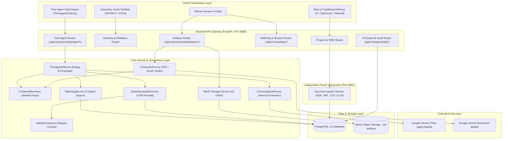
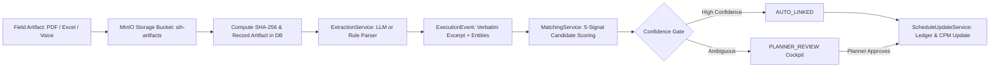
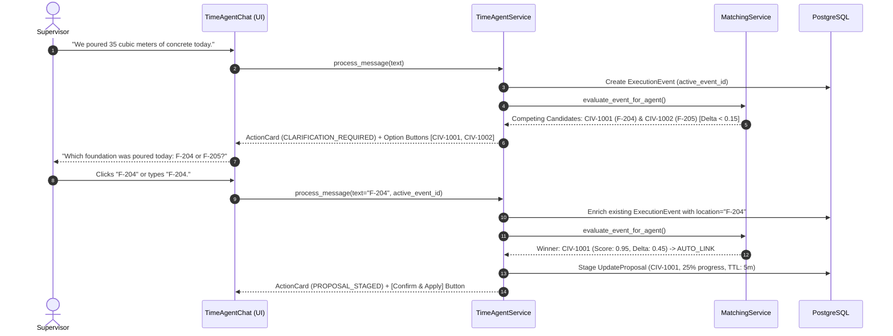
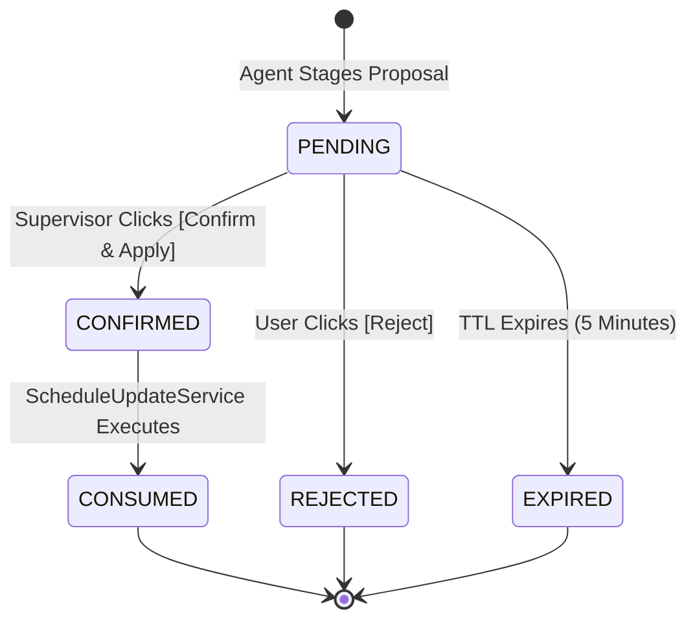
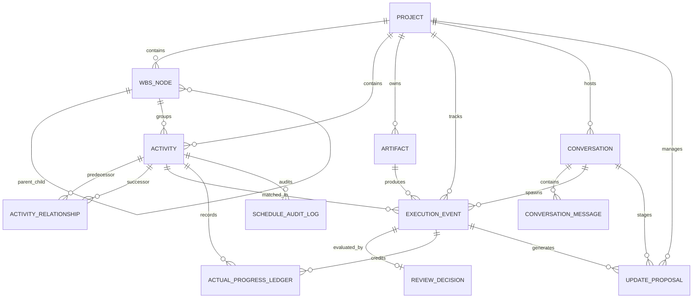

# Primavera Schedule Platform (ScheduleManager) & Time Agent
## Project Knowledge & Presentation Handoff Document (PPT_HANDOFF.md)

**Document Name:** `docs/PPT_HANDOFF.md`  
**Target Audience:** Presentation Authors, Solution Engineers, Technical Speakers, Project Stakeholders  
**Baseline Codebase:** Current `ScheduleManager` Repository (`c:\Users\Gues\Desktop\sihnew\ScheduleManager`)  
**Status:** Hardened Technical Source of Truth for Final Project Presentation / PPT Creation  

---

## Table of Contents
1. [Project Identification](#section-1--project-identification)
2. [Problem Statement & Domain Framing](#section-2--problem-statement--domain-framing)
3. [Existing Workflow / Before Our System](#section-3--existing-workflow--before-our-system)
4. [Our Solution](#section-4--our-solution)
5. [Complete System Architecture](#section-5--complete-system-architecture)
6. [Time Agent](#section-6--time-agent)
7. [Artifact / Field Report Pipeline](#section-7--artifact--field-report-pipeline)
8. [Hybrid Input Model](#section-8--hybrid-input-model)
9. [Matching Engine](#section-9--matching-engine)
10. [Clarification Workflow](#section-10--clarification-workflow)
11. [Active Activity & Conversation Context](#section-11--active-activity--conversation-context)
12. [Date Resolution](#section-12--date-resolution)
13. [Quantity & Progress Semantics](#section-13--quantity--progress-semantics)
14. [Schedule Update & CPM Firewall](#section-14--schedule-update--cpm-firewall)
15. [Proposal & Confirmation Model](#section-15--proposal--confirmation-model)
16. [Database & Domain Model](#section-16--database--domain-model)
17. [API Layer](#section-17--api-layer)
18. [Frontend & User Experience](#section-18--frontend--user-experience)
19. [AI & LLM Architecture](#section-19--ai--llm-architecture)
20. [Security & Identity Model](#section-20--security--identity-model)
21. [Technology Stack](#section-21--technology-stack)
22. [Schedule Import & Export](#section-22--schedule-import--export)
23. [Monitoring & Infrastructure](#section-23--monitoring--infrastructure)
24. [Testing & Verification](#section-24--testing--verification)
25. [Borouge 4 Demo](#section-25--borouge-4-demo)
26. [What is Actually Implemented](#section-26--what-is-actually-implemented)
27. [V1 Limitations & Out of Scope](#section-27--v1-limitations--out-of-scope)
28. [Future Extensions](#section-28--future-extensions)
29. [Key Engineering Innovations & Differentiators](#section-29--key-engineering-innovations--differentiators)
30. [Complete End-to-End Sequence](#section-30--complete-end-to-end-sequence)
31. [PPT Content Map (Slide-by-Slide Guide)](#section-31--ppt-content-map)
32. [Visual Asset Checklist](#section-32--visual-asset-checklist)
33: [Presentation-Safe Terminology](#section-33--presentation-safe-terminology)
34. [Fact vs Claim Control](#section-34--fact-vs-claim-control)
35. [Final Executive Summary](#section-35--final-executive-summary)

---

## SECTION 1 — PROJECT IDENTIFICATION

* **Project Name:** `ScheduleManager` (Primavera Schedule Platform)
* **Short Presentation Title:** **AI-Assisted Schedule Ingestion, Governed Field-Progress Matching & Time Agent**
* **One-Line Description:** An implemented prototype platform for Primavera P6 schedule integration featuring an AI-assisted conversational Time Agent and multi-signal matching engine that converts unstructured site execution events into verified, CPM-safe schedule updates.
* **Executive Summary:**
  Capital construction projects suffer from persistent reporting lags of days or weeks between physical site work and master schedule updates in Primavera P6, leading to stale project baselines and contractual dispute risks. `ScheduleManager` addresses this by pairing MinIO artifact storage (with SHA-256 integrity hashing) with an LLM-assisted conversational **Time Agent** and a deterministic **5-signal candidate matching engine**. Field updates are routed through confidence gates and explicit human confirmation, updating actuals in an append-only progress ledger while strictly defending CPM network logic behind a planned-baseline protection firewall.
* **Problem Statement Identifier:** **SIH 2026 Problem Statement: PS26122** — *AI-driven automated progress tracking and schedule updating from unstructured construction documentation and supervisor updates*.
* **Core Presentation Clarification:** **PS26122 is the problem.** **ScheduleManager is our implemented solution platform.** **Time Agent is a major conversational interface/component within that solution, not the entire solution.**
* **Domain:** Project Controls, Capital Construction Engineering, CPM Scheduling (Oracle Primavera P6 & Microsoft Project).
* **Intended Users / Stakeholders:**
  1. **Site Field Supervisors / Foremen:** Report daily work progress via natural language chat or document uploads (PDF dockets, spreadsheets) without needing P6 licenses or understanding CPM task IDs.
  2. **Lead Project Controls Planners:** Review ambiguous or high-risk progress matches in a dedicated review cockpit, verify source excerpts, and safeguard contractual baseline dates.
  3. **Project Directors & Claims Engineers:** Review append-only progress ledgers and source artifact evidence during billing verification or dispute analysis.
* **Primary Objective:** Reduce the latency, transcription errors, and loss of evidence in construction schedule updating by providing a governed, auditable, and human-in-the-loop bridge between site execution reports and master CPM schedules.

---

## SECTION 2 — PROBLEM STATEMENT & DOMAIN FRAMING

### 2.1 Smart India Hackathon (SIH 2026) Problem Statement: PS26122
* **Official Core Challenge:** Construction site progress tracking currently relies on disparate, unstructured field records (daily logs, subcontractor PDFs, delivery receipts, supervisor notes) that must be reconciled with master project schedules.
* **Core Problem Statement Mandates:**
  1. Heterogeneous field input ingestion (PDFs, spreadsheets, shift notes, audio/voice notes).
  2. Extraction of activity-level actual start, end, and progress events.
  3. Conversational / voice interface powered by Large Language Models (LLMs) for natural supervisor reporting.
  4. Multi-signal / fuzzy entity matching linking execution events to the appropriate L5/L6 planned schedule nodes.
  5. Confidence-based planner review routing for ambiguous or competing candidate activities.
  6. Governed schedule and PMIS updating preserving baseline logic.
  7. Generation of structured actual-progress datasets and audit trails.
* **Architectural Alignment (Problem to Solution):**

```text
PS26122
   ↓
Planning-to-Execution Integration Problem
   ↓
Our Solution: ScheduleManager
   ├── Schedule ingestion (P6 XER, XML, CSV, XLSX)
   ├── Field artifact ingestion (PDF, Excel, CSV, Audio in MinIO)
   ├── ExecutionEvent normalization (Canonical structured entities)
   ├── 5-Signal candidate matching engine (Exact, Text, WBS, Temporal, Context)
   ├── Time Agent (Conversational site engineer & clarification dialog)
   ├── Human clarification & review cockpit (Confidence gating)
   ├── Governed schedule update (CPM baseline protection layer & progress ledger)
   └── Audit trail & native P6 XER export (Downstream synchronization)
```

* **Identified Pain Points in Problem Statement:**
  * Delays of days or weeks before field accomplishments are reflected in the authoritative project schedule.
  * Heavy manual effort required by project controls teams to decipher contractor notes and transcribe them into complex scheduling tools.
  * Disconnect between field reality and office reporting, leading to unexpected project delays, misaligned contractor billing, and lack of contemporaneous records when claims arise.

### 2.2 Our Domain Interpretation & Engineering Framing
To rigorously address the SIH problem statement, our team framed the reconciliation challenge using industry project controls principles:
* **The 6-Tier CPM Schedule Hierarchy:**
  * **L1 (Milestone Schedule):** Executive summary for client leadership and financiers.
  * **L2 (Management Summary):** Phase milestones across major project areas.
  * **L3 (Contractual Baseline Master Schedule):** Contract-binding critical path schedule (typically 1,000–5,000 activities) governing liquidated damages and formal milestones.
  * **L4 (Detailed Execution Schedule):** Work package / trade breakdown (5,000–50,000+ activities) where daily operations are scheduled.
  * **L5 (Work Package / Shift Level):** Weekly work plans and trade crew allocations.
  * **L6 (Field Daily Level):** Hourly inspections, equipment dockets, pour tickets, and turnstile logs.
* **The Structural Disconnect:** Physical work happens at Level 6, while master schedule control resides at Level 3 and Level 4. Field information is naturally informal:
  1. Daily progress PDFs from multiple subcontractors.
  2. Excel cutting lists, pour logs, and delivery dockets.
  3. Voice memos recorded by foremen on active work fronts.
  4. WhatsApp messages and ad-hoc supervisor shift notes.
* **Vocabulary Disconnect:** Site foremen write *"Poured 35 m3 concrete for F-204 today"*, while Primavera P6 defines the task as `CIV-1001: Substructure Concrete - Foundation F-204 Cap Beam`. Foremen rarely know or cite contractual P6 activity IDs.
* **Human Transposition Errors:** In large master schedules with identical or repetitive activity names across multiple work fronts (e.g. 50 bridge piers or equipment foundations), planners can easily credit progress to the wrong task, creating false critical-path delays or premature milestone billings.
* **Loss of Forensic Evidence:** Daily reports are often scattered across local folders and personal email inboxes. When delay claims or disputes arise, linking a specific percentage update back to the physical delivery ticket is difficult and time-consuming.
* **Technical Reconciliation Formulation:** High-dimensional, unstructured execution signals (text, tables, audio) lack deterministic foreign keys to discrete CPM graph nodes (`Activity.id`). The solution requires entity resolution over candidate vertices followed by governed mutation of actuals, strictly preventing unintended changes to dependency networks.

---

## SECTION 3 — EXISTING WORKFLOW / BEFORE OUR SYSTEM

Before `ScheduleManager`, project updating was entirely manual and fragmented:

```
[ Site Execution Front ]
         │
         ▼
[ Daily PDF / Paper Form / Voice Note / Excel ]
         │ (Transported via email, paper handover, or messaging apps)
         ▼
[ Planning Engineer's Inbox ] (Sits unreviewed for days or weeks)
         │
         ▼
[ Manual Interpretation ]
  - Planner attempts to decipher contractor shorthand
  - Searches multi-thousand line P6 activity table by keyword
  - Guesses which pier or foundation was poured
         │
         ▼
[ Manual Schedule Mutation in P6 ]
  - Planner types percent complete and actual dates
  - Risk of unintentionally altering planned dates or logic relationships
  - No direct hyperlink to source evidence file
         │
         ▼
[ Periodic Management Report ] (Stale before it is distributed)
```

### Critical Friction Points
1. **Unstructured Information:** Reports lack standardized formats, units, or codes.
2. **Activity Ambiguity:** Multiple activities share identical names across different project areas (e.g., "Pour Concrete" exists in Pier 1, Pier 2, Pier 3).
3. **Loss of Forensic Provenance:** Once typed into P6, the link between the field document and the schedule percentage is severed.
4. **Risk of Baseline Alteration:** In standard scheduling tools, updating an activity can accidentally alter planned start dates, baseline durations, or logic predecessors if user preferences or calculation options are misconfigured.
5. **Delayed Decision-Making:** Critical path slips are identified long after they occur on site.

---

## SECTION 4 — OUR SOLUTION

`ScheduleManager` establishes a **governed, closed-loop pipeline** linking physical site execution directly to master CPM schedules.

```
       PLANNED SCHEDULE (Primavera P6)
                     │
                     ▼
           [ Schedule Ingestion ]
      (Parse .XER / .XML / .CSV / .XLSX)
                     │
                     ▼
      [ Canonical Schedule in Postgres ]
                     ▲
                     │ Governed Safe Updates
                     │
          [ ScheduleUpdateService ]
          (CPM Baseline Firewall)
                     ▲
                     │ Confirmed Proposals
                     │
            [ Time Agent Engine ]
          (Confidence & Human Review)
                     ▲
                     │ Scored Candidates
                     │
           [ 5-Signal Matcher ]
                     ▲
                     │ Structured Events
                     │
         [ ExecutionEvent Creation ]
                     ▲
          ┌──────────┴──────────┐
          │                     │
[ Conversational Chat ]  [ Field Artifact ]
  (Supervisor Voice/Text)  (PDF / Excel in MinIO)
```

### How Our Solution Solves the Problem:
1. **Source Evidence Retention:** Raw field artifacts are written to MinIO object storage with SHA-256 content hashes before processing, ensuring raw evidence is preserved for verification and audit.
2. **Dual-Input Modality:** Supports both formal document uploads (PDF, Excel spreadsheets, audio recordings) and informal natural language conversations via the **Time Agent**.
3. **Structured Event Projection:** Both paths converge into a canonical `ExecutionEvent` entity containing quantity, unit, execution date, location, discipline, and verbatim excerpts.
4. **Deterministic 5-Signal Matching:** Evaluates activity codes, semantic text similarity, WBS hierarchy, temporal schedule windows, and location/contractor context.
5. **Confidence-Gated Governance:**
   * **High Confidence ($S_{\text{total}} \ge 0.85, \Delta \ge 0.15, C_{\text{ext}} \ge 0.80$):** Auto-linked.
   * **Ambiguous / Competing Candidates:** The Time Agent asks targeted clarifying questions to the supervisor, or routes the event to the planner review cockpit.
6. **Proposal & Confirmation Guardrail:** Updates are staged as temporary `UpdateProposal` records (5-minute TTL). Progress cannot touch the authoritative schedule without explicit human confirmation.
7. **CPM Baseline Protection Firewall:** Updates mutate *only* actual progress fields (`percent_complete`, `actual_start`, `actual_finish`, `status`). Planned baselines, logic links, and durations are shielded from field edits.
8. **Append-Only Auditing:** Every applied update writes to an append-only `ActualProgressLedger`, a `ScheduleAuditLog`, and a transactional `DomainOutbox` for downstream synchronization and P6 XER export.

---

## SECTION 5 — COMPLETE SYSTEM ARCHITECTURE



### Architectural Subsystems Verified in Codebase:
1. **Frontend (`frontend/`):** Next.js 14 App Router, TypeScript, Tailwind CSS, multi-tab workspace (`overview`, `wbs`, `activities`, `gantt`, `reports`, `time_agent`).
2. **Backend API (`backend/app/api/`):** FastAPI asynchronous endpoints with full CORS, exception handlers, and Pydantic validation schemas.
3. **Document Parser Service (`document-parser/`):** Standalone FastAPI service container parsing P6 XER, P6 XML, CSV, and XLSX formats into canonical schedule JSON.
4. **PostgreSQL 16 (`backend/app/domain/models.py`):** Authoritative relational database containing 13 production domain models.
5. **MinIO Object Store (`backend/app/services/minio_service.py`):** S3-compatible storage holding raw field artifacts with SHA-256 deduplication and 15-minute presigned viewing URLs.
6. **Credential Resolver (`backend/app/services/credential_resolver.py`):** Hardened server-side authority isolating API credentials between Time Agent and ExtractionService.

---

## SECTION 6 — TIME AGENT

### What Time Agent Is
The Time Agent is an intelligent, conversational construction execution agent built directly into the `ScheduleManager` interface. It acts as an interactive assistant that listens to supervisors, extracts structured operational data, matches it against schedule candidates, asks clarifying questions when details are ambiguous, and stages governed update proposals for human confirmation.

### Why It Exists
Field supervisors work on active, noisy construction fronts. They rarely have the time, training, or software access to navigate complex Primavera P6 schedules. The Time Agent enables supervisors to report progress in plain English (or upload daily field documents/dockets) from any mobile device or browser, translating field language into candidate CPM updates.

### What Users Can Say to It (Verified Examples from Code & Specs)
* *"We completed 35 cubic meters of concrete for F-204 today."* (Direct quantity report)
* *"We installed 18m of cable tray CT-07 today."* (Linear installation)
* *"SP-24-018 was erected today."* (Direct component erection)
* *"Update this activity to 80%."* (Direct percentage progress update against active UI context)
* *"F-204."* (Clarification answer in response to an agent question)

### Supported Intents (`backend/app/schemas/agent.py`)
1. **`INFORMATION_QUERY`:** Supervisor asks for schedule dates, activity progress, durations, or upcoming tasks.
2. **`PROGRESS_REPORT`:** Supervisor reports physical construction work performed (quantities, components, milestones).
3. **`PROGRESS_UPDATE_REQUEST`:** Supervisor directly requests a percentage or status update on a specific task.
4. **`CLARIFICATION_RESPONSE`:** Supervisor provides missing details (activity code, location, quantity semantics) in response to an agent clarification question.
5. **`ARTIFACT_SUBMISSION`:** Supervisor uploads or references a site document, inspection ticket, or delivery docket.

### Architectural Principle: LLM vs. Deterministic Service Responsibilities

```
┌────────────────────────────────────────────────────────┐
│             WHAT THE LLM (GEMINI) DOES                 │
│  - Natural Language Intent Classification              │
│  - Extraction of entities (Quantity, Unit, Date, Loc)  │
│  - Natural Language Clarification Generation           │
│  - Conversational Dialog Assistance                    │
└──────────────────────────┬─────────────────────────────┘
                           │ Pure Extraction / Parsing
                           ▼
┌────────────────────────────────────────────────────────┐
│         WHAT DETERMINISTIC BACKEND SERVICES DO         │
│  - Candidate Retrieval & Filtering (SQL)               │
│  - 5-Signal Scoring Engine (Mathematical Formula)      │
│  - Confidence Gating & Ambiguity Thresholds            │
│  - Temporal Date Resolution (Against Data Date)        │
│  - Quantity Math & Percentage Calculations             │
│  - Proposal Generation & Row-Locked Concurrency        │
│  - CPM Baseline Protection & Database Commit           │
│  - Ledger, Audit Log & Outbox Event Emission           │
└────────────────────────────────────────────────────────┘
```
**CRITICAL PRESENTATION POINT:** **The LLM cannot directly mutate the authoritative schedule.** Gemini is strictly restricted to language understanding and entity extraction; deterministic backend services govern candidate scoring, math calculations, and schedule database mutations.

---

## SECTION 7 — ARTIFACT / FIELD REPORT PIPELINE

The artifact pipeline ingests formal documents and stores them with cryptographic integrity:



### Supported Formats Verified in Codebase:
* **Digital & Scanned PDF (`.pdf`):** Processed via `pypdf` text extraction, then parsed with Google Gemini structured JSON extraction.
* **Spreadsheets (`.xlsx`, `.xls`, `.csv`):** Processed via `openpyxl` / `csv`, extracting contractor quantity logs, dates, and pour lists.
* **Worker Voice Memos (`.m4a`, `.mp3`, `.wav`):** Audio binary is securely saved in MinIO with SHA-256 hashing; placeholder event metadata is recorded (Speech-to-Text transcription is slated for V1.1).
* **Text / Shift Notes (`.txt`):** Direct UTF-8 ingestion and entity extraction.

---

## SECTION 8 — HYBRID INPUT MODEL

`ScheduleManager` supports three distinct source modalities in `ExecutionEvent.source_type`:

| Source Type | Description | Provenance Stored | Schema Handling |
| :--- | :--- | :--- | :--- |
| **`ARTIFACT`** | Generated from uploaded files (PDF, spreadsheet, audio). | `artifact_id`, `storage_key`, `file_sha256`, `page_number`, `bounding_box`. | Mandatory artifact metadata; `conversation_id` is null. |
| **`CONVERSATION`** | Generated from direct supervisor chat messages. | `conversation_id`, `message_id`. | Artifact fields (`artifact_id`, `storage_key`, `page_number`) are explicitly `nullable=True`. |
| **`HYBRID`** | Generated when a supervisor uploads a document attachment inside a chat thread or enriches a document event via conversation. | `artifact_id`, `storage_key`, `file_sha256`, `conversation_id`, `message_id`. | Both artifact provenance and conversational session tracking are populated simultaneously. |

**Convergence:** Regardless of whether work is reported via an uploaded PDF or a chat message, both paths produce an identical `ExecutionEvent` schema and enter the same downstream matching and schedule-update pipeline.

---

## SECTION 9 — MATCHING ENGINE

The `MatchingService` (`backend/app/services/matching_service.py`) performs entity resolution between field execution events and schedule activities.

### 1. Candidate Retrieval
* Filters activities within the target project where `status != 'COMPLETED'`.
* Applies a temporal window: `planned_start <= execution_date + 30 days` and `planned_finish >= execution_date - 30 days`.
* If temporal filtering yields zero activities, it safely falls back to all active activities in the project.

### 2. The 5-Signal Scoring Engine

The total match score $S_{\text{total}} \in [0.0, 1.0]$ combines 5 independent signals:

$$S_{\text{total}} = w_{\text{id}} S_{\text{id}} + w_{\text{text}} S_{\text{text}} + w_{\text{wbs}} S_{\text{wbs}} + w_{\text{temp}} S_{\text{temp}} + w_{\text{context}} S_{\text{context}}$$

| Signal | Name | Description | Scoring Logic in Code |
| :--- | :--- | :--- | :--- |
| **$S_{\text{id}}$** | Exact Code Match | Explicit activity code cited in field report or text. | $1.0$ if `reported_activity_code == activity_code` or activity code appears verbatim in excerpt; otherwise $0.0$. |
| **$S_{\text{text}}$** | Text Similarity | Token-overlap and semantic similarity between narrative and activity name. | Token Jaccard + substring ratio over description, verbatim excerpt, and activity reference. |
| **$S_{\text{wbs}}$** | WBS & Hierarchy | Alignment between event WBS hint / discipline and activity WBS node. | $1.0$ if WBS hint matches WBS name; $0.95$ if location matches WBS; $0.85$ if discipline matches; $0.50$–$0.90$ based on text score. |
| **$S_{\text{temp}}$** | Temporal Compatibility | Whether execution date falls within activity planned start/finish. | $1.0$ if within planned window; Gaussian decay penalty for dates outside the window. |
| **$S_{\text{context}}$** | Contextual Alignment | Matching physical location and subcontractor name. | $1.0$ if location matches activity name/location code; $+0.2$ bonus if subcontractor matches. |

### 3. Configured Scoring Weights
* **When Exact Code is Present ($S_{\text{id}} = 1.0$):**
  $$S_{\text{total}} = \max\left(0.95, 0.40 S_{\text{id}} + 0.30 S_{\text{text}} + 0.15 S_{\text{wbs}} + 0.10 S_{\text{temp}} + 0.05 S_{\text{context}}\right)$$
  *(Guarantees an exact code match always scores $\ge 0.95$)*
* **When No Code is Present ($S_{\text{id}} = 0.0$):**
  $$S_{\text{total}} = 0.45 S_{\text{text}} + 0.25 S_{\text{wbs}} + 0.15 S_{\text{temp}} + 0.15 S_{\text{context}}$$

### 4. Confidence Routing Rules
Candidates are sorted descending by $S_{\text{total}}$. The margin delta $\Delta = S_{\text{top}} - S_{\text{second}}$ measures separation:
* **`AUTO_LINK` Threshold:**
  $$S_{\text{total}} \ge 0.85 \quad \wedge \quad \Delta \ge 0.15 \quad \wedge \quad C_{\text{ext}} \ge 0.80$$
  *(Score $\ge 85\%$, margin over runner-up $\ge 15\%$, extraction confidence $\ge 80\%$)*
* **`PLANNER_REVIEW` Routing:**
  Triggered if $S_{\text{total}} < 0.85$, or $\Delta < 0.15$ (competing ambiguity), or $C_{\text{ext}} < 0.80$.

### 5. Safe Non-Finalizing Evaluation for Time Agent
Standard batch matching (`evaluate_event()`) mutates the database event status to `AUTO_LINKED` or `IN_REVIEW`. For the Time Agent, `MatchingService.evaluate_event_for_agent()` was introduced:
* Evaluates candidates, computes scores, and determines routing.
* **Does NOT mutate `event.status` and does NOT call `db.commit()`**.
* Allows repeated evaluation during conversational clarification without premature state finalization.

---

## SECTION 10 — CLARIFICATION WORKFLOW

When an event is ambiguous (e.g. multiple competing foundation pours), the Time Agent does not guess. It initiates a structured clarification loop:



### Clarification Invariants:
1. **Same Logical Event Enrichment:** Subsequent turns update the *same* `ExecutionEvent` record (tracked via `Conversation.active_event_id`) rather than spawning orphaned duplicate events.
2. **Maximum Turn Bound:** `Conversation.clarification_turns` is capped at **3 turns**. If ambiguity remains unresolved after 3 turns, the agent escalates the event to `PLANNER_REVIEW` in the main cockpit.
3. **No Unchecked Guessing:** The agent never silently picks a candidate activity when $\Delta < 0.15$.

---

## SECTION 11 — ACTIVE ACTIVITY & CONVERSATION CONTEXT

### UI Context Binding
When a user opens the Time Agent chat from the Gantt chart or Activities table, the frontend sends an optional `active_activity_id` anchor.

### Critical Safety Invariant: Context is NOT Evidence
* An active UI selection is **conversational context, NOT forensic evidence**.
* The presence of `active_activity_id` does **not** grant an exact match score ($S_{\text{id}} = 1.0$).
* **Precedence Rule:** If a supervisor explicitly writes an activity code (e.g. *"Poured F-205 today"*) while viewing activity `F-204` on screen, the **explicitly reported text takes precedence** over the UI anchor.
* The anchor is only used to resolve relative pronouns (e.g., *"Update this activity to 80%"* or *"Completed today"*).

---

## SECTION 12 — DATE RESOLUTION

Schedule updating requires strict temporal discipline:
1. **Explicit ISO Date:** Dates in `YYYY-MM-DD` format (e.g. `2024-06-01`) resolve directly.
2. **Relative Day Terms ("today", "yesterday"):**
   * Resolved against `Project.data_date` (the schedule cutoff date) if present.
   * If `project.data_date` is not set, falls back to current UTC date.
   * **Why this matters:** When demoing or updating an archive project from 2024, "today" must resolve to the project's data date (e.g., June 1, 2024), **not** the physical calendar year of the machine running the code.
3. **Weekday References ("on Monday"):** Resolves to the most recent prior occurrence relative to `project.data_date`.
4. **Deterministic Resolution:** Date parsing is handled by deterministic Python code in `ConversationalParser.resolve_temporal_date()`, avoiding LLM date errors.

---

## SECTION 13 — QUANTITY & PROGRESS SEMANTICS

The `ScheduleUpdateService` implements strict mathematical progress calculation based on activity physical quantities:

### 1. Incremental vs. Cumulative Semantics
* **`INCREMENTAL` (Default for daily shift reports):**
  $$\text{New Installed} = \text{Previous Installed} + \Delta Q$$
  $$\text{New } \% = \min\left(100.0, \text{Previous } \% + \left(\frac{\Delta Q}{Q_{\text{planned}}}\right) \times 100\right)$$
* **`CUMULATIVE` (Total progress to date):**
  $$\Delta Q = Q_{\text{reported}} - Q_{\text{previous}}$$
  $$\text{New } \% = \min\left(100.0, \left(\frac{Q_{\text{reported}}}{Q_{\text{planned}}}\right) \times 100\right)$$

### 2. Validation & Safety Invariants:
* **Negative Delta Rejection:** If reported cumulative quantity is less than previously recorded installed quantity ($Q_{\text{cum}} < Q_{\text{prev}}$), the update is rejected (`ValidationException`). Site progress cannot go backwards.
* **Equal Quantity Handling:** If $Q_{\text{cum}} == Q_{\text{prev}}$, incremental progress is $0.0$ and percentage remains unchanged.
* **Quantity Overrun / Capping:** If installed quantity exceeds planned quantity ($Q_{\text{installed}} > Q_{\text{planned}}$), progress caps cleanly at $100.0\%$ (cannot exceed 100%).

### Borouge 4 Demo Example:
* Planned Quantity ($Q_{\text{planned}}$): $140.0\text{ m}^3$
* Baseline Progress: $0.0\%$ ($0.0\text{ m}^3$ installed)
* Reported Incremental Pour: $35.0\text{ m}^3$
* Resulting Progress Delta: $\left(\frac{35.0}{140.0}\right) \times 100 = \mathbf{25.0\%}$
* Resulting Status: `IN_PROGRESS`

---

## SECTION 14 — SCHEDULE UPDATE & CPM FIREWALL

### The CPM Baseline Protection Layer
In critical path scheduling, unvalidated updates can corrupt planned project logic. The **CPM Firewall** is an architectural barrier enforced by `ScheduleUpdateService`:

```
┌──────────────────────────────────────────────────────────────────┐
│                   THE CPM BASELINE FIREWALL                      │
├─────────────────────────────────┬────────────────────────────────┤
│ MUTABLE (Actual Progress Fields) │ IMMUTABLE (Contract Baselines) │
├─────────────────────────────────┼────────────────────────────────┤
│  percent_complete               │  planned_start                 │
│  actual_start                   │  planned_finish                │
│  actual_finish                  │  original_duration             │
│  status (IN_PROGRESS/COMPLETED) │  calendar                      │
│                                 │  predecessor/successor links   │
│                                 │  relationship lag              │
└─────────────────────────────────┴────────────────────────────────┘
```
**RULE:** **Schedule updates are constrained by a CPM baseline protection layer.** Field updates can alter only actual progress fields (`percent_complete`, `actual_start`, `actual_finish`, `status`). Planned start dates, planned finish dates, durations, and logic links are shielded from field edits.

### Governed Mutation Steps (Executed in a Single Database Transaction):
1. **Idempotency Check:** Queries `ActualProgressLedger` for `(activity_id, execution_event_id)`. If present, immediately aborts duplicate write.
2. **Progress Math:** Calculates new bounded cumulative percent complete ($0.0 \le \% \le 100.0$).
3. **Actual Date Setting:** Sets `actual_start` on first progress; sets `actual_finish` when reaching $100.0\%$.
4. **Append-Only Ledger Entry:** Writes to `ActualProgressLedger`.
5. **Audit Logging:** Writes previous state and new state JSON to `ScheduleAuditLog`.
6. **Outbox Emission:** Inserts `SCHEDULE_PROGRESS_UPDATED` event into `DomainOutbox`.
7. **Event Status Update:** Transitions `ExecutionEvent.status = 'APPLIED'`.

---

## SECTION 15 — PROPOSAL & CONFIRMATION MODEL

To ensure that neither AI extractions nor supervisor typos directly alter the master schedule, updates are staged as **UpdateProposals** requiring human confirmation.



### Proposal Security & Concurrency Controls
1. **5-Minute TTL:** Staged proposals expire after 300 seconds (`expires_at`), preventing stale updates from lingering.
2. **Baseline Snapshot:** Every proposal stores `baseline_activity_state` JSON (the activity's exact percent, status, and dates at the moment the proposal was generated).
3. **Stale Proposal Conflict Detection:** At confirmation time, the engine compares the activity's *current* state against the snapshot. If another engineer updated the activity in the interim, the proposal is rejected (`HTTP 409 Conflict`).
4. **Row-Level Concurrency Locking (`SELECT FOR UPDATE`):** When `/confirm` is called, the proposal row is locked at the database level. Concurrent requests cannot execute the same proposal twice.
5. **Caller Transaction Ownership:** Proposal status transition to `CONSUMED` and schedule update execution occur in the **same atomic database transaction** (`commit=False` parameter pattern).

---

## SECTION 16 — DATABASE & DOMAIN MODEL

The relational schema in PostgreSQL 16 contains **13 production models**:



### Entity Reference Table

| Entity | Table Name | Purpose | Critical Fields |
| :--- | :--- | :--- | :--- |
| **`Project`** | `projects` | Master project schedule container. | `project_code`, `data_date`, `planned_start`, `planned_finish`. |
| **`WBSNode`** | `wbs` | Hierarchical Work Breakdown Structure tree. | `code`, `name`, `parent_id`, `project_id`. |
| **`Activity`** | `activities` | CPM schedule task (leaf node). | `activity_code`, `name`, `status`, `planned_start/finish`, `actual_start/finish`, `percent_complete`, `planned_quantity`. |
| **`ActivityRelationship`** | `relationships` | CPM logic link between activities. | `predecessor_id`, `successor_id`, `relationship_type` (FS/SS/FF/SF), `lag`. |
| **`Artifact`** | `artifacts` | Raw document metadata stored in MinIO with SHA-256 content hashes. | `storage_key`, `sha256`, `mime_type`, `size_bytes`, `extraction_status`. |
| **`ExecutionEvent`** | `execution_events` | Discrete site execution work item. | `verbatim_excerpt`, `quantity`, `unit`, `execution_date`, `location`, `status`, `source_type` (ARTIFACT/CONVERSATION/HYBRID). |
| **`ReviewDecision`** | `review_decisions` | Planner review sign-off for ambiguous events. | `decision` (APPROVED/REJECTED/REASSIGNED), `reviewer_id`, `notes`. |
| **`ActualProgressLedger`** | `actual_progress_ledger` | Append-only progress ledger by application design. | `installed_quantity`, `incremental_percent`, `cumulative_percent`, composite unique key `(activity_id, execution_event_id)`. |
| **`ScheduleAuditLog`** | `schedule_audit_log` | Append-only audit trail recording before/after state diffs for all changes. | `previous_state` (JSON), `new_state` (JSON), `user_id`, `timestamp`. |
| **`DomainOutbox`** | `domain_outbox` | Transactional outbox for event streaming. | `event_type`, `aggregate_id`, `payload` (JSON), `status` (PENDING). |
| **`Conversation`** | `conversations` | Time Agent chat session container. | `project_id`, `user_id`, `active_activity_id`, `active_event_id`, `clarification_turns`, `status`. |
| **`ConversationMessage`** | `conversation_messages` | Individual chat turns in conversation. | `sender` (USER/AGENT/SYSTEM), `content`, `message_metadata` (JSON). |
| **`UpdateProposal`** | `update_proposals` | Staged schedule update awaiting confirmation (5m TTL). | `proposed_state` (JSON), `baseline_activity_state` (JSON), `status` (PENDING/CONFIRMED/CONSUMED/EXPIRED), `expires_at`. |

---

## SECTION 17 — API LAYER

The backend exposes a comprehensive, RESTful FastAPI interface across modular routers:

### 1. Time Agent Router (`backend/app/api/agent.py`)
* `POST /api/v1/projects/{project_id}/agent/conversations`: Initializes or resumes an active conversation session.
* `GET /api/v1/projects/{project_id}/agent/conversations/{conversation_id}`: Fetches conversation details and message history.
* `POST /api/v1/projects/{project_id}/agent/conversations/{conversation_id}/messages`: Submits supervisor chat turn; returns agent response and action card.
* `POST /api/v1/projects/{project_id}/agent/conversations/{conversation_id}/attachments`: Uploads field report documents (PDF, Excel, CSV) or audio files within chat; returns hybrid execution event.
* `POST /api/v1/projects/{project_id}/agent/conversations/{conversation_id}/confirm`: Atomically locks, validates, and applies a staged proposal (or rejects it).

### 2. Schedule Import & Management Routers (`backend/app/api/projects.py`, `wbs.py`, `activities.py`, `relationships.py`)
* `POST /projects/import`: Multi-format file upload (`.xer`, `.xml`, `.csv`, `.xlsx`); orchestrates parsing and relational DB population.
* `GET /projects`: Lists all imported projects with aggregate activity and WBS counts.
* `GET /projects/{project_id}`: Detailed project metadata.
* `DELETE /projects/{project_id}`: Deletes a project and cascades cleanup across associated schedule records.
* `GET /projects/{project_id}/wbs`: Lists WBS nodes for a project.
* `GET /projects/{project_id}/wbs/tree`: Hierarchical WBS tree with nested child nodes and activity counts.
* `GET /projects/{project_id}/activities`: Filtered, sorted, and paginated activity table.
* `GET /activities/{activity_id}`: Details for a specific activity.
* `PATCH /activities/{activity_id}`: Governed activity update with percent bounds validation.
* `GET /projects/{project_id}/relationships`: Network predecessor/successor logic links.

### 3. Artifact & Review Routers (`backend/app/api/artifacts.py`, `matching.py`, `review.py`)
* `POST /api/v1/projects/{project_id}/artifacts/upload`: Uploads raw field artifacts to MinIO; records SHA-256 hash in PostgreSQL.
* `GET /api/v1/projects/{project_id}/artifacts`: Lists artifacts associated with a project.
* `GET /api/v1/projects/{project_id}/artifacts/{artifact_id}`: Retrieves metadata for a specific artifact.
* `GET /api/v1/projects/{project_id}/artifacts/{artifact_id}/url`: Generates temporary presigned MinIO S3 viewing URL (15-minute expiry).
* `GET /api/v1/artifacts/download`: Download proxy for stored artifact bytes.
* `POST /api/v1/matching/evaluate`: Triggers 5-signal candidate evaluation and confidence routing on execution events.
* `GET /api/v1/review/queue`: Lists pending ambiguous events requiring human planner review.
* `POST /api/v1/review/decisions`: Planner review cockpit decision recording (Approve / Reject).

### 4. Export & Audit Routers (`backend/app/api/export.py`)
* `GET /api/v1/projects/{project_id}/audit-trail`: Fetches comprehensive change history from `ScheduleAuditLog`.
* `GET /api/v1/projects/{project_id}/export/xer`: Generates and streams an Oracle Primavera P6 XER file reflecting verified progress updates across supported core tables.

---

## SECTION 18 — FRONTEND / USER EXPERIENCE

The frontend (`frontend/`) is a Next.js 14 web application providing a unified project cockpit:

```
┌────────────────────────────────────────────────────────────────────────┐
│                        SCHEDULEMANAGER COCKPIT                         │
├───────────┬──────────────┬──────────────┬──────────┬─────────┬─────────┤
│ Overview  │ WBS Explorer │  Activities  │  Gantt   │ Reports │ Time Ag.│
├───────────┴──────────────┴──────────────┴──────────┴─────────┴─────────┤
│                                                                        │
│   [ GANTT CHART VIEW / TIMELINE ]                                      │
│   ========================================================             │
│   CIV-1001: Foundation Pour F-204       [==== 25% ====]                │
│   CIV-1002: Foundation Pour F-205       [ 0%          ]                │
│                                                                        │
│ ┌────────────────────────────────────────────────────────────────────┐ │
│ │ TIME AGENT SLIDE-OVER DRAWER (TimeAgentChat.tsx)                   │ │
│ │                                                                    │ │
│ │ [Agent]: What work was completed on site today?                    │ │
│ │ [User] : We poured 35 m3 concrete today.                           │ │
│ │ [Agent]: Did this apply to F-204 or F-205?                         │ │
│ │          (Option Button: [F-204]) (Option Button: [F-205])         │ │
│ │ [User] : [Clicks F-204]                                            │ │
│ │ [Agent]: Staged Update Proposal:                                   │ │
│ │          Activity: CIV-1001 (Foundation F-204)                     │ │
│ │          Delta   : +35 m3 (0% -> 25%)                              │ │
│ │          [Confirm & Apply] [Reject]                                │ │
│ │ [User] : [Clicks Confirm & Apply]                                  │ │
│ │ [Agent]: Update Applied! Gantt refreshed.                          │ │
│ └────────────────────────────────────────────────────────────────────┘ │
└────────────────────────────────────────────────────────────────────────┘
```

### Key Frontend Features:
1. **Embedded & Global Time Agent Drawer:** Available both as a dedicated full-page tab and as a persistent floating slide-out drawer accessible across Gantt, WBS, and Activity views.
2. **Interactive Action Cards:** Proposals render with current percent, proposed percent, quantity delta, execution date, and confidence badges.
3. **Clarification Quick-Buttons:** Renders selectable candidate buttons during ambiguity, minimizing typing for site supervisors on mobile devices.
4. **Live Gantt Refresh:** Calling proposal confirmation automatically refreshes the DHTMLX Gantt timeline to reflect newly applied progress immediately.

---

## SECTION 19 — AI / LLM ARCHITECTURE

### Provider & Model Configuration
* **LLM Provider:** Google Gemini API.
* **Time Agent Model (`TIME_AGENT_LLM_MODEL`):** `gemini-2.5-flash` (Optimized for low-latency conversational classification, JSON extraction, and dialog generation).
* **Extraction Model (`EXTRACTION_LLM_MODEL`):** `gemini-3.5-flash` (Optimized for deep document parsing, complex tabular analysis, and multi-event extraction).

### Hardened Credential Isolation (`CredentialResolver`)
The repository enforces independent server-side credentials:
* `TIME_AGENT_GEMINI_API_KEY`: Dedicated key used exclusively by the conversational Time Agent.
* `EXTRACTION_GEMINI_API_KEY`: Dedicated key used exclusively by the document extraction service.
* **Legacy Fallback Governance:** Shared `GEMINI_API_KEY` is maintained strictly as a temporary backward-compatibility mechanism.
* **Production Protection:** In production (`ENVIRONMENT=production`), fallback to `GEMINI_API_KEY` is **strictly disabled** unless explicitly enabled via `ALLOW_LEGACY_GEMINI_FALLBACK=true`.
* **Zero Secret Leakage:** Gemini keys are transmitted via `x-goog-api-key` HTTP headers (never in URL query strings) and are never logged or exposed in client responses.

---

## SECTION 20 — SECURITY / IDENTITY MODEL

### Current V1 Identity Architecture (Accurate Representation)
* **Prototype / Trusted Caller Identity:** The current V1 implementation identifies actors via request headers (`X-User-ID`, `X-User-Role`) and form parameters (`uploaded_by`, `user_id`, `reviewer_id`).
* **Default Actors:**
  * Field Supervisor: `site-supervisor` / `supervisor-salem`
  * Project Planner: `planner-user`
* **Project Scope Authorization:** Endpoints validate that all requested activities, events, and proposals strictly belong to the specified `project_id`. Cross-project mutation attempts return `HTTP 404 / 422`.
* **Honest Representation for PPT:** V1 implements a **functional prototype authorization boundary** suitable for testing, evaluation, and controlled demonstrations. Production OAuth2/OIDC/JWT authentication is a documented future roadmap capability.

---

## SECTION 21 — TECHNOLOGY STACK

| Layer | Technology | Version / Spec | Role in ScheduleManager |
| :--- | :--- | :--- | :--- |
| **Frontend Framework** | Next.js | 14.1.0 | React application framework hosting the project controls dashboard. |
| **Language (Frontend)**| TypeScript | 5.3.3 | Type-safe UI components, API clients, and domain interfaces. |
| **Styling** | Tailwind CSS | 3.4.1 | Responsive, modern project controls UI styling. |
| **Timeline View** | DHTMLX Gantt / SVG | Latest | Interactive CPM Gantt chart visualization with logic links. |
| **Backend Framework** | FastAPI | 0.110.0 | High-performance asynchronous REST API framework. |
| **Language (Backend)** | Python | 3.12 | Core backend business logic, math calculations, and AI orchestration. |
| **ORM / Database** | SQLAlchemy | 2.0.28 | Object-relational mapping, relationship cascades, and unit-of-work transactions. |
| **Database** | PostgreSQL | 16-alpine | Authoritative relational database for projects, activities, and ledgers. |
| **Object Storage** | MinIO | Latest | S3-compatible object store for raw field artifact retention with SHA-256 hashing. |
| **AI / LLM** | Google Gemini | 2.5-flash / 3.5-flash | Natural language intent classification and document field extraction. |
| **HTTP Client** | HTTPX | 0.27.0 | Resilient HTTP client for inter-service and Gemini API communication. |
| **PDF Processing** | PyPDF | Latest | Document parsing and page text extraction for site reports. |
| **Spreadsheet Engine** | openpyxl / csv | Latest | Multi-sheet Excel workbook and CSV progress log parsing. |
| **Container Architecture**| Docker & Compose | Compose v2 | Deployment with five containers/services (`frontend`, `backend`, `document-parser`, `postgres`, `minio`). |
| **Testing** | Pytest | 9.1.1 | Automated unit, integration, and E2E test suite. |

---

## SECTION 22 — SCHEDULE IMPORT & EXPORT

### Supported Formats & Normalization
The `document-parser` service normalizes incoming schedule files into a unified canonical JSON schema:
1. **Primavera P6 `.xer`:** Parses `%T`, `%F`, `%R`, `%E` blocks across `PROJECT`, `PROJWBS`, `TASK`, and `TASKPRED` tables.
2. **Primavera P6 `.xml`:** Hierarchical XML schema parsing `<Project>`, `<WBS>`, `<Activity>`, and `<Relationship>`.
3. **Primavera `.csv`:** Header-aware CSV parser mapping standard P6 column aliases.
4. **Excel `.xlsx`:** Multi-sheet spreadsheet parser supporting tabular schedule rows.

### Roundtrip P6 XER Export (`backend/app/api/export.py`)
`ScheduleManager` can export its database state back into a native, syntactically valid Oracle Primavera P6 XER file:
* **Exported Tables:** `%T PROJECT`, `%T PROJWBS`, `%T TASK`, `%T TASKPRED`.
* **Progress Fidelity:** Successfully preserves updated `status_code`, `act_start_date`, `act_end_date`, and `percent_complete` alongside original planned dates and logic relationships.
* **Roundtrip Testing:** Roundtrip-tested in `tests/test_xer_export_roundtrip.py` for the supported core XER tables and relationships (`PROJECT`, `PROJWBS`, `TASK`, `TASKPRED`). Advanced P6 features like complex resource leveling curves or user-defined fields (UDFs) are not covered in V1.

---

## SECTION 23 — MONITORING & INFRASTRUCTURE

### Docker Compose Architecture (`docker-compose.yml`)

The platform is deployed using Docker Compose with five containers/services:

```
┌────────────────────────────────────────────────────────┐
│               DOCKER BRIDGE NETWORK                    │
├────────────────────┬───────────────────────────────────┤
│ Container Name     │ Internal Port / Exposed Port      │
├────────────────────┼───────────────────────────────────┤
│ primavera-postgres │ 5432:5432 (PostgreSQL 16)         │
│ primavera-minio    │ 9000:9000 (API) / 9001:9001 (Web) │
│ primavera-parser   │ 8001:8001 (document-parser API)   │
│ primavera-backend  │ 8000:8080 (Backend API & Docs)    │
│ primavera-frontend │ 3000:3000 (Next.js Dashboard)     │
└────────────────────┴───────────────────────────────────┘
```

---

## SECTION 24 — TESTING AND VERIFICATION

The codebase contains a comprehensive automated test suite executed via Pytest.

### Test Results Summary:
* **Total Backend Tests:** **42 Tests**
* **Passing Tests:** **42 Passed (100% Pass Rate)**
* **Execution Time:** ~3.51 seconds

### Test Suites Breakdown:
1. **`test_credential_resolver.py` (9 Tests):** Verifies dedicated keys, one key missing, legacy fallback, production fallback blocking, independent models, explicit overrides, zero real Gemini calls, and secret suppression in logs.
2. **`test_time_agent.py` (13 Tests):** Verifies conversational clarification turns, proposal staging, row-level locking, stale proposal conflict detection, incremental/cumulative quantity math, temporal resolution against data date, and cross-project validation.
3. **`test_extraction_matching_integration.py` (10 Tests):** Verifies artifact hashing, MinIO storage, 5-signal matching, auto-link thresholds, review cockpit routing, and progress ledger updates.
4. **`test_xer_export_roundtrip.py` (2 Tests):** Verifies core multi-table XER generation and relationship link preservation.
5. **`test_import_e2e.py` (2 Tests):** Verifies end-to-end schedule ingestion and database population.
6. **`test_activities_api.py` (3 Tests):** Verifies activity CRUD, filtering, pagination, and sorting.
7. **`test_relationships_api.py` (2 Tests):** Verifies logic link creation and predecessor loops.
8. **`test_validation.py` (1 Test):** Verifies activity date logic and percent complete bounds validation.

---

## SECTION 25 — BOROUGE 4 DEMO

The **Borouge 4 Petrochemical Expansion Project** is the benchmark end-to-end demonstration (`scratch/run_borouge_demo.py`):

```
┌────────────────────────────────────────────────────────────────────────┐
│               BOROUGE 4 DEMO EXECUTION WALKTHROUGH                     │
├────────────────────────────────────────────────────────────────────────┤
│ 1. Project Baseline Initialized:                                       │
│    Project Code: BOROUGE4_DEMO (Data Date: 2024-06-01)                 │
│    Activity 1  : CIV-1001 - Foundation Pour F-204 (Planned: 140 m3)    │
│    Activity 2  : CIV-1002 - Foundation Pour F-205 (Planned: 120 m3)    │
│    Initial State: Both activities 0.0% Complete, NOT_STARTED           │
├────────────────────────────────────────────────────────────────────────┤
│ 2. Turn 1 (Ambiguous Supervisor Utterance):                            │
│    Supervisor: "We poured 35 cubic meters of concrete today."          │
│    Agent Action: Identifies ambiguity between F-204 & F-205.           │
│    Agent Reply: "Which foundation was poured today: F-204 or F-205?"   │
├────────────────────────────────────────────────────────────────────────┤
│ 3. Turn 2 (Clarification & Disambiguation):                            │
│    Supervisor: "F-204."                                                │
│    Agent Action: Re-evaluates same ExecutionEvent with location="F-204"│
│    Scoring Result: S_total = 0.95, Delta = 0.45 -> AUTO_LINK Target   │
│    Proposal Staged: Activity CIV-1001, +35 m3, Progress: 0% -> 25%     │
├────────────────────────────────────────────────────────────────────────┤
│ 4. CPM Firewall Verification:                                          │
│    Before confirmation, database is checked. Progress is STILL 0.0%.  │
│    No unconfirmed update touches the master schedule.                  │
├────────────────────────────────────────────────────────────────────────┤
│ 5. Turn 3 (Supervisor Explicit Confirmation):                          │
│    Supervisor Clicks: [Confirm & Apply]                                │
│    Execution: Row-locked transaction applies progress to Activity.     │
│    New State: CIV-1001 percent_complete = 25.0%, status = IN_PROGRESS  │
│    Ledger Entry Created: 35.0 m3 installed, cumulative = 25.0%        │
│    Schedule Audit Log Written: previous_state -> new_state JSON        │
│    Domain Outbox Emitted: SCHEDULE_PROGRESS_UPDATED event              │
│    Proposal Status Transitioned: PENDING -> CONSUMED                   │
└────────────────────────────────────────────────────────────────────────┘
```

---

## SECTION 26 — WHAT IS ACTUALLY IMPLEMENTED

| Feature / Subsystem | Implemented? | Source Code Evidence | Technical Notes |
| :--- | :---: | :--- | :--- |
| **P6 Schedule Import (.xer, .xml, .csv, .xlsx)** | **YES** | `document-parser/app/parsers/` | Normalizes supported formats into canonical JSON. |
| **Relational Schedule Persistence** | **YES** | `backend/app/domain/models.py` | Full relational model in PostgreSQL. |
| **MinIO Artifact Storage & SHA-256** | **YES** | `backend/app/services/minio_service.py` | Provenance retention with SHA-256 and presigned URLs. |
| **LLM & Rule-based Document Extraction** | **YES** | `backend/app/services/extraction_service.py` | Extracts execution events from PDF, Excel, text. |
| **5-Signal Candidate Matching** | **YES** | `backend/app/services/matching_service.py` | Exact code, text, WBS, temporal, context signals. |
| **Safe Non-Finalizing Evaluation** | **YES** | `matching_service.py:evaluate_event_for_agent` | Evaluates candidates without premature DB commits. |
| **Conversational Time Agent** | **YES** | `backend/app/services/agent_service.py` | Dialog manager, active event tracking, proposals. |
| **Gemini Intent & Entity Parsing** | **YES** | `backend/app/services/agent_parser.py` | Intent classification & structured JSON extraction. |
| **Hardened Credential Isolation** | **YES** | `backend/app/services/credential_resolver.py` | Independent API keys and production safety guards. |
| **Multi-Turn Clarification Loop** | **YES** | `agent_service.py:process_message` | Enriches existing events across up to 3 turns. |
| **UpdateProposal Lifecycle & Locking** | **YES** | `backend/app/domain/models.py:UpdateProposal` | 5m TTL (300s), baseline snapshots, row-level locking. |
| **CPM Baseline Protection Layer** | **YES** | `backend/app/services/schedule_update_service.py` | Planned dates shielded; updates actuals only. |
| **Append-Only Progress Ledger** | **YES** | `backend/app/domain/models.py:ActualProgressLedger` | Composite uniqueness `(activity_id, event_id)`. |
| **Schedule Audit Trail & Domain Outbox** | **YES** | `backend/app/domain/models.py:ScheduleAuditLog` | State diffs and transactional outbox events. |
| **P6 Native XER Export** | **YES** | `backend/app/api/export.py` | Streams valid multi-table P6 XER export for core tables. |
| **Interactive Next.js Frontend** | **YES** | `frontend/app/projects/[id]/page.tsx` | Cockpit with Gantt, WBS, and Time Agent chat. |
| **Audio File Storage** | **YES** | `minio_service.py` / `extraction_service.py` | Securely stores `.m4a`/`.wav` bytes in MinIO. |
| **Automated Speech-to-Text (STT)** | **NO** | `extraction_service.py:parse_voice_memo` | **DEFERRED TO V1.1.** Records placeholder note. |
| **Production OAuth2 / JWT Auth** | **NO** | `backend/app/api/` | Uses demo identity headers (`X-User-ID`). |

---

## SECTION 27 — V1 LIMITATIONS / OUT OF SCOPE

1. **Automated Speech-to-Text (STT) Deferred:** Voice memos are securely stored in MinIO with SHA-256 hashes, but automated transcription via Whisper/Gemini Audio is scheduled for V1.1.
2. **Demo Identity Model:** V1 uses trusted caller identity headers (`X-User-ID`) rather than enterprise Single Sign-On (SSO) / OAuth2.
3. **No Autonomous Rescheduling:** The Time Agent updates progress actuals (`percent_complete`, `actual_start`), but does not autonomously recalculate CPM forward/backward passes.
4. **P6 Feature Scope:** Focuses on core schedule entities (activities, WBS, relationships, actuals). Advanced P6 features like complex resource leveling curves or user-defined fields (UDFs) are not parsed in V1.

---

## SECTION 28 — FUTURE EXTENSIONS

1. **V1.1 Speech-to-Text Integration:** Direct Whisper/Gemini Audio transcription of site voice memos into structured events.
2. **Enterprise SSO & OAuth2:** Role-based access control (RBAC) mapping field supervisors, project managers, and lead planners.
3. **Bi-Directional P6 Enterprise Web Services Synchronization:** Live REST synchronization with Oracle Primavera Cloud / P6 EPPM.
4. **Computer Vision Progress Verification:** Processing site progress photos attached to chat to cross-verify physical work (e.g. rebar density).

---

## SECTION 29 — KEY ENGINEERING INNOVATIONS / DIFFERENTIATORS

1. **The Governed LLM Boundary:** The language model is strictly restricted to extraction and conversation. All candidate retrieval, scoring, progress math, and database mutations are executed by deterministic code.
2. **Same ExecutionEvent Clarification Continuity:** Clarification dialogs enrich the *same* underlying `ExecutionEvent` record across turns rather than creating fragmented ghost rows.
3. **Non-Finalizing Matching Evaluation (`evaluate_event_for_agent`):** Allows candidates to be scored during conversational clarification without prematurely locking the event or mutating the database.
4. **Deterministic Temporal Anchoring:** Dates resolve against the project's contractual `data_date`, allowing historical schedules to be updated without calendar-drift errors.
5. **The CPM Baseline Protection Layer:** Planned dates, baseline durations, and logic dependencies are shielded from field updates.
6. **Proposal Snapshot & Row-Locking Concurrency:** Reduces race conditions and prevents stale proposals from being applied over conflicting schedule edits.
7. **Append-Only Idempotent Progress Ledger:** Composite uniqueness `(activity_id, execution_event_id)` ensures duplicate reports cannot double-credit progress.

---

## SECTION 30 — COMPLETE END-TO-END SEQUENCE

```mermaid
sequenceDiagram
    autonumber
    actor Supervisor
    participant UI as TimeAgentChat (Frontend)
    participant API as AgentRouter (FastAPI)
    participant Agent as TimeAgentService
    participant Parser as ConversationalParser (Gemini)
    participant Matcher as MatchingService
    participant Updater as ScheduleUpdateService
    participant DB as PostgreSQL 16
    participant MinIO as MinIO Object Store

    Note over Supervisor,UI: Conversational Reporting & Disambiguation
    Supervisor->>UI: Types: "Poured 35 m3 concrete today"
    UI->>API: POST /api/v1/projects/{id}/agent/conversations/{conv_id}/messages
    API->>Agent: process_message()
    Agent->>Parser: parse_with_gemini(text)
    Parser-->>Agent: ParsedIntent(PROGRESS_REPORT, qty=35, unit=m3, loc=None)
    Agent->>DB: INSERT ExecutionEvent (status=DRAFT, active_event_id)
    Agent->>Matcher: evaluate_event_for_agent()
    Matcher-->>Agent: Candidates: CIV-1001 & CIV-1002 (Delta < 0.15 -> AMBIGUOUS)
    Agent-->>UI: ActionCard(CLARIFICATION_REQUIRED, options=[F-204, F-205])
    UI-->>Supervisor: Displays question & option buttons

    Supervisor->>UI: Clicks option "F-204"
    UI->>API: POST /api/v1/projects/{id}/agent/conversations/{conv_id}/messages (text="F-204")
    API->>Agent: process_message(text="F-204", active_event_id)
    Agent->>DB: UPDATE ExecutionEvent (location="F-204")
    Agent->>Matcher: evaluate_event_for_agent()
    Matcher-->>Agent: Top: CIV-1001 (Score: 0.95, Delta: 0.45 -> AUTO_LINK)
    Agent->>DB: INSERT UpdateProposal (CIV-1001, delta=+35m3, 25%, TTL: 5m)
    Agent-->>UI: ActionCard(PROPOSAL_STAGED, [Confirm & Apply])
    UI-->>Supervisor: Displays proposal card with delta & button

    Note over Supervisor,DB: Governed Confirmation & CPM Firewall Update
    Supervisor->>UI: Clicks [Confirm & Apply]
    UI->>API: POST /api/v1/projects/{id}/agent/conversations/{conv_id}/confirm
    API->>Agent: confirm_proposal()
    Agent->>DB: SELECT proposal FOR UPDATE (Row Lock)
    Agent->>Agent: Verify TTL (5m) & Compare baseline snapshot
    Agent->>Updater: apply_event_progress(activity_id, commit=False)
    Updater->>DB: Check Idempotency in ActualProgressLedger
    Updater->>DB: INSERT ActualProgressLedger (installed=35m3, cum=25%)
    Updater->>DB: UPDATE Activity (percent_complete=25%, actual_start=date)
    Updater->>DB: INSERT ScheduleAuditLog (state_diff_json)
    Updater->>DB: INSERT DomainOutbox (SCHEDULE_PROGRESS_UPDATED)
    Agent->>DB: UPDATE UpdateProposal (status=CONSUMED)
    Agent->>DB: COMMIT Transaction
    Agent-->>UI: HTTP 200 (Success, new_percent=25.0%)
    UI-->>Supervisor: Shows confirmation badge; refreshes Gantt timeline
```

---

## SECTION 31 — PPT CONTENT MAP

A slide-by-slide structure tailored for presentation slide builders:

### Slide 1 — Title & Project Identity
* **Objective:** Introduce the project and establish executive context as a direct response to SIH Problem Statement PS26122.
* **Main Points:** 
  - **SIH 2026 Problem Statement:** PS26122 (Planning-to-Execution Progress Reconciliation).
  - **Implemented Solution:** `ScheduleManager` (AI-Assisted Schedule Ingestion, Governed Field-Progress Matching & Time Agent).
  - **Key Clarification:** **PS26122 is the problem.** **ScheduleManager is our implemented solution platform.** **Time Agent is a major conversational interface/component within that platform, not the entire solution.**
* **Recommended Visual:** Split screen showing an industrial refinery site and an Oracle Primavera P6 Gantt chart.
* **Key Facts:** Built specifically for SIH 2026 Problem Statement PS26122; provides closed-loop progress updating with auditable governance.

### Slide 2 — The Industry Problem (The Latency & Traceability Gap)
* **Objective:** Explain why manual schedule updating fails.
* **Main Points:** Delays of days or weeks before site reports reach the master schedule; vocabulary disconnect between foremen and P6 activity codes; manual transcription errors; loss of forensic evidence for delay analysis.
* **Recommended Visual:** Diagram of the broken manual workflow showing delayed emails, manual typing, and stale reports.
* **Key Facts:** The problem statement describes delays of days or weeks between work completion and schedule reconciliation.

### Slide 3 — Our Solution Overview (Governed Closed-Loop Integration)
* **Objective:** Present the end-to-end concept.
* **Main Points:** MinIO artifact storage with SHA-256 hashing; conversational Time Agent; 5-signal matching engine; CPM baseline protection layer; append-only progress ledger.
* **Recommended Visual:** High-level solution diagram (Artifact + Chat $\rightarrow$ Matcher $\rightarrow$ Proposal $\rightarrow$ CPM Firewall $\rightarrow$ P6 Export).
* **Do NOT Claim:** Do not claim fully autonomous rescheduling without human oversight.

### Slide 4 — Complete System Architecture
* **Objective:** Prove technical credibility to engineering judges.
* **Main Points:** Next.js 14 frontend; FastAPI backend; PostgreSQL 16; MinIO S3 store; Google Gemini LLM; independent document parser service.
* **Recommended Visual:** Mermaid architecture diagram from Section 5.
* **Key Facts:** Docker Compose deployment with five containers/services (`frontend`, `backend`, `document-parser`, `postgres`, `minio`).

### Slide 5 — The Time Agent (Conversational Site Engineer)
* **Objective:** Highlight the conversational AI capability.
* **Main Points:** Supervisors report work in plain English; handles direct quantity reports and clarifications; supported intents.
* **Recommended Visual:** Screenshot of `TimeAgentChat.tsx` displaying supervisor message and clarification buttons.
* **Key Facts:** Powered by `gemini-2.5-flash`; isolates credentials via `CredentialResolver`.

### Slide 6 — Why the AI Cannot Directly Change the Schedule
* **Objective:** Address AI safety, governance, and enterprise trust.
* **Main Points:** The LLM cannot directly mutate the authoritative schedule. The LLM is strictly used for language understanding and entity extraction. Deterministic code governs candidate scoring, math calculations, and schedule commits.
* **Recommended Visual:** Architecture flow showing separation of language understanding from deterministic mutation:

```
                 GEMINI
                    │
        Language understanding
                    │
                    ▼
            ExecutionEvent
                    │
                    ▼
        Deterministic Matcher
                    │
                    ▼
            Update Proposal
                    │
             Human Confirm
                    │
                    ▼
      ScheduleUpdateService
                    │
                    ▼
          Authoritative DB
```

* **Key Facts:** Staged proposals isolate AI recommendations from master schedule tables until verified by human confirmation.

### Slide 7 — The 5-Signal Matching Engine
* **Objective:** Explain how field events find the correct P6 activity.
* **Main Points:** Multi-signal formula combining Exact Code ($S_{\text{id}}$), Text Similarity ($S_{\text{text}}$), WBS Hierarchy ($S_{\text{wbs}}$), Temporal Schedule Window ($S_{\text{temp}}$), and Context ($S_{\text{context}}$).
* **Recommended Visual:** Scoring formula box with signal weight breakdown and margin delta ($\Delta$) routing rule.
* **Key Facts:** Exact codes score $\ge 0.95$; auto-link requires $S_{\text{total}} \ge 0.85$ and $\Delta \ge 0.15$.

### Slide 8 — Clarification & Human-in-the-Loop Governance
* **Objective:** Demonstrate how the system handles ambiguity.
* **Main Points:** When candidates are close ($\Delta < 0.15$), the agent asks targeted clarifying questions; enriches the same event; stages proposals with 5-minute TTL.
* **Recommended Visual:** Sequence diagram showing Turn 1 (Ambiguity) $\rightarrow$ Turn 2 (Clarification) $\rightarrow$ Proposal Card.
* **Key Facts:** Maximum 3 clarification turns before automatic escalation to planner review.

### Slide 9 — The CPM Baseline Firewall & Ledger
* **Objective:** Demonstrate schedule integrity and auditability.
* **Main Points:** Planned dates and logic dependencies are shielded from field edits; updates affect actuals only; append-only `ActualProgressLedger`; complete state diffs in `ScheduleAuditLog`.
* **Recommended Visual:** Diagram of the CPM Firewall (Mutable vs. Immutable fields) and sample ledger entry.
* **Key Facts:** Idempotent update handling enforced via composite unique constraint `(activity_id, execution_event_id)`.

### Slide 10 — Benchmark Demonstration (Borouge 4 Petrochemical Expansion)
* **Objective:** Walk through the verified live demo.
* **Main Points:** Foundation concrete pour ($140\text{ m}^3$ planned); ambiguous initial report; supervisor clarifies "F-204"; staged proposal ($25\%$ progress); supervisor confirmation; instant database commit.
* **Recommended Visual:** Step-by-step screenshots or transcript from `run_borouge_demo.py`.
* **Key Facts:** Exact mathematical verification: $35\text{ m}^3 / 140\text{ m}^3 = 25.0\%$ progress.

### Slide 11 — Schedule Interoperability & P6 XER Export
* **Objective:** Prove enterprise compatibility with existing tools.
* **Main Points:** Ingests P6 `.xer`, `.xml`, `.csv`, `.xlsx`. Exports compliant native P6 `.xer` files reflecting verified site updates across core tables.
* **Recommended Visual:** Graphic showing roundtrip flow: P6 XER Ingest $\rightarrow$ ScheduleManager Updates $\rightarrow$ P6 XER Export $\rightarrow$ Re-opened in Oracle Primavera P6.
* **Key Facts:** Validated by automated roundtrip regression tests for core tables (`PROJECT`, `PROJWBS`, `TASK`, `TASKPRED`).

### Slide 12 — Testing, Hardening & Verification
* **Objective:** Emphasize software reliability and code quality.
* **Main Points:** 42 automated tests passing ($100\%$ pass rate); credential isolation verified; zero external API calls in test suite; production security guards.
* **Recommended Visual:** Pytest terminal output screenshot (42 passed in 3.51s).
* **Key Facts:** Complete test coverage across credential resolution, concurrency row-locking, and quantity semantics.

### Slide 13 — Future Roadmap & Conclusion
* **Objective:** Summarize business value and outline next steps.
* **Main Points:** Near-term: Speech-to-Text voice transcription (V1.1) and Enterprise SSO/OAuth2. Long-term: Vision-based progress validation.
* **Recommended Visual:** Impact metric summary cards (e.g. manual cycle of days/weeks reduced toward near-real-time updates; source forensic traceability).
* **Closing Line:** *ScheduleManager delivers governed, AI-assisted site progress ingestion while safeguarding contractual master schedules.*

---

## SECTION 32 — VISUAL ASSET CHECKLIST

| Visual Asset | Screen / Component to Capture | What It Demonstrates | Slide Placement |
| :--- | :--- | :--- | :--- |
| **Gantt Chart Cockpit** | `frontend/app/projects/[id]/page.tsx` (Gantt Tab) | P6-style CPM timeline with activity bars and logic links. | Slide 1, Slide 3, Slide 10 |
| **Time Agent Chat Drawer** | `TimeAgentChat.tsx` | Supervisor conversation, message history, and file dropzone. | Slide 5 |
| **Clarification Action Card** | `TimeAgentChat.tsx` | Clarification question with interactive candidate option buttons. | Slide 8, Slide 10 |
| **Staged Proposal Card** | `TimeAgentChat.tsx` | Staged update card showing current %, proposed %, delta, and [Confirm & Apply] button. | Slide 8, Slide 10 |
| **Updated Gantt Progress** | Gantt Timeline post-confirmation | CIV-1001 updating from 0% to 25% complete with green progress fill. | Slide 10, Slide 13 |
| **Architecture Diagram** | Mermaid System Architecture | Containerized architecture design, ports, and data flows. | Slide 4 |
| **5-Signal Scoring Box** | Formula diagram (Section 9) | Transparent mathematical scoring weights and confidence thresholds. | Slide 7 |
| **CPM Firewall Matrix** | Table graphic (Section 14) | Separation of mutable actuals from immutable contractual baselines. | Slide 9 |
| **Pytest Terminal Output** | Command line test execution | 42 passed tests verifying reliability, safety, and performance. | Slide 12 |

---

## SECTION 33 — PRESENTATION-SAFE TERMINOLOGY

* **ExecutionEvent:** A normalized, discrete record representing physical work performed on site on a specific date, derived from a document or conversation.
* **Time Agent:** The conversational AI assistant that interacts with supervisors to collect, clarify, and stage progress updates.
* **UpdateProposal:** A temporary, staged schedule update containing baseline snapshots and delta calculations awaiting human confirmation (5-minute TTL).
* **CPM Baseline Protection Layer / Firewall:** The strict architectural rule preventing field updates from altering planned dates, baseline durations, or network logic.
* **5-Signal Matching:** The mathematical engine evaluating activity codes, text similarity, WBS hierarchy, temporal windows, and physical context.
* **Margin Delta ($\Delta$):** The score difference between the top-ranked candidate activity and the runner-up, measuring match certainty.
* **Clarification Turn:** A dialog exchange where the agent asks the supervisor to resolve ambiguous details before proceeding.
* **Data Date:** The contractual cutoff date of the schedule against which relative temporal references ("today", "yesterday") are deterministically resolved.
* **ActualProgressLedger:** The append-only database ledger recording every progress delta credited to an activity by application design.
* **Domain Outbox:** A transactional messaging table used to reliably publish schedule events to external systems.
* **Source Type:** The provenance category of an execution event (`ARTIFACT`, `CONVERSATION`, or `HYBRID`).

---

## SECTION 34 — FACT VS CLAIM CONTROL

To ensure credibility during presentations and technical Q&A, strictly follow these phrasing guidelines:

| Presentation Topic | Safe Phrasing (RECOMMENDED) | Unsafe Phrasing (AVOID) |
| :--- | :--- | :--- |
| **AI Role** | *"Gemini is used for conversational understanding, intent classification, and document entity extraction."* | *"AI automatically manages and runs the entire schedule."* |
| **Decision Authority** | *"Deterministic backend services calculate progress and enforce confidence thresholds."* | *"The AI decides which activity to update."* |
| **Schedule Integrity** | *"The CPM Firewall ensures planned dates and logic links are shielded from field updates."* | *"The agent autonomously reschedules the critical path."* |
| **Mutation Boundary** | *"The LLM cannot directly mutate the authoritative schedule; updates require deterministic matching and human confirmation."* | *"Zero risk of AI hallucinations corrupting the schedule."* |
| **Baseline Protection** | *"Schedule updates are constrained by a CPM baseline protection layer."* | *"Guaranteed baseline protection under all circumstances."* |
| **Traceability** | *"Applied updates retain source/provenance information linking to document bytes or transcripts."* | *"100% forensic traceability."* |
| **Reporting Latency** | *"The prototype reduces the manual reporting cycle from days or weeks toward near-real-time processing."* | *"Zero Reporting Latency / 7-day latency eliminated to seconds."* |
| **System Classification**| *"An implemented prototype platform / containerized prototype for governed schedule integration."* | *"A production-grade Primavera P6 enterprise system."* |
| **Container Architecture**| *"Docker Compose deployment with five containers/services: frontend, backend, parser, database, and storage."* | *"5 containerized microservices built from scratch."* |
| **Artifact Retention** | *"Raw artifacts are retained in MinIO with SHA-256 content hashes for provenance and integrity verification."* | *"Permanent, unalterable, completely immutable audit storage."* |
| **Progress Ledger** | *"The progress ledger is append-only by application design."* | *"An intrinsically tamper-proof cryptographic blockchain."* |
| **XER Fidelity** | *"Roundtrip-tested for the supported core XER tables and relationships (PROJECT, PROJWBS, TASK, TASKPRED)."* | *"100% structural fidelity across all Primavera P6 features."* |
| **Media Capability** | *"Supports text conversations, PDF/spreadsheet artifacts, and audio file retention (STT deferred to V1.1)."* | *"Full real-time multimodal image, photo, and voice recognition."* |
| **Authentication** | *"V1 implements project-scoped authorization with trusted caller identity headers for prototype evaluation."* | *"Enterprise-grade OAuth2/JWT authentication is deployed."* |
| **Matching Accuracy** | *"Multi-signal matching routes high-confidence matches and presents ambiguous cases for human review."* | *"Our AI matching is 100% accurate under all conditions."* |
| **Test Verification** | *"The backend is hardened with 42 automated tests covering concurrency, security, and math."* | *"The software is completely bug-free and certified."* |

---

## SECTION 35 — FINAL EXECUTIVE SUMMARY

### 30-Second Elevator Pitch
`ScheduleManager` reduces the multi-week reporting lag in capital construction by providing a conversational AI **Time Agent** and document ingestion pipeline that translates unstructured field updates into verified Primavera P6 schedule updates. By pairing a mathematical 5-signal matching engine with an append-only progress ledger and CPM baseline protection layer, the platform ensures that master schedules are updated accurately, transparently, and safely without risking contractual baseline integrity.

### 1-Minute Pitch
In capital construction, critical project decisions often rely on Primavera P6 schedules that are days or weeks out of date because translating daily field logs into CPM activities requires tedious manual interpretation. `ScheduleManager` bridges this gap. Field supervisors report progress via simple mobile chat or document uploads. An intelligent Time Agent extracts physical work events, disambiguates competing activities through natural dialogue, and stages transparent update proposals. Once confirmed by an authorized user, updates are committed to an append-only progress ledger while strictly shielding contractual baseline dates behind a CPM protection layer. Master schedules stay fresh, accurate, and completely auditable.

### Technical Engineering Summary
`ScheduleManager` is a containerized prototype platform deployed via Docker Compose with five services: Next.js 14 frontend, FastAPI backend, independent document parser, PostgreSQL 16 database, and MinIO object storage. It couples Google Gemini for conversational language understanding with deterministic backend services for entity resolution and schedule mutation. The system features a 5-signal candidate matching engine ($S_{\text{total}} \ge 0.85, \Delta \ge 0.15$), row-level concurrency locking for update proposals (5-minute TTL), append-only progress ledgers, transactional domain outboxes, hardened credential isolation, and native roundtrip Primavera P6 XER export for core tables—backed by a verified 42-test automated regression suite.

### Core Value Proposition
* **Near-Real-Time Progress Ingestion:** The prototype reduces the manual reporting cycle from days or weeks toward near-real-time processing.
* **Forensic Provenance:** Applied updates retain source/provenance information linking directly to source document bytes or chat transcripts.
* **CPM Baseline Protection:** Schedule updates are constrained by a CPM baseline protection layer; contractual planned dates and logic links are shielded from field edits.
* **Human-in-the-Loop Governance:** AI proposes; authorized humans confirm.
