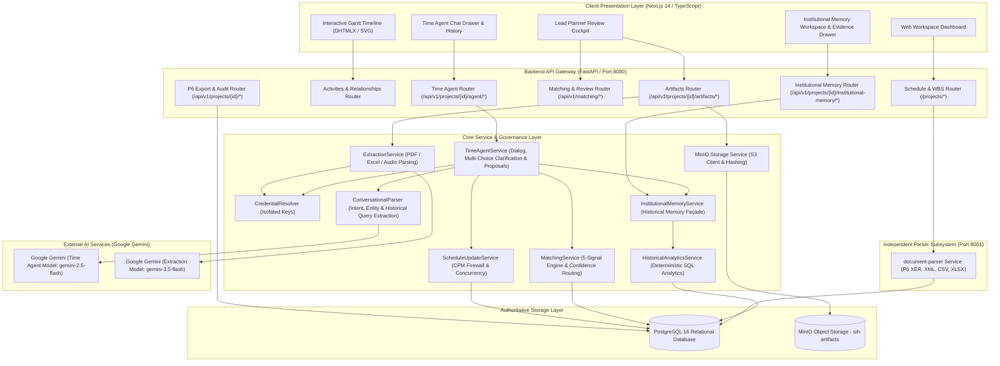
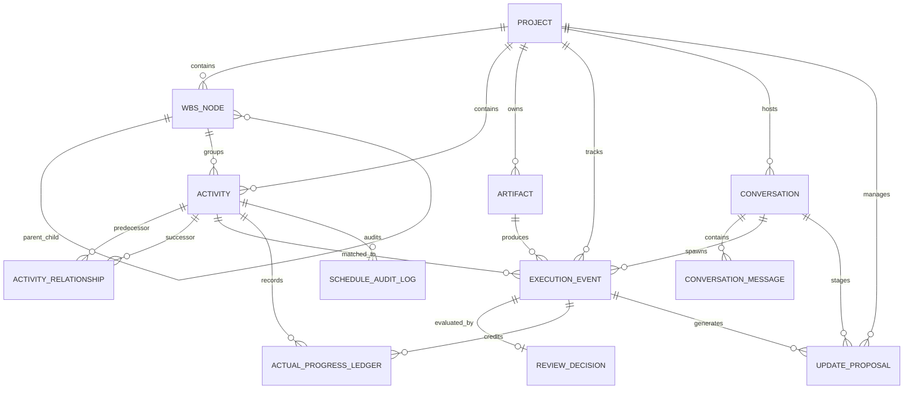
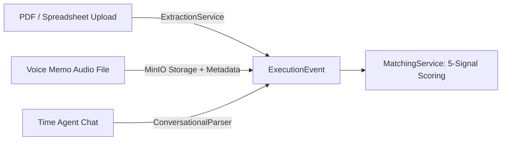
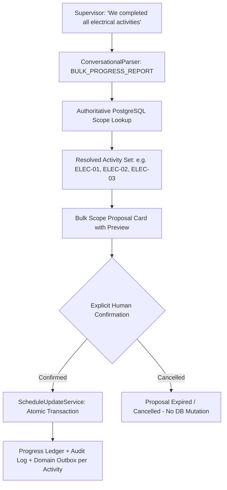

# Primavera Schedule Platform (ScheduleManager) & Time Agent
## Technical Presentation Handoff Document & Source of Truth (`PPT_HANDOFF.md`)

**Document Name:** `docs/PPT_HANDOFF.md`  
**Target Audience:** Presentation Authors, Solution Engineers, Technical Speakers, Project Stakeholders, Hackathon Judges  
**Baseline Codebase:** Current `ScheduleManager` Repository (`c:\Users\Gues\Desktop\sihnew\ScheduleManager`)  
**Status:** Complete Technical Source of Truth for Final Project Presentation (PPT) Creation  

---

## EXECUTIVE SUMMARY & NARRATIVE ARC

```text
       PLAN
         │
         ▼
   Primavera P6
         │
         ▼
  SCHEDULE INGESTION
         │
         ▼
  FIELD EXECUTION  ──►  EXECUTION EVENT
                               │
                               ▼
                       ACTIVITY MATCHING
                               │
                               ▼
                           GOVERNANCE
                               │
                               ▼
                        SCHEDULE UPDATE
                               │
                    ┌──────────┴──────────┐
                    ▼                     ▼
               AUDIT TRAIL          ACTUAL HISTORY
                                          │
                                          ▼
                                 INSTITUTIONAL MEMORY
                                          │
                            ┌─────────────┼─────────────┐
                            ▼             ▼             ▼
                       Productivity    Duration    Benchmarks
                            │             │             │
                            └─────────────┼─────────────┘
                                          │
                                          ▼
                                     PLAN BETTER
```

**ScheduleManager is an AI-assisted Primavera P6 schedule management platform that connects planned schedule data with real field execution through structured execution events, multi-signal activity matching, governed schedule updates, auditable progress history, and historical execution intelligence.**

The system establishes a closed-loop **Planning → Execution → Verification → Learning** bridge. It does not simply capture site progress; it connects actual execution back to the schedule, preserves cryptographic evidence, and transforms verified execution data into structured **Institutional Memory** for future project planning.

---

## TABLE OF CONTENTS

1. [Project Identification & Identity](#1-project-identification--identity)
2. [SIH26122 Problem Statement & Domain Framing](#2-sih26122-problem-statement--domain-framing)
3. [Existing Industry Workflow & The "Before" Gap](#3-existing-industry-workflow--the-before-gap)
4. [ScheduleManager Solution & Core Conceptual Loop](#4-schedulemanager-solution--core-conceptual-loop)
5. [Complete End-to-End System Architecture](#5-complete-end-to-end-system-architecture)
6. [Architectural Firewalls & Layer Separation](#6-architectural-firewalls--layer-separation)
7. [Authoritative Data Model (13 Production Entities)](#7-authoritative-data-model-13-production-entities)
8. [Schedule Ingestion & Primavera P6 Interoperability](#8-schedule-ingestion--primavera-p6-interoperability)
9. [Field Evidence Ingestion & The ExecutionEvent Pipeline](#9-field-evidence-ingestion--the-executionevent-pipeline)
10. [Deterministic 5-Signal Activity Matching Engine](#10-deterministic-5-signal-activity-matching-engine)
11. [Time Agent: Conversational Site Engineer](#11-time-agent-conversational-site-engineer)
12. [Dynamic Multi-Choice Clarification](#12-dynamic-multi-choice-clarification)
13. [Governed Bulk Progress Intent](#13-governed-bulk-progress-intent)
14. [Conversation History vs. Institutional Memory](#14-conversation-history-vs-institutional-memory)
15. [Schedule Update Governance & The CPM Baseline Firewall](#15-schedule-update-governance--the-cpm-baseline-firewall)
16. [Append-Only Progress Ledger & Audit Provenance](#16-append-only-progress-ledger--audit-provenance)
17. [Institutional Memory Engine V1 (Implemented)](#17-institutional-memory-engine-v1-implemented)
18. [Observed Productivity Analytics & Formulae](#18-observed-productivity-analytics--formulae)
19. [Planned vs. Actual Duration Analytics](#19-planned-vs-actual-duration-analytics)
20. [Advisory Planning Benchmarks & Sparse Data Governance](#20-advisory-planning-benchmarks--sparse-data-governance)
21. [Interactive Evidence Lineage Drawer & CSV Export](#21-interactive-evidence-lineage-drawer--csv-export)
22. [Time Agent Grounded Historical Query Flow](#22-time-agent-grounded-historical-query-flow)
23. [Frontend Cockpit & User Experience](#23-frontend-cockpit--user-experience)
24. [Verified REST API Reference](#24-verified-rest-api-reference)
25. [AI Architecture, LLM Roles & Credential Isolation](#25-ai-architecture-llm-roles--credential-isolation)
26. [Technology Stack & Verified Versions](#26-technology-stack--verified-versions)
27. [Container Topology & Infrastructure](#27-container-topology--infrastructure)
28. [Automated Testing & Verification (74 Passed Tests)](#28-automated-testing--verification-74-passed-tests)
29. [Benchmark Demonstration: Borouge 4 Petrochemical Expansion](#29-benchmark-demonstration-borouge-4-petrochemical-expansion)
30. [Product Differentiation: "Not Just a RAG Chatbot"](#30-product-differentiation-not-just-a-rag-chatbot)
31. [Implemented V1 Scope vs. Deferred Roadmap](#31-implemented-v1-scope-vs-deferred-roadmap)
32. [Safe Presentation Claims vs. Claims NOT to Make](#32-safe-presentation-claims-vs-claims-not-to-make)
33. [Slide-by-Slide PPT Presentation Blueprint](#33-slide-by-slide-ppt-presentation-blueprint)
34. [Presentation-Safe Terminology Glossary](#34-presentation-safe-terminology-glossary)
35. [Final Presentation Checklist & Delivery Notes](#35-final-presentation-checklist--delivery-notes)

---

## 1. PROJECT IDENTIFICATION & IDENTITY

* **Project Name:** `ScheduleManager`
* **Short Presentation Title:** **AI-Assisted Schedule Ingestion, Governed Field-Progress Matching & Time Agent**
* **Concise Product Definition:**
  > "ScheduleManager is an AI-assisted Primavera P6 schedule management platform that connects planned schedule data with real field execution through structured execution events, multi-signal activity matching, governed schedule updates, auditable progress history, and historical execution intelligence."
* **Core Product Identity Guardrails:**
  * **NOT merely a chatbot:** Chat is one ingestion interface among multiple input modalities.
  * **NOT a generic RAG wrapper:** RAG searches text; ScheduleManager performs entity resolution over schedule graphs and executes governed transactional state mutations.
  * **NOT an unconstrained AI tool:** AI parses language and explains data; deterministic backend services execute scoring, progress math, schedule commits, and statistical analytics.
  * **Time Agent’s Position:** Time Agent is a major conversational interface within ScheduleManager, not the entire platform.
* **Target Users & Stakeholders:**
  1. **Field Supervisors / Site Engineers:** Report physical accomplishments via natural language chat or document uploads without P6 licenses or knowledge of contractual activity IDs.
  2. **Lead Project Controls Planners:** Review ambiguous progress matches in an interactive cockpit, verify source excerpts, and safeguard contractual baseline dates.
  3. **Project Directors & Claims Engineers:** Query audit logs, inspect the append-only progress ledger, and analyze historical productivity benchmarks across completed work.

---

## 2. SIH26122 PROBLEM STATEMENT & DOMAIN FRAMING

### 2.1 The Official SIH 2026 Problem Statement
* **Identifier:** **SIH 2026 Problem Statement: PS26122**
* **Domain:** Construction Project Controls, Heavy Industrial Engineering, CPM Scheduling.
* **Core Mandate:** Automated progress tracking and schedule updating from unstructured construction documentation and supervisor updates.
* **Critical Relationship Distinction:**
  * **SIH26122** = The problem statement and industry challenge.
  * **ScheduleManager** = The implemented solution platform.
  * **Time Agent** = The conversational assistant component inside the solution.

### 2.2 Industrial Scheduling Realities & Friction
1. **The Hierarchy Disconnect:** Contractual master schedules in Primavera P6 reside at Level 3 and Level 4 (1,000–50,000+ activities), while physical work occurs at Level 6 (daily equipment dockets, pour tickets, shift logs).
2. **Vocabulary Mismatch:** Site supervisors report in operational terms (*"Poured 35 cubic meters of concrete for F-204 today"*), whereas P6 tracks abstract contractual codes (*`CIV-1001: Substructure Concrete - Foundation F-204 Cap Beam`*). Foremen rarely know or cite contractual P6 activity IDs.
3. **Severe Reporting Lag:** Manual transcription and multi-step approvals create delays of days or weeks before field accomplishments reach the master schedule, leading to stale baselines and delayed critical-path warnings.
4. **Loss of Forensic Evidence:** Daily reports remain scattered across email inboxes, paper clipboards, and local drives. When contractor delay claims arise, linking a schedule percentage back to the contemporaneous field ticket is time-consuming and contentious.
5. **Loss of Institutional Knowledge:** Once a project concludes, actual productivity rates and real installation durations are buried in static archive files, forcing estimators on subsequent projects to rely on generic rule-of-thumb guesses rather than actual historical performance.

---

## 3. EXISTING INDUSTRY WORKFLOW & THE "BEFORE" GAP

```text
[ Site Execution Front ]
          │
          ▼
[ Unstructured Field Reports ] (Daily PDFs, Excel cutting logs, WhatsApp shift notes, paper tickets)
          │
          ▼ (Transmitted via email or handover; sits unreviewed for days or weeks)
[ Planning Engineer's Desk ]
          │
          ▼
[ Manual Deciphering & P6 Search ]
  - Planner attempts to decode contractor shorthand
  - Searches 10,000+ activity schedule by keyword
  - Guesses which foundation or pier was poured
          │
          ▼
[ Manual Schedule Mutation in P6 ]
  - Directly types percent complete and actual dates
  - High risk of accidentally overwriting planned baseline dates or relationship links
  - Severed connection to source evidence documents
          │
          ▼
[ Project Completion & Knowledge Loss ]
  - Archive files stored on local servers
  - Actual production rates and duration variances are permanently lost to future planners
```

---

## 4. SCHEDULEMANAGER SOLUTION & CORE CONCEPTUAL LOOP

`ScheduleManager` replaces manual guesswork with a governed, closed-loop pipeline:

```text
PLAN (Primavera P6 XER / XML / CSV / XLSX)
  ↓
FIELD EXECUTION (PDFs, Spreadsheets, Shift Notes, Time Agent Chat)
  ↓
MATCH (Deterministic 5-Signal Candidate Engine)
  ↓
GOVERN (Confidence Gating, Clarification Loops & Staged Proposals)
  ↓
UPDATE (CPM Baseline Protection Layer & ScheduleUpdateService)
  ↓
AUDIT (Append-Only ActualProgressLedger & ScheduleAuditLog)
  ↓
INSTITUTIONAL MEMORY (Authoritative PostgreSQL Historical Execution Analytics)
  ↓
LEARN FROM HISTORY (Observed Productivity, Duration Variance, Advisory Benchmarks)
  ↓
PLAN BETTER (Evidence-Backed Planning Intelligence for Future Work)
```

---

## 5. COMPLETE END-TO-END SYSTEM ARCHITECTURE



---

## 6. ARCHITECTURAL FIREWALLS & LAYER SEPARATION

The system enforces strict architectural boundaries to guarantee safety and enterprise credibility:

```text
┌────────────────────────────────────────────────────────────────────────┐
│ 1. COGNITIVE LAYER (Google Gemini via ConversationalParser)            │
│    - Intent classification & entity extraction                         │
│    - Conversational clarification question generation                  │
│    - Grounded natural language explanations                            │
│    - RESTRICTION: No SQL queries, no math, no database writes         │
├────────────────────────────────────────────────────────────────────────┤
│ 2. MATCHING LAYER (MatchingService)                                    │
│    - Deterministic 5-signal scoring formula                            │
│    - Confidence routing: AUTO_LINK vs. IN_REVIEW vs. UNMATCHED         │
│    - RESTRICTION: evaluate_event_for_agent() does not mutate DB        │
├────────────────────────────────────────────────────────────────────────┤
│ 3. GOVERNANCE LAYER (UpdateProposal & ReviewCockpit)                   │
│    - 5-minute TTL proposal staging with baseline activity snapshot     │
│    - Dynamic multi-choice candidate selection                          │
│    - Human confirmation required before state transition               │
├────────────────────────────────────────────────────────────────────────┤
│ 4. AUTHORITY LAYER (ScheduleUpdateService & PostgreSQL 16)             │
│    - Single authoritative mutation gate for schedule actuals           │
│    - CPM Baseline Firewall (shields planned dates & network logic)     │
│    - Atomic emission of ProgressLedger, AuditLog & DomainOutbox        │
├────────────────────────────────────────────────────────────────────────┤
│ 5. HISTORICAL INTELLIGENCE LAYER (HistoricalAnalyticsService)          │
│    - Pure PostgreSQL queries over verified past execution records      │
│    - Deterministic observed productivity, duration variance & P50/P80  │
│    - RESTRICTION: Zero fabricated benchmarks; strict sample size gates │
└────────────────────────────────────────────────────────────────────────┘
```

---

## 7. AUTHORITATIVE DATA MODEL (13 PRODUCTION ENTITIES)

The authoritative relational schema in PostgreSQL 16 contains **exactly 13 domain models** (`backend/app/domain/models.py`):



### Verified Domain Entities Reference

| Entity | Table Name | Purpose | Key Fields |
| :--- | :--- | :--- | :--- |
| **`Project`** | `projects` | Master project schedule container. | `project_code`, `name`, `data_date`, `planned_start`, `planned_finish`. |
| **`WBSNode`** | `wbs` | Hierarchical Work Breakdown Structure. | `code`, `name`, `parent_id`, `project_id`. |
| **`Activity`** | `activities` | CPM schedule task (leaf node). | `activity_code`, `name`, `status`, `planned_start/finish`, `actual_start/finish`, `percent_complete`, `planned_quantity`. |
| **`ActivityRelationship`** | `relationships` | CPM network logic dependency. | `predecessor_id`, `successor_id`, `relationship_type` (FS/SS/FF/SF), `lag`. |
| **`Artifact`** | `artifacts` | Field document metadata in MinIO. | `storage_key`, `file_sha256`, `mime_type`, `size_bytes`, `extraction_status`. |
| **`ExecutionEvent`** | `execution_events` | Discrete site work item. | `verbatim_excerpt`, `quantity`, `unit`, `execution_date`, `location`, `status`, `source_type` (`ARTIFACT`/`CONVERSATION`/`HYBRID`). |
| **`ReviewDecision`** | `review_decisions` | Planner review sign-off. | `decision` (`APPROVED`/`REJECTED`/`REASSIGNED`), `reviewer_id`, `notes`. |
| **`ActualProgressLedger`** | `actual_progress_ledger` | Append-only progress ledger. | `installed_quantity`, `incremental_percent`, `cumulative_percent`, unique `(activity_id, execution_event_id)`. |
| **`ScheduleAuditLog`** | `schedule_audit_log` | Complete state diff audit trail. | `previous_state` (JSON), `new_state` (JSON), `user_id`, `timestamp`. |
| **`DomainOutbox`** | `domain_outbox` | Transactional outbox event queue. | `event_type`, `aggregate_id`, `payload` (JSON), `status` (`PENDING`). |
| **`Conversation`** | `conversations` | Project-scoped chat session. | `project_id`, `user_id`, `title`, `active_activity_id`, `active_event_id`, `clarification_turns`. |
| **`ConversationMessage`** | `conversation_messages` | Chat message turn. | `sender` (`USER`/`AGENT`/`SYSTEM`), `content`, `message_metadata` (JSON). |
| **`UpdateProposal`** | `update_proposals` | Staged update awaiting confirmation. | `proposed_state` (JSON), `baseline_activity_state` (JSON), `status` (`PENDING`/`CONFIRMED`/`CONSUMED`/`EXPIRED`), `expires_at`. |

> **CRITICAL ARCHITECTURAL FACT FOR PRESENTATION:**  
> **No separate `InstitutionalMemory` table exists in PostgreSQL.** Institutional Memory V1 is computed dynamically and deterministically by `HistoricalAnalyticsService` from the authoritative relational execution tables (`execution_events`, `actual_progress_ledger`, `activities`, `schedule_audit_log`). There are **no duplicate memory tables, no embeddings, and no vector stores in V1**.

---

## 8. SCHEDULE INGESTION & PRIMAVERA P6 INTEROPERABILITY

### Supported Schedule Formats
* **Oracle Primavera P6 `.xer`:** Parses `%T`, `%F`, `%R`, `%E` record blocks across `PROJECT`, `PROJWBS`, `TASK`, and `TASKPRED` tables.
* **Oracle Primavera P6 `.xml`:** Hierarchical XML parser extracting projects, WBS branches, activities, and logic relationships.
* **Tabular Schedule Imports (`.csv`, `.xlsx`):** Header-aware tabular parsers supporting standard project controls column aliases.

### Roundtrip P6 XER Export (`GET /api/v1/projects/{id}/export/xer`)
`ScheduleManager` can serialize its PostgreSQL database state back into a native, syntactically valid Oracle Primavera P6 XER file:
* **Exported Tables:** `%T PROJECT`, `%T PROJWBS`, `%T TASK`, `%T TASKPRED`.
* **Fidelity:** Preserves updated `status_code`, `act_start_date`, `act_end_date`, and `percent_complete` alongside contractual planned dates and logic links.
* **Verification:** Validated by automated roundtrip regression tests (`tests/test_xer_export_roundtrip.py`).
* **Scope Boundary:** Advanced P6 features such as resource leveling curves, expense categories, and user-defined fields (UDFs) are outside V1 scope.

---

## 9. FIELD EVIDENCE INGESTION & THE EXECUTIONEVENT PIPELINE

Field progress arrives through three distinct modalities, all converging into canonical `ExecutionEvent` records:



### Source Type Modalities
1. **`ARTIFACT`:** Uploaded files (PDF inspection dockets, Excel logs, audio memos). Stored in MinIO with SHA-256 hash, size, and MIME type.
2. **`CONVERSATION`:** Direct chat utterances from field supervisors. Linked to `conversation_id` and `message_id`.
3. **`HYBRID`:** File attachments uploaded inside a chat session or chat clarification that enriches an artifact event. Tracks both artifact storage keys and conversation session context.

---

## 10. DETERMINISTIC 5-SIGNAL ACTIVITY MATCHING ENGINE

The `MatchingService` (`backend/app/services/matching_service.py`) connects execution events to schedule activities using a transparent multi-signal formula:

### 1. Candidate Retrieval & Pre-Filtering
* Scope: Activities within the target project where `status != 'COMPLETED'`.
* Temporal Window: `planned_start <= execution_date + 30 days` and `planned_finish >= execution_date - 30 days`.
* Safe Fallback: If temporal filtering yields zero matches, the engine falls back to all non-completed activities in the project.

### 2. 5-Signal Scoring Formula

$$S_{\text{total}} = w_{\text{id}} S_{\text{id}} + w_{\text{text}} S_{\text{text}} + w_{\text{wbs}} S_{\text{wbs}} + w_{\text{temp}} S_{\text{temp}} + w_{\text{context}} S_{\text{context}}$$

| Signal | Evaluation Logic in Code | Weight (Code Present) | Weight (No Code Present) |
| :--- | :--- | :---: | :---: |
| **$S_{\text{id}}$ (Exact Code)** | $1.0$ if reported activity code matches `activity_code` or appears verbatim in excerpt; else $0.0$. | **0.40** (guarantees $S \ge 0.95$) | **0.00** |
| **$S_{\text{text}}$ (Text Similarity)** | Token Jaccard overlap + substring matching across activity name and description. | **0.30** | **0.45** |
| **$S_{\text{wbs}}$ (WBS & Hierarchy)** | $1.0$ for exact WBS name match; $0.95$ for location match; $0.85$ for discipline match. | **0.15** | **0.25** |
| **$S_{\text{temp}}$ (Temporal Window)**| $1.0$ if execution date falls within planned dates; Gaussian decay outside window. | **0.10** | **0.15** |
| **$S_{\text{context}}$ (Site Context)**| Matches physical location and contractor name ($+0.2$ bonus). | **0.05** | **0.15** |

### 3. Confidence Routing Gates
Candidates are sorted descending by $S_{\text{total}}$. Margin delta $\Delta = S_{\text{top}} - S_{\text{second}}$:
* **`AUTO_LINK` (Clear Match):** $S_{\text{total}} \ge 0.85 \quad \wedge \quad \Delta \ge 0.15 \quad \wedge \quad C_{\text{ext}} \ge 0.80$.
* **`IN_REVIEW` (Ambiguous / Competing):** $S_{\text{total}} \ge 0.50$ but fails auto-link criteria (e.g. $\Delta < 0.15$).
* **`UNMATCHED`:** $S_{\text{total}} < 0.50$.

---

## 11. TIME AGENT: CONVERSATIONAL SITE ENGINEER

The Time Agent is an interactive assistant embedded in the project cockpit. It translates unstructured field dialogue into governed schedule actions.

### 6 Supported Intent Classes (`backend/app/schemas/agent.py`)
1. **`INFORMATION_QUERY`:** Supervisor asks for schedule dates, activity progress, upcoming tasks, or historical benchmarks.
2. **`PROGRESS_REPORT`:** Supervisor reports physical site accomplishments (e.g., *"Poured 35 m3 concrete for F-204 today"*).
3. **`PROGRESS_UPDATE_REQUEST`:** Supervisor requests a direct percentage or status update on a specific task.
4. **`CLARIFICATION_RESPONSE`:** Supervisor provides missing details (activity code, location, foundation number) in response to an agent query.
5. **`ARTIFACT_SUBMISSION`:** Supervisor uploads or references a site docket, pour ticket, or inspection report.
6. **`BULK_PROGRESS_REPORT`:** Supervisor reports progress across a broader scope (e.g., *"We completed all electrical activities in Substation B"*).

---

## 12. DYNAMIC MULTI-CHOICE CLARIFICATION

When a supervisor's report is ambiguous, the Time Agent does not guess. It initiates a dynamic clarification loop based on the number of viable candidates:

```text
Ambiguous Supervisor Report (e.g. "We poured 35 m3 concrete today")
                         │
                         ▼
        Candidate Retrieval & 5-Signal Scoring
                         │
         ┌───────────────┴───────────────┐
         ▼                               ▼
Two Competing Candidates          Three to Four Candidates
         │                               │
         ▼                               ▼
Pairwise A/B Clarification        Structured Multi-Choice List
"Did this apply to F-204          Selectable Candidate Buttons +
 or F-205?"                       "None of these" Option
```

### Dynamic Clarification Invariants
1. **Pairwise A/B Prompt:** For 2 close candidates ($\Delta < 0.15$), the agent asks a direct comparative question with two action buttons.
2. **Ranked Candidate List:** For 3–4 candidates, the agent presents a structured multi-choice list with activity codes, names, locations, and scores, alongside a **"None of these"** escape option.
3. **Same Event Enrichment:** Subsequent turns update the *existing* `ExecutionEvent` record (tracked via `Conversation.active_event_id`) rather than spawning orphan rows.
4. **Strict 3-Turn Bound:** Clarification is capped at **3 turns**. If ambiguity persists after 3 turns, the agent automatically routes the event to the Lead Planner Review Queue (`IN_REVIEW`).

---

## 13. GOVERNED BULK PROGRESS INTENT

Supervisors often report work at a summary or trade level (*"We completed all the electrical activities"*). `ScheduleManager` handles this through a governed, multi-step bulk workflow:



### Bulk Intent Safety Invariants
* **Authoritative Membership:** The LLM extracts the scope keywords (e.g., discipline = electrical); **PostgreSQL executes the authoritative query** resolving which activities belong to that scope. The LLM never invents or finalizes activity membership.
* **Preview Before Confirmation:** The UI renders a Bulk Proposal Card listing all target activities, planned quantities, and proposed status (`COMPLETED`, 100%).
* **Atomic Mutation:** Updates are executed in a single transaction across `ScheduleUpdateService`.
* **Safe Scope Boundary:** Governed bulk intent safely handles **scope completion** (e.g. marking a resolved group completed). **Arbitrary quantity distribution** (e.g. dividing $35\text{ m}^3$ blindly across 5 tasks) is **strictly unsupported** to prevent unverified progress allocation.

---

## 14. CONVERSATION HISTORY VS. INSTITUTIONAL MEMORY

A vital technical distinction for presentation clarity:

| Dimension | Conversation History | Institutional Memory |
| :--- | :--- | :--- |
| **Core Question** | *"What did we discuss in this chat session?"* | *"What have we learned from historical project execution?"* |
| **Scope** | Project/schedule-scoped (`project_id`). | Historical project execution actuals across verified records. |
| **Authoritative Store** | `conversations` and `conversation_messages` tables. | `actual_progress_ledger`, `execution_events`, `activities`. |
| **Nature of Data** | Ephemeral chat turns, proposals, clarification states. | Append-only verified progress, installed quantities, actual dates. |
| **Isolation** | Separate chats never share active events or proposals. | Aggregated deterministically across completed project actuals. |
| **LLM Role** | Chat dialogue and prompt history. | LLM explains structured DTO results; **does not compute metrics**. |

> **IMPORTANT NON-CLAIM:** There is **NO global cross-project chat memory**. Conversations are strictly isolated to their parent project. Institutional Memory is **not** a chat replay; it is structured relational execution intelligence.

---

## 15. SCHEDULE UPDATE GOVERNANCE & THE CPM BASELINE FIREWALL

### The CPM Baseline Protection Layer
Contractual CPM schedules require strict separation between mutable progress actuals and immutable contractual baseline logic:

```text
┌────────────────────────────────────────────────────────────────────────┐
│                   THE CPM BASELINE FIREWALL                            │
├──────────────────────────────────┬─────────────────────────────────────┤
│ MUTABLE (Actual Progress Fields) │ IMMUTABLE (Contractual Baselines)   │
├──────────────────────────────────┼─────────────────────────────────────┤
│  percent_complete                │  planned_start                      │
│  actual_start                    │  planned_finish                     │
│  actual_finish                   │  original_duration                  │
│  status (IN_PROGRESS/COMPLETED)  │  calendar assignments               │
│                                  │  predecessor/successor dependencies │
│                                  │  relationship lag                   │
└──────────────────────────────────┴─────────────────────────────────────┘
```

### UpdateProposal Lifecycle & Concurrency Controls
* **5-Minute TTL:** Proposals expire automatically after 300 seconds (`expires_at`).
* **Baseline State Snapshot:** Proposals capture a snapshot of the activity's state when staged (`baseline_activity_state`).
* **Conflict Detection:** At confirmation, the current activity state is compared against the snapshot. If another user modified the activity in the interim, the update is rejected with `HTTP 409 Conflict`.
* **Row-Level Concurrency Locking (`SELECT FOR UPDATE`):** When `/confirm` is called, the proposal row is locked at the database level, preventing double-execution.
* **Monotonicity & Bounds:** Cumulative percent is clamped to $[0.0, 100.0\%]$. Negative quantity deltas are rejected (`ValidationException`). Progress cannot go backwards.

---

## 16. APPEND-ONLY PROGRESS LEDGER & AUDIT PROVENANCE

Every verified update applied by `ScheduleUpdateService` produces an unbreakable audit trail across three relational tables:

```text
                 ScheduleUpdateService.apply_event_progress()
                                      │
        ┌─────────────────────────────┼─────────────────────────────┐
        ▼                             ▼                             ▼
ActualProgressLedger          ScheduleAuditLog                DomainOutbox
- activity_id                 - previous_state (JSON)         - SCHEDULE_PROGRESS_UPDATED
- execution_event_id          - new_state (JSON)              - payload (JSON)
- installed_quantity          - user_id                       - status: PENDING
- incremental_percent         - timestamp
- cumulative_percent
- composite unique key:
  (activity_id, event_id)
```

1. **Idempotency Guarantee:** Composite unique index `(activity_id, execution_event_id)` prevents duplicate reports from double-crediting progress.
2. **Forensic Provenance:** Every ledger row points directly to the originating `ExecutionEvent`, which links to the source MinIO artifact (SHA-256 hash) or chat transcript.
3. **State Diff Auditing:** `ScheduleAuditLog` preserves exact before-and-after JSON state diffs for all schedule mutations.

---

## 17. INSTITUTIONAL MEMORY ENGINE V1 (IMPLEMENTED)

> **PRESENTATION BREAKTHROUGH:**  
> Institutional Memory V1 is **fully implemented in current working code**, not a design concept or roadmap item.

### Definition
> **"Institutional Memory turns verified historical project execution data into reusable, queryable knowledge about how work actually happened."**

### V1 Engine Architecture

```text
Verified Execution Records
(ExecutionEvent + ActualProgressLedger + Activity + ScheduleAuditLog)
                       │
                       ▼
           HistoricalAnalyticsService
         (Deterministic SQL Analytics)
                       │
                       ▼
    ┌──────────────────┼──────────────────┐
    ▼                  ▼                  ▼
Observed          Planned vs.          Advisory
Productivity       Actual Duration      Planning Benchmarks
(Qty / Day)        Variance             (N >= 3, P50/P80 N >= 5)
    │                  │                  │
    └──────────────────┼──────────────────┘
                       │
                       ▼
           InstitutionalMemoryService
         (Domain Façade & CSV Export)
                       │
         ┌─────────────┴─────────────┐
         ▼                           ▼
Frontend Workspace            Time Agent Tool
(5 Dedicated Subviews)        (query_historical_performance)
```

---

## 18. OBSERVED PRODUCTIVITY ANALYTICS & FORMULAE

### Authoritative Mathematical Formula
The observed production rate is calculated deterministically via SQL over verified ledger actuals:

$$\text{Observed Production Rate} = \frac{\sum \text{installed\_quantity}}{\text{COUNT}(\text{DISTINCT } \text{reporting\_date})}$$

### Critical Technical Safeguards
1. **Strict Unit Isolation:** Incompatible engineering units are never combined. $m^3$ (concrete), $m$ (cable tray), $t$ (steel), and spools (piping) are tracked in strictly segregated unit buckets.
2. **Presentation-Safe Terminology:** Referred to as **"Observed production rate"** or **"Quantity per reporting day"**. Not claimed as "labor productivity" or "hourly crew productivity" because timesheet crew hours are not in the primary schedule model.
3. **Multi-Day Reporting Normalization:** Distinct reporting dates are used as the denominator, preventing duplicate daily reports from distorting the rate.

---

## 19. PLANNED VS. ACTUAL DURATION ANALYTICS

### Duration Variance Formula
For completed schedule activities where required dates exist:

$$\text{Planned Duration} = \text{planned\_finish} - \text{planned\_start}$$

$$\text{Actual Duration} = \text{actual\_finish} - \text{actual\_start}$$

$$\text{Duration Variance} = \text{Actual Duration} - \text{Planned Duration}$$

### Governance & Eligibility Rules
* **Exclusion of Incomplete Work:** Duration metrics are computed **only for completed activities** (`status = 'COMPLETED'` with non-null `actual_start` and `actual_finish`). Ongoing activities do not distort historical duration averages.
* **Positive Variance:** Indicates the activity took longer than planned (schedule overrun).
* **Negative Variance:** Indicates the activity finished faster than planned.

---

## 20. ADVISORY PLANNING BENCHMARKS & SPARSE DATA GOVERNANCE

### Sample Size Governance Rules
The system enforces strict statistical sample size thresholds to prevent misleading planners:

| Metric | Required Sample Size ($N$) | Behavior When Sample is Insufficient |
| :--- | :---: | :--- |
| **Observed Rate** | $N \ge 1$ | Displays observed rate; flags `INSUFFICIENT_SAMPLE` if $N < 3$. |
| **Planning Benchmark** | $N \ge 3$ | Status: `INSUFFICIENT_SAMPLE`. Benchmark not declared authoritative. |
| **P50 / P80 Percentiles**| $N \ge 5$ | Percentiles suppressed until $\ge 5$ verified completed activities exist. |
| **No History Available** | $N = 0$ | Status: `NO_HISTORICAL_BENCHMARK` or `NO_RECORDS`. |

> **CORE GOVERNANCE MESSAGE FOR JUDGES:**  
> **"The system does not fabricate historical benchmarks when evidence is insufficient."** Transparently displaying `INSUFFICIENT_DATA` is an engineered governance strength, not a limitation.

---

## 21. INTERACTIVE EVIDENCE LINEAGE DRAWER & CSV EXPORT

### Interactive Evidence Drawer (`frontend/components/EvidenceDrawer.tsx`)
Every historical metric links back to its underlying evidence. Clicking any metric opens a slide-over drawer displaying:
* **Event ID:** Unique execution event identifier (`UUID`).
* **Ledger ID:** Primary key in `actual_progress_ledger`.
* **Activity:** Contractual activity code and name.
* **Reporting Date:** Verified date of work execution.
* **Installed Quantity & Unit:** e.g., $35.0\text{ m}^3$.
* **Verbatim Source Excerpt:** Exact text from the field report or supervisor chat.
* **Source Document:** Document filename or conversation session ID.
* **Extraction Confidence & Match Score:** Audit metrics showing automated extraction quality.

### Standard RFC 4180 CSV Export (`GET .../institutional-memory/ledger/export`)
Planners can export the entire verified historical ledger to standard CSV for external analysis in Excel, PowerBI, or enterprise PMIS platforms.

---

## 22. TIME AGENT GROUNDED HISTORICAL QUERY FLOW

When a user asks historical questions in chat, the Time Agent queries Institutional Memory via a deterministic tool:

```text
Supervisor/Planner: "What was our historical concrete pouring rate?"
                         │
                         ▼
             Time Agent / ConversationalParser
     (Classifies INFORMATION_QUERY with historical intent)
                         │
                         ▼
        query_historical_performance() Tool Call
                         │
                         ▼
             InstitutionalMemoryService
                         │
                         ▼
             HistoricalAnalyticsService
             (Pure SQL Math in PostgreSQL)
                         │
                         ▼
                   Structured DTO
  { metric: "concrete", rate: 35.0, unit: "m3/day", sample_size: 1,
    status: "INSUFFICIENT_SAMPLE", evidence_count: 1 }
                         │
                         ▼
          Time Agent Conversational Explanation
  "Our historical concrete pouring rate in this project is 35.0 m³/day,
   based on 1 verified record (Foundation F-204).
   Note: Sample size is currently sparse (N=1), so this is an observed
   rate rather than a dependable baseline."
                         │
                         ▼
             Interactive Evidence Link
```

---

## 23. FRONTEND COCKPIT & USER EXPERIENCE

The Next.js 14 frontend provides a unified, 7-tab project controls workspace (`frontend/app/projects/[id]/page.tsx`):

```text
┌────────────────────────────────────────────────────────────────────────────────────────┐
│                                SCHEDULEMANAGER COCKPIT                                 │
├──────────┬──────────────┬────────────┬─────────┬───────────────┬────────────┬──────────┤
│ Overview │ WBS Explorer │ Activities │  Gantt  │ Field Reports │ Time Agent │ Inst.Mem │
└──────────┴──────────────┴────────────┴─────────┴───────────────┴────────────┴──────────┘
```

### Tab Descriptions
1. **Overview:** Project-level KPIs, overall percent complete, activity status breakdowns.
2. **WBS Explorer:** Hierarchical tree view of Work Breakdown Structure nodes with nested activity counts.
3. **Activities:** Filterable, sortable tabular view of all CPM activities with planned/actual dates and progress.
4. **Gantt:** Interactive CPM timeline (DHTMLX Gantt / SVG) with dependency logic links and progress fill.
5. **Field Reports:** Artifact upload dropzone (PDF, Excel, Audio), SHA-256 integrity cards, and Lead Planner Review Cockpit.
6. **Time Agent:** Conversational chat interface with project-scoped chat history, dynamic clarification cards, staged proposals, and audio recording.
7. **Institutional Memory:** Dedicated 5-subview analytics workspace:
   * **Overview & Insights:** Executive KPIs, total verified volume by unit, average duration variance.
   * **Observed Productivity:** Tabular breakdown of production rates grouped by discipline and unit.
   * **Planned vs. Actual:** Duration variance table for completed activities with visual overrun indicators.
   * **Execution Memory Ledger:** Filterable historical execution records with Evidence Drawer triggers and CSV export.
   * **Historical Query:** Interactive query console with natural language explanations and grounded citations.

---

## 24. VERIFIED REST API REFERENCE

All endpoints verified active in current FastAPI backend:

### Institutional Memory Endpoints (`backend/app/api/analytics.py`)
* `GET /api/v1/projects/{id}/institutional-memory/summary`: Executive KPIs and aggregate historical metrics.
* `GET /api/v1/projects/{id}/institutional-memory/ledger`: Paginated, filterable historical execution ledger.
* `GET /api/v1/projects/{id}/institutional-memory/productivity`: Observed production rates grouped by unit.
* `GET /api/v1/projects/{id}/institutional-memory/durations`: Planned vs. actual durations and variances for completed tasks.
* `GET /api/v1/projects/{id}/institutional-memory/benchmarks`: Advisory planning benchmarks (N $\ge$ 3, P50/P80 N $\ge$ 5).
* `POST /api/v1/projects/{id}/institutional-memory/query`: Grounded natural language query console.
* `GET /api/v1/projects/{id}/institutional-memory/ledger/export`: RFC 4180 CSV export of historical ledger.

### Time Agent Endpoints (`backend/app/api/agent.py`)
* `POST /api/v1/projects/{id}/agent/conversations`: Initializes a new conversation session.
* `GET /api/v1/projects/{id}/agent/conversations`: Lists all conversations scoped to the project.
* `GET /api/v1/projects/{id}/agent/conversations/{conv_id}`: Retrieves message history and active proposal state.
* `POST /api/v1/projects/{id}/agent/conversations/{conv_id}/messages`: Submits user chat turn; returns agent response.
* `POST /api/v1/projects/{id}/agent/conversations/{conv_id}/attachments`: Uploads field report within chat.
* `POST /api/v1/projects/{id}/agent/conversations/{conv_id}/confirm`: Atomically confirms and applies a staged proposal.

### Schedule & Artifact Endpoints
* `POST /projects/import`: Multi-format schedule ingestion (.xer, .xml, .csv, .xlsx).
* `GET /projects`: Lists all imported projects.
* `GET /projects/{id}/wbs/tree`: Hierarchical WBS tree.
* `GET /projects/{id}/activities`: Paginated activity table.
* `POST /api/v1/projects/{id}/artifacts/upload`: Raw artifact upload to MinIO with SHA-256 recording.
* `POST /api/v1/matching/evaluate`: Batch candidate matching evaluation.
* `GET /api/v1/review/queue`: Planner review queue for ambiguous events.
* `POST /api/v1/review/decisions`: Planner review decision recording.
* `GET /api/v1/projects/{id}/audit-trail`: Comprehensive change history from `ScheduleAuditLog`.
* `GET /api/v1/projects/{id}/export/xer`: Native Oracle Primavera P6 XER export.

---

## 25. AI ARCHITECTURE, LLM ROLES & CREDENTIAL ISOLATION

### Provider & Model Specifications
* **AI Provider:** Google Gemini API.
* **Time Agent Model (`TIME_AGENT_LLM_MODEL`):** `gemini-2.5-flash` (Optimized for conversational speed, intent parsing, and entity extraction).
* **Document Extraction Model (`EXTRACTION_LLM_MODEL`):** `gemini-3.5-flash` (Optimized for multi-page tabular reasoning and complex document parsing).

### Hardened Credential Isolation (`CredentialResolver`)
* `TIME_AGENT_GEMINI_API_KEY`: Isolated key dedicated exclusively to conversational processing.
* `EXTRACTION_GEMINI_API_KEY`: Isolated key dedicated exclusively to document extraction.
* **Production Firewall:** In production (`ENVIRONMENT=production`), fallback to shared legacy keys is blocked unless explicitly overridden.
* **Zero Secret Leakage:** Keys are passed via internal HTTP headers (`x-goog-api-key`) and never exposed in client bundles or log files.

---

## 26. TECHNOLOGY STACK & VERIFIED VERSIONS

| Component | Technology | Version | Purpose in ScheduleManager |
| :--- | :--- | :--- | :--- |
| **Frontend Framework** | Next.js | 14.1.0 | React web application hosting project controls cockpit. |
| **UI Language** | TypeScript | 5.3.3 | Strongly typed interfaces, API contracts, and components. |
| **Styling** | Tailwind CSS | 3.4.1 | Project controls design system and responsive layouts. |
| **Gantt Visualization** | DHTMLX Gantt / SVG | Latest | Interactive CPM timeline with dependency links. |
| **Backend Framework** | FastAPI | 0.110.0 | High-performance asynchronous REST API gateway. |
| **Backend Language** | Python | 3.12 | Core services, deterministic math, and AI orchestration. |
| **ORM & Database Client** | SQLAlchemy | 2.0.28 | Object-relational mapping, unit of work, and transactions. |
| **Relational Database** | PostgreSQL | 16-alpine | Authoritative store for schedules, events, ledgers, and audit logs. |
| **Object Store** | MinIO | Latest | S3-compatible object storage for field artifacts with SHA-256. |
| **AI / LLM Gateway** | Google Gemini | 2.5-flash / 3.5-flash | Language understanding, entity extraction, conversational dialogue. |
| **Schedule Parser** | document-parser | Custom FastAPI | Multi-format schedule ingestion (.xer, .xml, .csv, .xlsx). |
| **PDF Extraction** | PyPDF | Latest | Document parsing and page text extraction. |
| **Spreadsheet Engine** | openpyxl / csv | Latest | Tabular cutting list and progress log parsing. |
| **Test Runner** | Pytest | 9.1.1 | Automated regression, unit, and integration test suite. |

---

## 27. CONTAINER TOPOLOGY & INFRASTRUCTURE

The system is deployed via Docker Compose across **5 containerized services**:

```text
┌────────────────────────────────────────────────────────────────────────┐
│                        DOCKER COMPOSE TOPOLOGY                         │
├────────────────────┬──────────────────┬────────────────────────────────┤
│ Container Name     │ Port Mapping     │ Core Function                  │
├────────────────────┼──────────────────┼────────────────────────────────┤
│ primavera-postgres │ 5432:5432        │ PostgreSQL 16 database         │
│ primavera-minio    │ 9000:9000 (API)  │ S3-compatible artifact store   │
│                    │ 9001:9001 (Web)  │ MinIO administrative console   │
│ primavera-parser   │ 8001:8001        │ Schedule document parser API   │
│ primavera-backend  │ 8080:8000        │ FastAPI backend & API gateway  │
│ primavera-frontend │ 3000:3000        │ Next.js project controls UI    │
└────────────────────┴──────────────────┴────────────────────────────────┘
```

---

## 28. AUTOMATED TESTING & VERIFICATION (74 PASSED TESTS)

The entire codebase is verified by an automated Pytest test suite totaling **74 passed tests**:

```text
============================== TEST SUITE SUMMARY ==============================
Backend Regression Suite        : 65 passed, 0 failed (in 23.14s)
Document Parser Suite           :  9 passed, 0 failed (in 2.14s)
--------------------------------------------------------------------------------
TOTAL ACROSS PLATFORM           : 74 PASSED, 0 FAILED (100% Pass Rate)
================================================================================
```

### Test Coverage Breakdown
1. **Institutional Memory Suite (`tests/test_institutional_memory.py` - 14 Tests):**
   * Verifies historical ledger retrieval and project isolation.
   * Verifies multi-day observed production rate math ($\sum Q / \text{days}$).
   * Verifies strict isolation of incompatible engineering units ($m^3$ vs. $m$ vs. $t$).
   * Verifies planned vs. actual duration variance and exclusion of incomplete tasks.
   * Verifies advisory planning benchmarks ($N \ge 3$) and P50/P80 calculations ($N \ge 5$).
   * Verifies sparse data handling (`NO_HISTORICAL_BENCHMARK`, `INSUFFICIENT_SAMPLE`).
   * Verifies Time Agent historical query tool execution and grounded citations.
   * Verifies RFC 4180 CSV export generation.
2. **Time Agent Suite (`tests/test_time_agent.py` - 16 Tests):**
   * Verifies dynamic clarification dialogs and candidate option formatting.
   * Verifies proposal staging, 5-minute TTL expiration, and row-level locking.
   * Verifies stale proposal conflict detection (`HTTP 409`).
   * Verifies project-scoped chat navigation and message persistence.
   * Verifies governed bulk intent scope resolution and preview staging.
3. **Extraction & Matching Integration (`tests/test_extraction_matching_integration.py` - 10 Tests):**
   * Verifies MinIO SHA-256 artifact storage, 5-signal matching scores, and confidence routing.
4. **Credential Isolation (`tests/test_credential_resolver.py` - 9 Tests):**
   * Verifies independent API keys and production safety blocks.
5. **Schedule Ingestion & Export (`tests/test_xer_export_roundtrip.py`, `test_import_e2e.py` - 4 Tests):**
   * Verifies multi-table XER parsing, canonical JSON normalization, and roundtrip XER export.
6. **Domain APIs & Validation (12 Tests):**
   * Verifies activity CRUD, WBS tree assembly, logic relationship validation, and percent complete bounds.
7. **Document Parser Subsystem (9 Tests):**
   * Verifies standalone schedule parsing across XER, XML, CSV, and XLSX formats.

---

## 29. BENCHMARK DEMONSTRATION: BOROUGE 4 PETROCHEMICAL EXPANSION

The verified 12-step demonstration scenario (`BOROUGE4_DEMO`):

```text
STEP 1: BASELINE SCHEDULE IMPORT
- Project: BOROUGE4_DEMO (Data Date: 2024-06-01)
- Activity 1: CIV-1001 (Foundation Pour F-204, Planned: 140 m3, Status: NOT_STARTED, 0%)
- Activity 2: CIV-1002 (Foundation Pour F-205, Planned: 120 m3, Status: NOT_STARTED, 0%)

STEP 2: SUPERVISOR FIELD REPORT
- Supervisor enters chat: "We poured 35 cubic meters of concrete today."

STEP 3: TIME AGENT INTENT PARSING
- ConversationalParser classifies PROGRESS_REPORT; extracts qty=35, unit=m3, date=2024-06-01.

STEP 4: 5-SIGNAL CANDIDATE MATCHING
- Matcher retrieves CIV-1001 and CIV-1002. Scores are tied (Delta < 0.15).

STEP 5: DYNAMIC CLARIFICATION DIALOG
- Agent prompts: "Which foundation was poured today: F-204 or F-205?" (Renders ActionCard).

STEP 6: SUPERVISOR SELECTION
- Supervisor clicks "F-204". Agent enriches same ExecutionEvent with location="F-204".
- Re-scoring: CIV-1001 scores S_total = 0.95 (AUTO_LINK).

STEP 7: PROPOSAL STAGING
- Agent stages UpdateProposal: CIV-1001, +35 m3, 0.0% -> 25.0%, TTL: 5 minutes.
- CPM Baseline Firewall verified: Authoritative schedule remains 0.0% until confirmation.

STEP 8: GOVERNED CONFIRMATION & COMMIT
- Supervisor clicks [Confirm & Apply].
- ScheduleUpdateService executes row-locked transaction:
  * CIV-1001 percent_complete = 25.0%, status = IN_PROGRESS, actual_start = 2024-06-01.
  * ActualProgressLedger entry written (35.0 m3, cumulative 25.0%).
  * ScheduleAuditLog records full state diff JSON.
  * DomainOutbox emits SCHEDULE_PROGRESS_UPDATED event.

STEP 9: VERIFIED EXECUTION BECOMES INSTITUTIONAL MEMORY
- Verified progress is immediately queryable in the Institutional Memory workspace.

STEP 10: HISTORICAL QUERY IN CHAT
- Planner asks: "What was our observed concrete pouring rate?"

STEP 11: DETERMINISTIC HISTORICAL CALCULATION
- System computes: SUM(35) / 1 reporting day = 35.0 m3/day.
- Flags sample status: INSUFFICIENT_SAMPLE (N=1 < 3).

STEP 12: EVIDENCE LINEAGE & FUTURE PLANNING
- Time Agent explains rate with citations. Planner opens Evidence Drawer, verifies verbatim excerpt,
  and uses observed rate as planning context for upcoming foundations.
```

---

## 30. PRODUCT DIFFERENTIATION: "NOT JUST A RAG CHATBOT"

```text
GENERIC CONSTRUCTION RAG CHATBOT             SCHEDULEMANAGER PLATFORM
┌───────────────────────────────┐            ┌─────────────────────────────────────────┐
│ User: "How much did we pour?" │            │ User: "Poured 35 m3 concrete today"     │
│              │                │            │                   │                     │
│              ▼                │            │                   ▼                     │
│ Vector Search over PDFs       │            │ Canonical ExecutionEvent Normalized     │
│              │                │            │                   │                     │
│              ▼                │            │                   ▼                     │
│ LLM Generates Text Summary    │            │ Deterministic 5-Signal Candidate Match  │
│              │                │            │                   │                     │
│              ▼                │            │                   ▼                     │
│ Text Answer on Screen         │            │ Governed Human Confirmation Guardrail   │
│ (No schedule update,          │            │                   │                     │
│  no audit trail,              │            │                   ▼                     │
│  no baseline protection)      │            │ CPM Baseline Firewall Schedule Commit   │
│                               │            │                   │                     │
│                               │            │                   ▼                     │
│                               │            │ Append-Only Ledger & SHA-256 Audit Trail│
│                               │            │                   │                     │
│                               │            │                   ▼                     │
│                               │            │ Institutional Memory Analytics (Postgres)│
│                               │            │                   │                     │
│                               │            │                   ▼                     │
│                               │            │ Evidence-Backed Future Planning Context │
└───────────────────────────────┘            └─────────────────────────────────────────┘
```

### Core Engineering Differentiators
1. **Schedule-Aware Execution:** Operates over explicit CPM schedule graphs, WBS trees, and contractual logic networks.
2. **Deterministic Matching Engine:** Candidate resolution is governed by mathematical formulas and confidence gates, not unconstrained LLM guessing.
3. **The CPM Baseline Firewall:** Contractual planned start/finish dates and logic relationships are shielded from field edits.
4. **Append-Only Idempotent Progress Ledger:** Composite uniqueness `(activity_id, execution_event_id)` ensures duplicate reports cannot corrupt actuals.
5. **Implemented Institutional Memory V1:** Converts verified execution records into deterministic production rates, duration variances, and advisory benchmarks without hallucination.
6. **Forensic Evidence Lineage:** Every metric and percentage connects directly to underlying document bytes (SHA-256) or supervisor chat transcripts.

---

## 31. IMPLEMENTED V1 SCOPE VS. DEFERRED ROADMAP

| Capability | Status in Current Codebase | Technical Notes |
| :--- | :---: | :--- |
| **Primavera P6 Import (.xer, .xml, .csv, .xlsx)** | **IMPLEMENTED** | Normalized into canonical PostgreSQL schedule schema. |
| **Relational Data Model (13 Entities)** | **IMPLEMENTED** | Complete SQLAlchemy domain models in PostgreSQL 16. |
| **MinIO Artifact Storage & SHA-256 Hashing** | **IMPLEMENTED** | S3-compatible storage with SHA-256 deduplication and presigned URLs. |
| **5-Signal Candidate Matching Engine** | **IMPLEMENTED** | Exact code, text, WBS, temporal, and context signals with confidence gating. |
| **Time Agent Conversational Interface** | **IMPLEMENTED** | Intent classification, entity extraction, action cards, and drawer UX. |
| **Dynamic Multi-Choice Clarification** | **IMPLEMENTED** | Pairwise A/B for 2 candidates, structured candidate list for 3–4 candidates. |
| **Governed Bulk Progress Intent** | **IMPLEMENTED** | Authoritative SQL scope resolution, preview card, and atomic completion. |
| **Project-Scoped Chat History** | **IMPLEMENTED** | Persistent multi-chat navigation scoped strictly to `project_id`. |
| **CPM Baseline Protection Firewall** | **IMPLEMENTED** | Planned dates and logic links shielded; actuals updated safely. |
| **UpdateProposal Staging & Row-Locking** | **IMPLEMENTED** | 5-minute TTL, baseline snapshots, concurrency locking (`SELECT FOR UPDATE`). |
| **Append-Only Progress Ledger & Audit Log** | **IMPLEMENTED** | Idempotent ledger with state diffs in `ScheduleAuditLog`. |
| **P6 Roundtrip XER Export** | **IMPLEMENTED** | Native P6 XER export for core tables (`PROJECT`, `PROJWBS`, `TASK`, `TASKPRED`). |
| **Institutional Memory V1 Engine** | **IMPLEMENTED** | Observed rates, duration variances, benchmarks, and CSV export. |
| **Time Agent Historical Query Tool** | **IMPLEMENTED** | Deterministic SQL math explained conversationally with citations. |
| **Automated Test Suite** | **IMPLEMENTED** | 74 automated tests passing (65 backend + 9 parser). |
| **Automated Speech-to-Text (STT)** | **DEFERRED (V1.1)** | Voice memos stored in MinIO with SHA-256; automated transcription in V1.1. |
| **Vector Database / Semantic Memory (Qdrant)** | **DEFERRED (V2.0)** | V1 Institutional Memory uses PostgreSQL; vector search is future scope. |
| **Cross-Project Organizational Benchmarking** | **DEFERRED (V1.1)** | Current V1 analytics are project-scoped; enterprise pooling in V1.1. |
| **Production Enterprise SSO / OAuth2 / JWT** | **DEFERRED (V1.1)** | V1 uses trusted caller identity headers (`X-User-ID`). |
| **Autonomous CPM Rescheduling** | **OUT OF SCOPE** | Forward/backward CPM passes remain within Primavera P6. |
| **Automated Schedule Revert / Rollback** | **OUT OF SCOPE** | Revert feature was discussed conceptually but is not implemented. |

---

## 32. SAFE PRESENTATION CLAIMS VS. CLAIMS NOT TO MAKE

| Topic | Claims SAFE to Make (RECOMMENDED) | Claims NOT to Make (STRICTLY AVOID) |
| :--- | :--- | :--- |
| **AI Role** | *"Gemini handles language parsing and explains data; deterministic backend services execute scoring, math, and mutations."* | *"AI autonomously manages and updates the schedule."* |
| **Matching** | *"Multi-signal matching routes high-confidence matches and routes ambiguous cases to clarification or planner review."* | *"Our AI matching is 100% accurate with zero false links."* |
| **Schedule Safety** | *"Schedule updates are constrained by a CPM baseline protection layer shielding planned dates and logic links."* | *"Guaranteed zero-risk schedule automation."* |
| **Institutional Memory** | *"V1 Institutional Memory computes deterministic observed rates and duration variances from authoritative PostgreSQL records."* | *"V1 features an AI vector memory brain that predicts project delays."* |
| **Historical Data** | *"The system requires N $\ge$ 3 for benchmarks and transparently reports INSUFFICIENT_DATA when history is sparse."* | *"AI guarantees accurate duration predictions for all future tasks."* |
| **Evidence Lineage** | *"Applied updates retain source provenance linking to document bytes (SHA-256) or chat transcripts."* | *"100% unalterable blockchain forensic proof."* |
| **Voice Ingestion** | *"Audio memos are securely stored in MinIO with cryptographic hashes; transcription is slated for V1.1."* | *"Real-time speech-to-text voice recognition is live."* |
| **P6 Compatibility** | *"Roundtrip-tested for supported core XER tables: PROJECT, PROJWBS, TASK, and TASKPRED."* | *"Full 100% feature parity with Oracle Primavera P6 Enterprise."* |
| **Chat Scope** | *"Conversations are project-scoped; separate chats do not leak active events or proposals."* | *"The AI maintains global organizational memory across all projects."* |
| **Testing** | *"Hardened by 74 automated tests covering concurrency, math, credential isolation, and memory."* | *"The software is certified bug-free and production-ready."* |

---

## 33. SLIDE-BY-SLIDE PPT PRESENTATION BLUEPRINT

A structured 14-slide guide for presentation deck creation:

### Slide 1: Title & Vision
* **Title:** ScheduleManager: AI-Assisted Primavera P6 Schedule Management Platform
* **Subtitle:** Governed Field-Progress Ingestion, Multi-Signal Activity Matching & Institutional Memory
* **Key Message:** Bridging the gap between planned CPM schedules and physical site execution with auditable AI governance.
* **Visual:** Split graphic showing an industrial construction site (Level 6) and a Primavera P6 Gantt timeline (Level 3/4).
* **Technical Fact:** Built for Smart India Hackathon Problem Statement PS26122.

### Slide 2: The Industrial Challenge (SIH26122)
* **Title:** The Planning-to-Execution Gap in Capital Construction
* **Key Message:** Schedules become stale because reconciling informal field reports with contractual P6 tasks is slow, manual, and error-prone.
* **Bullet Points:**
  * Multi-week reporting lag between site accomplishment and master schedule updates.
  * Vocabulary mismatch: Supervisors report *"F-204 concrete pour"*; P6 tracks `CIV-1001`.
  * Manual transcription severed from source evidence, complicating contractor delay claims.
  * Historical execution data is permanently lost upon project handover.
* **Visual:** Flow diagram showing broken manual workflow (Paper/PDF $\rightarrow$ Email $\rightarrow$ Manual P6 Typing $\rightarrow$ Stale Baselines).

### Slide 3: The ScheduleManager Solution
* **Title:** The Closed-Loop Planning-to-Execution Architecture
* **Key Message:** A governed pipeline connecting site reality to master schedules, turning verified execution into institutional planning intelligence.
* **Bullet Points:**
  * Dual-modality ingestion: Documents (PDF, Excel, Audio) + Conversational Time Agent.
  * Deterministic 5-signal matching engine with confidence-based routing.
  * CPM Baseline Firewall protecting planned contractual milestones.
  * Institutional Memory Engine transforming verified actuals into reusable benchmarks.
* **Visual:** High-level conceptual loop (`PLAN -> EXECUTE -> MATCH -> GOVERN -> UPDATE -> AUDIT -> INSTITUTIONAL MEMORY -> PLAN BETTER`).

### Slide 4: System Architecture & Container Topology
* **Title:** Engineered for Enterprise Governance & Reliability
* **Key Message:** Strict layer separation prevents unverified AI outputs from touching master schedule data.
* **Bullet Points:**
  * Next.js 14 frontend cockpit + FastAPI asynchronous backend gateway.
  * PostgreSQL 16 authoritative relational store + MinIO S3 artifact storage (SHA-256).
  * Independent `document-parser` microservice for P6 XER, XML, CSV, and XLSX.
  * Hardened credential isolation separating Time Agent and Extraction LLM keys.
* **Visual:** Container architecture diagram showing ports 3000, 8080, 8001, 5432, 9000/9001.

### Slide 5: Deterministic 5-Signal Activity Matching
* **Title:** Multi-Signal Candidate Resolution Engine
* **Key Message:** Entity resolution over schedule graphs using transparent mathematical scoring rather than unconstrained LLM guessing.
* **Bullet Points:**
  * Signals: Exact Code ($S_{\text{id}}$), Text Similarity ($S_{\text{text}}$), WBS Hierarchy ($S_{\text{wbs}}$), Temporal Window ($S_{\text{temp}}$), Context ($S_{\text{context}}$).
  * Exact activity code guarantees $S_{\text{total}} \ge 0.95$.
  * Confidence Gates: `AUTO_LINK` ($\ge 0.85$, $\Delta \ge 0.15$), `IN_REVIEW` ($\ge 0.50$), `UNMATCHED` ($< 0.50$).
  * Non-finalizing evaluation (`evaluate_event_for_agent`) enables safe conversational dialog.
* **Visual:** 5-signal formula box and confidence threshold routing diagram.

### Slide 6: Time Agent: Conversational Site Assistant
* **Title:** Conversational Progress Ingestion & Dynamic Clarification
* **Key Message:** Supervisors report in natural language; the agent clarifies ambiguity through structured multi-choice options.
* **Bullet Points:**
  * Supports 6 intents: Progress reports, queries, updates, clarifications, artifacts, bulk scope.
  * Dynamic Clarification: Pairwise A/B for 2 candidates; ranked list for 3–4 candidates + "None of these".
  * Clarification enriches the same `ExecutionEvent` (max 3 turns before planner escalation).
  * Project-scoped chat navigation with persistent session history (no global memory leakage).
* **Visual:** UI screenshot of `TimeAgentChat.tsx` displaying clarification option buttons.

### Slide 7: Governed Bulk Progress Intent
* **Title:** Trade-Level Progress Reporting with Authoritative Scope Control
* **Key Message:** Natural language bulk intent is resolved authoritatively by PostgreSQL, previewed safely, and committed atomically.
* **Bullet Points:**
  * Supervisor reports: *"We completed all electrical activities in Substation B"*.
  * LLM extracts scope intent; PostgreSQL authoritatively resolves matching activity IDs.
  * Bulk Proposal Card renders full preview of affected activities and proposed status.
  * Atomic transaction execution across `ScheduleUpdateService` upon human confirmation.
  * Strict safety boundary: Scope completion is supported; blind quantity distribution is rejected.
* **Visual:** Sequence flow: Natural Language $\rightarrow$ SQL Scope Lookup $\rightarrow$ Preview Card $\rightarrow$ Confirmation $\rightarrow$ Atomic Commit.

### Slide 8: Schedule Update Governance & The CPM Firewall
* **Title:** Protecting Contractual Baselines & Concurrency Safety
* **Key Message:** Field updates can alter progress actuals, but cannot corrupt planned baseline dates or network logic.
* **Bullet Points:**
  * CPM Firewall: `percent_complete` and `actual_start/finish` are mutable; planned dates and links are immutable.
  * UpdateProposal guardrail: 5-minute TTL, baseline snapshot, conflict detection (`HTTP 409`).
  * Row-level locking (`SELECT FOR UPDATE`) prevents concurrent double-commits.
  * Monotonic progress clamping ($0.0 \le \% \le 100.0$); negative progress deltas rejected.
* **Visual:** CPM Firewall table (Mutable Actuals vs. Immutable Contract Baselines).

### Slide 9: Append-Only Progress Ledger & Forensic Audit Trail
* **Title:** Complete Contemporaneous Provenance for Dispute Defense
* **Key Message:** Every applied progress update produces an unbreakable audit record linking schedule actuals to raw evidence.
* **Bullet Points:**
  * `ActualProgressLedger`: Idempotent progress records via unique key `(activity_id, execution_event_id)`.
  * `ScheduleAuditLog`: Full before-and-after JSON state diffs recorded with user IDs and timestamps.
  * `DomainOutbox`: Transactional event emission for enterprise synchronization.
  * Native roundtrip Oracle Primavera P6 XER export preserving verified actuals for core tables.
* **Visual:** Graphic linking Schedule Percentage $\rightarrow$ Ledger Row $\rightarrow$ Execution Event $\rightarrow$ MinIO SHA-256 PDF.

### Slide 10: Institutional Memory V1: Learning from History
* **Title:** Every Verified Execution Event Becomes Future Project Intelligence
* **Key Message:** Institutional Memory V1 is fully implemented, turning PostgreSQL actuals into deterministic planning intelligence.
* **Bullet Points:**
  * Computed directly from authoritative relational records—no separate memory tables or vector stores.
  * Observed Production Rate: $\sum Q / \text{reporting days}$, with strict isolation of engineering units ($m^3, m, t$).
  * Planned vs. Actual duration variance calculated for completed tasks ($A - P$).
  * Sparse Data Governance: Requires $N \ge 3$ for benchmarks and $N \ge 5$ for P50/P80 percentiles; transparently reports `INSUFFICIENT_DATA`.
* **Visual:** Institutional Memory architecture diagram (`Verified Actuals -> Deterministic SQL -> DTO -> UI / Chat`).

### Slide 11: Grounded Historical Query & Evidence Drawer
* **Title:** Natural Language Historical Queries with Verbatim Lineage
* **Key Message:** Planners query historical performance conversationally; the system computes math in SQL and provides clickable evidence.
* **Bullet Points:**
  * Planner asks: *"What was our historical concrete pouring rate?"*
  * Time Agent calls `query_historical_performance()`; deterministic SQL computes the exact rate.
  * Agent delivers a grounded explanation citing sample sizes and sample-quality flags.
  * Interactive Evidence Drawer displays Event ID, Ledger ID, dates, quantities, and verbatim excerpts.
  * Standard RFC 4180 CSV export for downstream enterprise analytics.
* **Visual:** Screenshot of Institutional Memory Workspace showing the KPI cards and the Evidence Drawer.

### Slide 12: Benchmark Demonstration: Borouge 4
* **Title:** End-to-End Verification on Industrial Petrochemical Benchmark
* **Key Message:** Proving the closed-loop pipeline on the Borouge 4 Expansion Project.
* **Bullet Points:**
  * Schedule Ingest: P6 schedule with Foundation Pour tasks CIV-1001 ($140\text{ m}^3$) and CIV-1002 ($120\text{ m}^3$).
  * Supervisor reports: *"Poured 35 m3 concrete today"*; Agent prompts A/B clarification ("F-204 or F-205?").
  * Supervisor selects "F-204"; staged proposal generated ($+35\text{ m}^3$, $0\% \rightarrow 25\%$).
  * Confirmed and applied: Progress ledger, audit log, and outbox emitted.
  * Instantly queryable in Institutional Memory; rate verified as $35.0\text{ m}^3/\text{day}$ ($N=1$).
* **Visual:** Step-by-step transcript and screenshots from `BOROUGE4_DEMO`.

### Slide 13: Software Quality & Automated Verification
* **Title:** Rigorous Engineering & Test Verification
* **Key Message:** Verified by a comprehensive regression suite of 74 automated tests across all platform tiers.
* **Bullet Points:**
  * 65 Backend Tests Passed (100% pass rate in 23.14s) + 9 Document Parser Tests Passed.
  * 14 Institutional Memory tests verifying rate math, unit isolation, duration variance, and sparse data gates.
  * 16 Time Agent tests verifying clarification dialogs, proposal locking, and chat history.
  * Hardened credential isolation: Zero secret leakage, independent keys, production fallback blocks.
* **Visual:** Terminal screenshot of Pytest execution showing `74 passed, 0 failed`.

### Slide 14: Value Proposition & Strategic Summary
* **Title:** Why ScheduleManager Wins
* **Key Message:** Not another chatbot—a governed, auditable, and learning bridge between site reality and project schedules.
* **Bullet Points:**
  * **Eliminates Reporting Lag:** Shifts progress capture from multi-week delays toward near-real-time ingestion.
  * **Protects Contractual Baselines:** CPM Firewall shields contractual milestone dates and logic networks.
  * **Forensic Auditability:** Contemporaneous evidence retention for dispute avoidance and claims defense.
  * **Institutional Memory:** Transforms completed projects into queryable, evidence-backed planning intelligence.
* **Closing Line:** *"ScheduleManager ensures master schedules reflect site reality today, while building the knowledge required to plan better tomorrow."*

---

## 34. PRESENTATION-SAFE TERMINOLOGY GLOSSARY

* **`ExecutionEvent`:** A normalized, canonical domain record representing physical work performed on site on a specific date, derived from a document upload or conversational utterance.
* **`Time Agent`:** The conversational AI assistant within ScheduleManager that interacts with supervisors to collect, clarify, and stage progress updates.
* **`UpdateProposal`:** A temporary, staged schedule update containing baseline snapshots and delta calculations awaiting explicit human confirmation (5-minute TTL).
* **`CPM Baseline Firewall`:** The strict architectural boundary ensuring field updates mutate *only* actual progress fields, shielding planned start/finish dates, durations, and logic links.
* **`Deterministic Matching`:** Mathematical candidate resolution evaluating exact codes, text similarity, WBS hierarchy, temporal windows, and physical context without LLM guessing.
* **`Margin Delta ($\Delta$)`:** The score separation between the top-ranked candidate activity and the runner-up, measuring match certainty.
* **`ActualProgressLedger`:** The append-only relational ledger recording every verified progress increment credited to an activity by application design.
* **`Institutional Memory`:** The structured historical execution intelligence engine that turns verified PostgreSQL actuals into observed productivity rates, duration variances, and planning benchmarks.
* **`Observed Production Rate`:** $\sum \text{installed\_quantity} / \text{distinct reporting days}$, calculated deterministically with strict engineering unit isolation.
* **`Sparse Data Governance`:** Architectural rules requiring $N \ge 3$ for benchmarks and $N \ge 5$ for percentiles, transparently reporting `INSUFFICIENT_DATA` when evidence is limited.
* **`Domain Outbox`:** A transactional outbox table (`domain_outbox`) ensuring reliable event streaming to external PMIS systems upon schedule mutation.

---

## 35. FINAL PRESENTATION CHECKLIST & DELIVERY NOTES

### Presentation Strengths to Highlight
1. **The Closed-Loop Story:** `PLAN -> EXECUTE -> MATCH -> GOVERN -> UPDATE -> AUDIT -> INSTITUTIONAL MEMORY -> PLAN BETTER`. Emphasize that the system completes the entire lifecycle.
2. **Deterministic Governance:** Judges love knowing the LLM does not execute SQL, does not calculate progress percentages, and cannot overwrite CPM baselines.
3. **Institutional Memory is Live:** Highlight that Institutional Memory V1 is working in code, computing observed rates and duration variances from PostgreSQL with transparent sample-size warnings.
4. **Interactive Evidence Drawer:** Demonstrate clicking a historical metric and tracing it back to the exact verbatim sentence from the field log.

### Traps to Avoid During Q&A
* **Do NOT claim AI reschedules the project:** Explain that forward/backward CPM calculation remains inside Primavera P6; ScheduleManager updates actual progress safely.
* **Do NOT claim 100% automated matching:** State that high-confidence events auto-link ($\ge 0.85, \Delta \ge 0.15$), while ambiguous events are safely routed to clarification or the Lead Planner Review Cockpit.
* **Do NOT claim vector database memory:** State that V1 uses structured PostgreSQL relational analytics; semantic vector retrieval is a planned V2.0 enhancement.
* **Do NOT claim live speech-to-text:** State that audio memos are stored with SHA-256 hashes in MinIO as contemporaneous evidence, with automated transcription scheduled for V1.1.
* **Do NOT claim an automated rollback feature:** Revert/rollback was discussed conceptually but is not an implemented feature in the current codebase.
